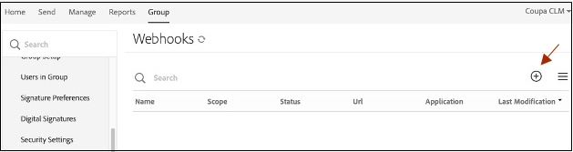

# [!DNL Coupa] Installationshandbuch{#coupa-installation-guide}

[**Adobe Sign-Support kontaktieren**](https://adobe.com/go/adobesign-support-center_de)

## Übersicht {#overview}

In diesem Dokument wird erläutert, wie Sie Ihr Adobe Sign-Konto für die Integration [!DNL Coupa BSM Suite] zum Abrufen von Signaturen.

Voraussetzungen:

* Abo für Adobe Sign Enterprise, [Adobe Sign Developer Edition](https://www.adobe.com/sign/developer-form.html)oder [Adobe Sign Enterprise Testversion](https://www.adobe.com/sign/business.html)
* Adobe Sign Administratorzugriff
* [!DNL Coupa BSM Suite] Standardinstanz oder erweiterte Instanz

Die allgemeinen Schritte zum Abschließen der Integration sind:

* Adobe Sign-Gruppe für die Verwendung mit konfigurieren [!DNL Coupa BSM Suite]
* Vernetzen [!DNL Coupa BSM Suite] nach Adobe Sign
* Erstellen Sie ein Adobe Sign-Webhook zur Benachrichtigung Ihres [!DNL Coupa BSM Suite] Beispiel

## Adobe Sign-Gruppe konfigurieren für [!DNL Coupa BSM Suite] {#configure-adobe-sign-for-coupa}

So verwenden Sie Adobe Sign für [!DNL Coupa] innerhalb eines Unternehmens müssen die Administratoren eine Adobe Sign-Gruppe speziell für [!DNL Coupa BSM Suite] Verwendung. Diese Adobe Sign-Gruppe sollte über ein einziges Gruppenadministrator-Benutzerkonto verfügen, das als Dienstkonto fungiert. Da dieses Dienstkonto für alle Signaturanfragen verwendet wird, sollte es anonym bleiben, z. B. `Legal@xyz.com`, `Purchasing@xyz.com`oder `CoupaCLM@xyz.com`und nicht persönlich, wie z. B. `Bob.Smith@xyz.com`.

### Erstellen einer Gruppe und eines Benutzers in Adobe Sign {#create-sign-user-group}

So erstellen Sie in Adobe Sign einen Benutzer:

1. Melden Sie sich bei Adobe Sign als Konto-Administrator an..
1. Navigieren Sie zu **[!UICONTROL Konto]** > **[!UICONTROL Benutzer]**.
1. Um einen neuen Benutzer zu erstellen, klicken Sie auf das Symbol  Symbol.
1. Geben Sie im daraufhin geöffneten Dialogfeld die neuen Benutzerdetails ein:

   1. Geben Sie eine funktionierende E-Mail an, auf die Sie zugreifen können.

      * Dieser Benutzer erstellt und verwaltet die OAuth-Beziehung.
      * Die E-Mail-Adresse muss eine tatsächliche Adresse zur Überprüfung sein.
   1. Geben Sie die entsprechenden Werte für [!UICONTROL Vorname] und [!UICONTROL Nachname].
   1. Im Dialogfeld [!UICONTROL Primäre Gruppe] ein, wählen Sie **[!UICONTROL Neue Gruppe für diesen Benutzer erstellen]**.
   1. Im Dialogfeld [!UICONTROL Neuer Gruppenname] einen intuitiven Gruppennamen wie *[!DNL Coupa BSM Suite]*.

   

1. Auswählen **[!UICONTROL Speichern]**.

   Nachdem Sie die Details gespeichert haben, zeigt der Katalog [!UICONTROL Benutzer] zeigt den neuen Benutzer mit einem [!UICONTROL ERSTELLT] Status.

   

   Die [!UICONTROL ERSTELLT] Status gibt an, dass der Benutzer seine E-Mail-Adresse noch nicht bestätigt hat.

1. So überprüfen Sie die E-Mail-Adresse:
   1. Melden Sie sich als E-Mail-Adresse des neuen Benutzers an.
   2. Suchen Sie die E-Mail &quot;Willkommen bei Adobe Sign&quot;. Prüfen Sie bei Bedarf die Spam-/Junk-Ordner.
   3. Klicken Sie auf den Text **[!UICONTROL Hier klicken, um Ihr Kennwort festzulegen]**.
   4. Legen Sie das Kennwort fest..

   Sobald Sie die E-Mail-Adresse bestätigt haben, ändert sich der Status des Benutzers von [!UICONTROL ERSTELLT] bis [!UICONTROL AKTIV].

   

### Authentifizierenden Benutzer definieren {#define-authenticating-user}

Nachdem Sie eine Gruppe und einen Benutzer in dieser Gruppe erstellt haben, müssen Sie den Benutzer zu einem &quot;Gruppenadministrator&quot; machen.

Um den neuen Benutzer im [!DNL Coupa BSM Suite] Gruppe:

1. Navigieren Sie zur Registerkarte [!UICONTROL Benutzer] -Seite (falls nicht bereits vorhanden).
2. Doppelklicken Sie auf den Benutzer.

   Es öffnet sich ein Fenster [!UICONTROL Bearbeiten] für die Benutzerberechtigungen.

3. Wählen Sie im Abschnitt Gruppenmitgliedschaft die Option **[!UICONTROL Gruppenadministrator]** und **[!UICONTROL Kann senden]** Optionen.
4. Deaktivieren Sie das **[!UICONTROL Der Benutzer ist ein Kontoadministrator]** und **[!UICONTROL Benutzer kann Dokumente signieren]** Optionen.
5. Klicken Sie auf **[!UICONTROL Speichern]**.

   

## Konfigurieren Sie die [!DNL Coupa BSM Suite] Beispiel {#configure-coupa}

Um die Verbindung zwischen dem [!DNL Coupa BSM Suite ] Instanz und Adobe Sign verwendet wird, muss eine vertrauenswürdige Beziehung zwischen den Services hergestellt werden.

So konfigurieren Sie die [!DNL Coupa BSM Suite]:

1. Verbinde dein [!DNL Coupa BSM Suite] in Ihrem Adobe Sign-Dienstkonto, das Sie oben erstellt haben.
1. Erstellen Sie eine Adobe Sign-Webhook-Instanz, um Ihre Coupa BSM Suite-Instanz über Aktualisierungen von Vereinbarungen zu benachrichtigen.

Weitere Informationen zum Verbinden der [!DNL Coupa BSM Suite] und wie Sie webhook erstellen und registrieren, lesen Sie [Support-Dokumentation für Adobe Sign Coupa BSM Suite Instance](https://success.coupa.com/Support/Docs/Power_Apps/CLM_Standard/Signing_and_Approvals/Enable_E-Signatures_Through_Adobe_Sign_and_DocuSign){target=&quot;_blank&quot;}.

## Erstellen [!DNL Webhook] in Adobe Sign {#create-webhook}

Die Coupa CLM-Integration verwendet Webhook-Benachrichtigungen von Adobe Sign, um Aktualisierungen über den Vereinbarungsstatus zu senden. Es ist wichtig, die Einrichtung des Webhooks abzuschließen, andernfalls bleiben die zum Signieren gesendeten Vereinbarungen unvollständig oder die signierten Vereinbarungen werden nicht wieder an Coupa CLM übermittelt.

So erstellen Sie Webhooks in Adobe Sign:

1. Melden Sie sich mit dem oben erstellten Gruppenadministratorbenutzer bei Adobe Sign an, z. B. `coupaclm@MyDomain.com`.

1. Navigieren Sie zu **Gruppen** > **Webhooks**.

   

1. Um eine neue Verbindung zu erstellen, wählen Sie die Option  Symbol.

1. Füllen Sie im Dialogfeld Erstellen die erforderlichen Felder aus.

   **Hinweis:** Sie müssen die URL für den Webhook-Handler von Coupa beziehen.

   

1. Wählen Sie die erforderlichen Benachrichtigungsparameter aus.

1. Auswählen **Speichern**.

## Support {#support}

### [!DNL Coupa BSM Suite] unterstützen {#coupa-support}

[!DNL Coupa BSM Suite ] ist der Integrationseigentümer und sollte Ihre erste Anlaufstelle für Fragen zum Umfang der Integration, zu Funktionsanfragen oder Problemen im täglichen Betrieb der Integration sein.

Bei Fragen wenden Sie sich an [Coupa Support](https://success.coupa.com/Support/Welcome_to_Coupa_Support){target=&quot;_blank&quot;}.

### Unterstützung für Adobe Sign {#adobe-sign-support}

Adobe Sign ist der Integrationspartner und sollte kontaktiert werden, wenn die Integration keine Signaturen einholt oder wenn die Benachrichtigung über ausstehende Signaturen fehlschlägt.

Wenn Sie Hilfe bei der Verwendung oder Konfiguration von Adobe Sign benötigen, können Sie sich an Ihren Customer Success Manager (CSM) wenden oder sich an den [Unterstützung für Adobe Sign](https://adobe.com/go/adobesign-support-center).

Adobe Sign-Administratoren können Tickets auch öffnen und über die Hilfe (?) Support erhalten. oben rechts im Adobe Sign-Portal.

