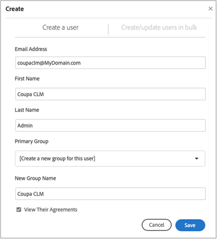

# [!DNL Coupa] Installationshandbuch{#coupa-installation-guide}

[**Adobe Sign-Support kontaktieren**](https://adobe.com/go/adobesign-support-center_de)

## Übersicht {#overview}

In diesem Dokument wird erläutert, wie Sie Ihr Adobe Sign-Konto so konfigurieren, dass [!DNL Coupa BSM Suite]-Instanz zum Abrufen von Signaturen integriert wird.

Voraussetzungen:

* Abonnement für Adobe Sign Enterprise, [Adobe Sign Developer Edition](https://www.adobe.com/sign/developer-form.html) oder [Adobe Sign Enterprise Trial](https://www.adobe.com/sign/business.html)
* Adobe Sign-Administratorzugriff
* [!DNL Coupa BSM Suite] Standardinstanz oder erweiterte Instanz

Die wichtigsten Schritte zum Abschluss der Integration sind:

* Konfigurieren einer Adobe Sign-Gruppe für die Verwendung mit [!DNL Coupa BSM Suite]
* [!DNL Coupa BSM Suite] mit Adobe Sign verbinden
* Erstellen Sie ein Adobe Sign-webhook, um Ihre [!DNL Coupa BSM Suite]-Instanz zu benachrichtigen

## Adobe Sign Group für [!DNL Coupa BSM Suite] konfigurieren {#configure-adobe-sign-for-coupa}

Damit Adobe Sign für [!DNL Coupa] innerhalb eines Unternehmens dediziert wird, müssen die Administratoren eine Adobe Sign-Gruppe speziell für die [!DNL Coupa BSM Suite]-Verwendung erstellen. Diese Adobe Sign-Gruppe sollte über ein einziges Gruppenadmin-Benutzerkonto verfügen, das als Dienstkonto fungiert. Da dieses Dienstkonto für alle Signaturanfragen verwendet wird, sollte es anonym bleiben, z. B. `Legal@xyz.com`, `Purchasing@xyz.com` oder `CoupaCLM@xyz.com`, und nicht persönlich, z. B. `Bob.Smith@xyz.com`.

### Gruppe und Benutzer in Adobe Sign erstellen {#create-sign-user-group}

So erstellen Sie in Adobe Sign einen Benutzer:

1. Melden Sie sich bei Adobe Sign als Konto-Administrator an..
1. Navigieren Sie zu **[!UICONTROL Konto]** > **[!UICONTROL Benutzer]**.
1. Um einen neuen Benutzer zu erstellen, klicken Sie auf das Symbol 
1. Geben Sie im daraufhin geöffneten Dialogfeld die neuen Benutzerdetails an:

   1. Stellen Sie eine funktionale E-Mail bereit, auf die Sie zugreifen können.

      * Dieser Benutzer erstellt und pflegt die OAuth-Beziehung.
      * Die E-Mail-Adresse muss eine tatsächliche Adresse zur Überprüfung sein.
   1. Geben Sie die entsprechenden Werte für [!UICONTROL Vorname] und [!UICONTROL Nachname] ein.
   1. Wählen Sie im Feld [!UICONTROL Primäre Gruppe] **[!UICONTROL Neue Gruppe für diesen Benutzer erstellen]** aus.
   1. Geben Sie im Feld [!UICONTROL Neuer Gruppenname] einen intuitiven Gruppennamen wie *[!DNL Coupa BSM Suite]* an.

   

1. Wählen Sie **[!UICONTROL Speichern]**.

   Nachdem Sie die Details gespeichert haben, zeigt die Seite [!UICONTROL Benutzer] den neuen Benutzer mit dem Status [!UICONTROL ERSTELLT] an.

   

   Der Status [!UICONTROL ERSTELLT] gibt an, dass der Benutzer seine E-Mail-Adresse noch nicht überprüft hat.

1. So überprüfen Sie die E-Mail-Adresse:
   1. Melden Sie sich bei der E-Mail des neuen Benutzers an.
   2. Suchen Sie die E-Mail &quot;Welcome to Adobe Sign&quot;. Überprüfen Sie bei Bedarf die Spam-/Junk-Ordner.
   3. Klicken Sie auf den Text **[!UICONTROL Hier klicken, um Ihr Kennwort festzulegen]**.
   4. Legen Sie das Kennwort fest..

   Nachdem Sie die E-Mail-Adresse bestätigt haben, ändert sich der Status des Benutzers von [!UICONTROL CREATED] in [!UICONTROL ACTIVE].

   

### Authentifizierungsbenutzer definieren {#define-authenticating-user}

Nachdem Sie eine Gruppe und einen Benutzer in dieser Gruppe erstellt haben, müssen Sie den Benutzer zu einem Gruppenadministrator machen.

So bewerben Sie den neuen Benutzer in der [!DNL Coupa BSM Suite]-Gruppe:

1. Navigieren Sie zur Seite [!UICONTROL Benutzer] (falls nicht bereits vorhanden).
2. Doppelklicken Sie auf den Benutzer.

   Es wird eine Seite [!UICONTROL Bearbeiten] für die Benutzerberechtigungen geöffnet.

3. Wählen Sie im Bereich Gruppenmitgliedschaft die Optionen **[!UICONTROL Gruppenadministrator]** und **[!UICONTROL Senden]** möglich.
4. Deaktivieren Sie die Optionen **[!UICONTROL Benutzer ist ein Kontoadministrator]** und **[!UICONTROL Benutzer kann Dokumente signieren]**.
5. Klicken Sie auf **[!UICONTROL Speichern]**.

   

## [!DNL Coupa BSM Suite]-Instanz konfigurieren {#configure-coupa}

Um die Verbindung zwischen der [!DNL Coupa BSM Suite ]-Instanz und Adobe Sign abzuschließen, muss zwischen den Diensten eine vertrauenswürdige Verbindung hergestellt werden.

So konfigurieren Sie [!DNL Coupa BSM Suite]:

1. Verbinden Sie Ihre [!DNL Coupa BSM Suite]-Instanz mit Ihrem oben erstellten Adobe Sign-Dienstkonto.
1. Erstellen Sie eine Adobe Sign-Webhook-Instanz, um Ihre Coupa BSM Suite-Instanz über Aktualisierungen von Vereinbarungen zu informieren.

Weitere Informationen zum Verbinden der [!DNL Coupa BSM Suite] und zum Erstellen und Registrieren von webhook finden Sie in der Dokumentation [Adobe Sign Coupa BSM Suite Instance support documentation](https://success.coupa.com/Support/Docs/Power_Apps/CLM_Standard/Signing_and_Approvals/Enable_E-Signatures_Through_Adobe_Sign_and_DocuSign){target=&quot;_blank&quot;}.

## [!DNL Webhook] in Adobe Sign erstellen {#create-webhook}

Die Coupa CLM-Integration verwendet webhook-Benachrichtigungen von Adobe Sign, um Updates über den Vertragsstatus zu senden. Es ist wichtig, das webhook Setup abzuschließen, da andernfalls die zum Unterschreiben gesendeten Vereinbarungen unvollständig bleiben oder die signierten Vereinbarungen nicht wieder an Coupa CLM gesendet werden.

So erstellen Sie webhook in Adobe Sign:

1. Melden Sie sich mit dem oben erstellten Gruppenadmin-Benutzer bei Adobe Sign an, z. B. `coupaclm@MyDomain.com`.

1. Navigieren Sie zu **Gruppen** > **Webhooks**.

   

1. Um eine neue Verbindung zu erstellen, wählen Sie das Symbol 

1. Füllen Sie im daraufhin geöffneten Dialogfeld Erstellen die erforderlichen Felder aus.

   **Hinweis:** Sie müssen die URL für den webhook handler von Coupa beziehen.

   

1. Wählen Sie die erforderlichen Benachrichtigungsparameter aus.

1. Wählen Sie **Speichern**.

## Support {#support}

### [!DNL Coupa BSM Suite] Support {#coupa-support}

[!DNL Coupa BSM Suite ] ist der Integrationseigentümer und sollte Ihre erste Anlaufstelle für Fragen über den Umfang der Integration, Funktionsanfragen oder Probleme in der laufenden Funktion der Integration sein.

Bei Fragen wenden Sie sich an den [Coupa-Support](https://success.coupa.com/Support/Welcome_to_Coupa_Support){target=&quot;_blank&quot;}.

### Adobe Sign-Support {#adobe-sign-support}

Adobe Sign ist der Integrationspartner und sollte kontaktiert werden, wenn bei der Integration keine Signaturen eingeholt werden oder wenn die Benachrichtigung über ausstehende Signaturen fehlschlägt.

Wenn Sie Hilfe bei der Verwendung oder Konfiguration von Adobe Sign benötigen, wenden Sie sich an Ihren Customer Success Manager (CSM) oder wenden Sie sich an den Support von [Adobe Sign](https://adobe.com/go/adobesign-support-center).

Adobe Sign-Administratoren können auch Tickets öffnen und Support über die Hilfe erhalten (?) rechts oben im Adobe Sign-Portal.

