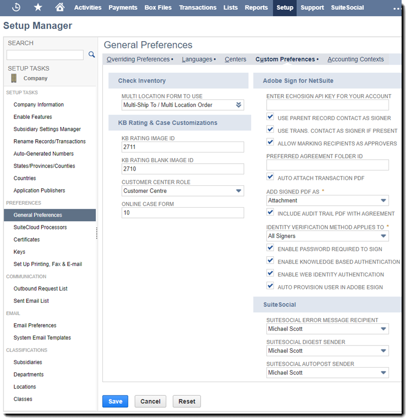
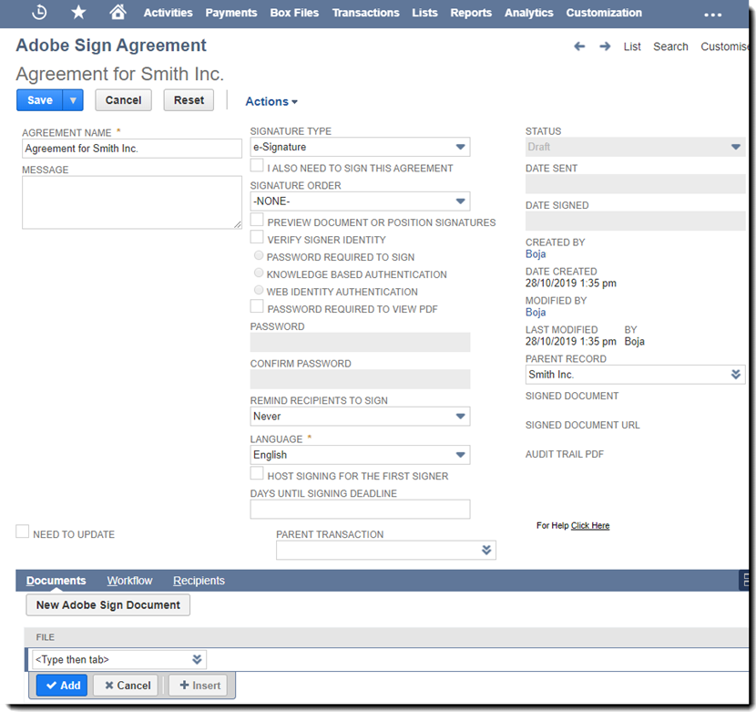

# [!DNL NetSuite] Installations- und Anpassungshandbuch v4.0.4) {#install-customize-NetSuite}

## Übersicht {#overview}

Adobe Sign für [!DNL NetSuite] bietet eine vollständige Integration von E-Signaturen in [!DNL NetSuite]. Sie können Adobe Sign für [!DNL NetSuite] Integration, um Vereinbarungen wie Verträge, Angebote und andere Dokumente, die eine elektronische Signatur erfordern, direkt von [!DNL NetSuite]. Adobe Sign-Verträge lassen sich über Kunden, Leads, Angebote und andere Ressourcen erstellen und versenden. [!DNL NetSuite] Datensätze. Adobe Sign-Updates [!DNL NetSuite] mit dem Status von Vereinbarungen und speichert die Vereinbarungen mit den zugehörigen [!DNL NetSuite] Datensätze, sobald sie vollständig ausgeführt wurden. Sie können den Verlauf aller Vereinbarungen anzeigen, die von [!DNL NetSuite] aus dem Produkt.

Weitere Informationen finden Sie unter [Versionshinweise für Adobe Sign für NetSuite](https://experienceleague.adobe.com/docs/sign-integrations/using/netsuite/release-notes.html?lang=en) für weitere Informationen.

## Paket installieren und OAuth konfigurieren {#install}

Nur ein [!DNL NetSuite] kann das Paket installieren oder aktualisieren. Um OAuth zu konfigurieren, zeigt der Katalog [!DNL NetSuite] Administrator muss Administratorzugriff auf Adobe Sign haben. Vor der Installation des Pakets in Ihrem Produktionskonto sollten Sie das Paket in einer [!DNL NetSuite] Sandbox-Konto.

Siehe [Adobe Sign-Vereinbarung erstellen](#createagreement) für weitere Informationen zu Testing.

>[!CAUTION]
>
>Kunden, die auf Version 4.0.4 aktualisieren, sollten ihren vorhandenen API-Schlüssel NICHT entfernen.
>
>Siehe [Benutzerdefinierte Voreinstellungen festlegen](#configure) für weitere Informationen zur Verwendung des API-Schlüssels.

### Installieren Sie das Paket zum ersten Mal

1. Navigieren Sie zu [!UICONTROL **Anpassung > SuiteBundler > Pakete suchen und installieren**].

1. Im Fenster &quot; *Pakete suchen und installieren* Seite, geben Sie **Adobe Sign** als Stichwort ein und wählen Sie **[!UICONTROL Suchen]**.

1. Wählen Sie das **Adobe Sign** Paketname.

   

1. Im Fenster &quot; *[!UICONTROL Paketdetails]* &quot; die Option **[!UICONTROL Installieren]**.
1. Im Dialogfeld *[!UICONTROL Paketinstallation in Vorschau anzeigen]* &quot; die Option **[!UICONTROL Paket installieren]**.

   (Die Standardwerte auf der Seite müssen nicht geändert werden.)

   

1. Wählen Sie im angezeigten Dialogfeld Installieren **[!UICONTROL OK]** , um fortzufahren.

   Während des Installationsvorgangs wird der Status des Pakets als *[!UICONTROL Ausstehend]* angezeigt.

   

1. Um einen aktualisierten Status anzuzeigen, wählen Sie **[!UICONTROL Aktualisieren]**.

   Nach Abschluss der Paketinstallation wird *Adobe Sign für[!DNL NetSuite]* auf der Seite *[!UICONTROL Installierte Pakete]* angezeigt.

   

1. Wenn Sie bereits Adobe Sign-Kundenkonto haben, führen Sie die folgenden Schritte aus:  [Konfigurieren von OAuth nach der Installation oder dem Upgrade](#oauth).

   Wenn Sie kein Adobe Sign-Konto haben, können Sie sich [für ein Enterprise-Probeabo anmelden](https://esign.adobe.com/adobe-sign-netsuite-trial-registration.html) und das System testen. Führen Sie die Online-Registrierungsschritte aus, um Ihr Adobe Sign-Konto zu aktivieren.

## Konfigurieren von OAuth nach der Installation oder dem Upgrade {#oauth}

Adobe Sign verwendet OAuth 2.0 zur Authentifizierung Ihres Adobe Sign-Kontos in [!DNL NetSuite].

Dieses Protokoll autorisiert Ihre installierten [!DNL NetSuite] zur Kommunikation mit Adobe Sign ohne Kennwortanforderung. Da vertrauliche Informationen nicht direkt zwischen den Anwendungen ausgetauscht werden, ist die Wahrscheinlichkeit geringer, dass Ihr Konto unerlaubt benutzt wird.

Diese Authentifizierung wirkt sich nicht auf Ihre Implementierung aus, Sie müssen jedoch nach der Installation oder dem Upgrade des Pakets in Ihrem Produktions- oder Sandbox-Konto eine einmalige Konfiguration vornehmen.

Die [!DNL NetSuite] Administrator, der OAuth konfiguriert, muss auch über einen Administratorzugriff auf Kontoebene für Adobe Sign verfügen.

1. In [!DNL NetSuite], navigieren Sie zur Registerkarte *Adobe Sign Config* -Listenseite.

1. Suchen nach **[!UICONTROL Adobe Sign Config]** (ein benutzerdefinierter Datensatztyp) mithilfe des Suchfelds in der Kopfzeile.

1. Wählen Sie auf der Seite Suchergebnisse **Anzeigen** für die *Adobe Sign Config* aufzeichnen.

   .

1. Wählen Sie auf der Seite Adobe Sign Config-Liste **[!UICONTROL Anzeigen]** für die *OAuth für den Zugriff auf Adobe Sign-APIs verwenden* aufzeichnen.

   

1. Wählen Sie auf der Seite Adobe Sign Config die Option **[!UICONTROL Mit Adobe Sign anmelden]**

   

1. Geben Sie auf der angezeigten Adobe Sign-Anmeldeseite Ihre Anmeldedaten ein und wählen Sie **[!UICONTROL Anmelden]**.

   

1. Wählen Sie auf der angezeigten Seite Zugriff bestätigen (für OAuth) **[!UICONTROL Zugriff erlauben]**

   

1. Wenn die Autorisierung abgeschlossen ist, werden Sie zurück zur Adobe Sign Config-Seite in [!DNL NetSuite], wie unten gezeigt.

   

   >[!NOTE]
   >
   >Bei der Konfiguration von OAuth in Ihrem Sandbox-Konto wird möglicherweise der Fehler &quot;Die Comp-ID des Kunden konnte nicht ermittelt werden&quot; angezeigt, wenn die Autorisierung abgeschlossen ist.
   >
   >
   >Um fortzufahren, müssen Sie den Abschnitt der Kontodomäne der URL (system.netsuite.com) in Ihrem Browser so ändern, dass er auf die [!DNL NetSuite] Sandbox wie folgt:
   >
   >
   >Ändern:
   >
   >
   >system.netsuite.com/app/site/hosting/scriptlet.nl?script=745&amp;deploy=1&amp;web_access_point=https://echosign.com
   >
   >
   >An:
   >
   >
   >system.**sandbox.** netsuite.com/app/site/hosting/scriptlet.nl?script=745&amp;deploy=1&amp;web_access_point=https://echosign.com

## Paket aktualisieren (vorhandene Benutzer)

[!DNL NetSuite] Paketaktualisierungen werden regelmäßig von Adobe veröffentlicht. Bestehende Benutzer der Adobe Sign für [!DNL NetSuite] kann auf das neueste Paket aktualisiert werden.

>[!CAUTION]
>
>Kunden, die auf eine neuere Version aktualisieren, sollten ihren vorhandenen API-Schlüssel NICHT entfernen.
>
>Weitere Informationen zur Verwendung des API-Schlüssels finden Sie unter [Festlegen benutzerdefinierter Voreinstellungen](#configure).

### Voraussetzungen {#prerequisites}

Die für die Aktualisierung auf das Paket v4.0.4 erforderliche Zeit hängt von der Anzahl der Vereinbarungen ab, die derzeit den Status &quot;Zur Signatur versandt&quot; aufweisen. Normalerweise dauert es 7 bis 10 Minuten, bis 100 Vereinbarungen aktualisiert sind. Notieren Sie sich die Anzahl der Datensätze, um die Aktualisierungsdauer abzuschätzen.

So bestimmen Sie die Anzahl der Vereinbarungen, die zur Signatur versendet werden:

1. Navigieren Sie zu **[!UICONTROL Anpassung > Listen, Datensätze und Dateien > Datensatztypen]**, suchen Sie dann *Adobe Sign-Vertrag.*

   Oder suchen Sie in der Suchleiste nach Adobe Sign-Vereinbarungen.

1. Für die [!UICONTROL Adobe Sign-Vereinbarungen] Datensatz, wählen Sie **[!UICONTROL Suchen]**.

   

1. Im Fenster &quot; **[!UICONTROL Status]** &quot; die Option **[!UICONTROL Zur Signatur versandt]** und wählen Sie dann **[!UICONTROL Senden]**.

   

   Notieren Sie sich die Anzahl der Datensätze, um die Aktualisierungsdauer abzuschätzen.

   

### Paket aktualisieren {#updating-the-bundle}

1. Navigieren Sie zu **[!UICONTROL Anpassung > SuiteBundler > Suchen und installieren > Liste]** und suchen Sie Ihr aktuelles Paket, wie unten gezeigt.

   >[!NOTE]
   >
   >Wenn es eine neue Version des Pakets gibt, wird rechts neben dem *Version* Nummer Ihres aktuellen Pakets.

1. Wählen Sie im Dropdown-Menü Aktion die Option **[!UICONTROL Aktualisieren]**.

   

1. Wählen Sie auf der Seite Paketaktualisierung in Vorschau anzeigen die Option **[!UICONTROL Paket aktualisieren]** ohne die auf der Seite angezeigten Standardwerte zu ändern.

   Während der Installation wird der Status des Pakets als *Ausstehend*.

   .

   >[!NOTE]
   >
   >Beim Aktualisieren des Pakets wird möglicherweise eine Warnmeldung angezeigt (siehe unten). Wenn Sie Ihr [!DNL NetSuite] eSignature-Datensätze, können Sie fortfahren. Wenn Sie sich nicht sicher sind, wird empfohlen, das Paket in einem Sandbox-Konto zu installieren, um es zuerst zu testen, bevor Sie es in einem Produktionskonto aktualisieren.

   

1. Um einen aktualisierten Status anzuzeigen, wählen Sie **[!UICONTROL Aktualisieren]**.

   

   >[!NOTE]
   >
   >Wenn das Update aufgrund mehrerer Vereinbarungen mit einer *Zur Signatur versandt* können Sie den Status **[!UICONTROL Ausführungsprotokoll]** -Unterregisterkarte für das *Installation des Adobe Sign-Pakets* , um den Fortschritt des Updates zu ermitteln. Siehe [Ermitteln des Aktualisierungsfortschritts](#determineprogress) für weitere Informationen.

   Nach Abschluss der Paketaktualisierung wird *Adobe Sign für[!DNL NetSuite]* auf der Seite *Installierte Pakete* angezeigt.

   

## Konfigurieren des Pakets {#configure}

### Benutzerdefinierte Voreinstellungen festlegen  {#set-custom-preferences}

Sie können benutzerdefinierte Voreinstellungen verwenden, um anzugeben, wie Vereinbarungen erstellt und in [!DNL NetSuite]. Darüber hinaus enthält der Katalog *Benutzer in Adobe Sign automatisch bereitstellen* können Sie angeben, ob [!DNL NetSuite] Benutzer werden in den Sign-Diensten automatisch bereitgestellt, wenn sie Vereinbarungen von [!DNL NetSuite].

1. Navigieren Sie zu **[!UICONTROL Einrichtung > Unternehmen > Allgemeine Voreinstellungen]**.
1. Blättern Sie auf der Seite nach unten und wählen Sie dann das **[!UICONTROL Benutzerdefinierte Voreinstellungen]** -Unterregisterkarte.

   

1. Aktivieren und konfigurieren Sie Ihre Adobe Sign-Voreinstellungen nach Bedarf:

   * **EchoSign-API-Schlüssel für Ihr Konto eingeben**: Fügen Sie in diesem Feld keine Werte hinzu und bearbeiten Sie sie nicht.
   * **Übergeordneten Datensatzkontakt als Unterzeichner verwenden**: Wenn diese Option aktiviert ist, wird der Kontakt aus dem übergeordneten Datensatz beim Erstellen von Vereinbarungen standardmäßig als erster Unterzeichner verwendet. Der Absender kann vor dem Senden einfach den Standardunterzeichner entfernen oder bearbeiten oder zusätzliche Unterzeichner zur Vereinbarung hinzufügen.
   * **Transaktionskontakt Wenden Sie sich an den Unterzeichner, falls vorhanden.**: Diese Voreinstellung ist nur gültig, wenn das Attribut *Übergeordneten Datensatzkontakt als Unterzeichner verwenden* ist ebenfalls aktiviert. Wenn diese Option aktiviert ist, wird beim Generieren einer Vereinbarung aus einem Transaktionsdatensatz (z. B. Angebot) der primäre Transaktionskontakt standardmäßig als erster Unterzeichner verwendet. Weitere Informationen finden Sie unter [Transaktionsdatensätze. ](#transrecords) Wenn kein primärer Transaktionskontakt vorhanden ist oder wenn vom gesendet wird [!DNL NetSuite] Objektdatensatz (z. B. Kundendatensatz, Partnerdatensatz), ist der Standardempfänger der primäre Kontakt für die Kunden-E-Mail. Der Absender kann vor dem Senden einfach den Standardunterzeichner entfernen oder bearbeiten oder zusätzliche Unterzeichner zur Vereinbarung hinzufügen.
   * **Markierung von Empfängern als Genehmiger zulassen**: Wenn diese Option aktiviert ist, können Absender Empfänger als Genehmiger markieren. Als Genehmiger markierte Empfänger können Vereinbarungen überprüfen und genehmigen, müssen sie jedoch nicht unterschreiben. Während des Genehmigungsprozesses müssen Genehmiger möglicherweise Daten in Felder eingeben.
   * **ID des bevorzugten Vereinbarungsordners**: Wird verwendet, um den Ordner anzugeben, in dem die endgültig unterzeichneten Vereinbarungen gespeichert werden. Wenn Sie keinen Wert für dieses Feld festlegen, werden die endgültig unterzeichneten Vereinbarungen standardmäßig im selben Ordner wie die ursprüngliche Dokumentdatei gespeichert. Die Ordner-ID muss eine Zahl sein.
   * **Transaktions-PDF automatisch anhängen**: Wenn diese Option aktiviert ist, werden Transaktions-PDF automatisch an Vereinbarungen angehängt, wenn neue Vereinbarungen aus Transaktionsdatensätzen erstellt werden.
   * **Signierte PDF hinzufügen als (Anhang oder Link)**: Wenn *Liste* aus der Dropdown-Liste ausgewählt ist, wird die signierte PDF automatisch als Link zur Datei hinzugefügt. Wenn im Dropdown-Menü *Anhang* &quot; ausgewählt wird, wird die signierte PDF-Datei in als Anhang zum Vereinbarungsdatensatz gespeichert.[!DNL NetSuite]
   * **Prüfprotokoll-PDF mit Vereinbarung einschließen**: Wenn diese Option aktiviert ist, werden Audit-Protokoll-PDF automatisch an Vereinbarungsdatensätze angehängt, nachdem die Vereinbarungen unterzeichnet wurden.
   * **Identitätsbestätigungsmethode gilt für**: Durch Aktivieren einer der Methoden zur Identitätsüberprüfung wird festgelegt, auf wen die Identifikationsüberprüfungsmethode angewendet wird. Die Optionen sind *Alle Unterzeichner, nur externe Unterzeichner* oder *Nur interne Unterzeichner*.

   **Identitätsbestätigungsmethoden** {#identity-verification-methods}

   Beim Erstellen einer Vereinbarung können Sie eine oder mehrere Identitätsbestätigungsmethoden auswählen. Wenn hier mehr als eine Identitätsbestätigungsmethode aktiviert wird, wird auf der Adobe Sign-Vereinbarungsseite eine **[!UICONTROL Identität des Unterzeichners bestätigen]** aus.

   * **Zum Unterschreiben erforderliches Kennwort aktivieren**: Unterzeichner auffordern, ein Einmalkennwort einzugeben, das Sie festlegen.

   * **Wissensbasierte Authentifizierung aktivieren**: Unterzeichner auffordern, ihren Namen, ihre Adresse und optional die letzten vier Ziffern ihrer Sozialversicherungsnummer anzugeben, und dann eine Liste mit Fragen zur Bestätigung der bereitgestellten Informationen beantworten. Nur in den USA erhältlich.

   * **Webidentitätsauthentifizierung aktivieren**: Unterzeichner auffordern, ihre Identität zu bestätigen, indem sie sich bei einer der folgenden Websites anmelden: Facebook, Google, LinkedIn, Microsoft Live, Twitter oder Yahoo!.

   * **Benutzer in Adobe Sign automatisch bereitstellen**: Wenn diese Option aktiviert ist, werden Benutzer, die Vereinbarungen senden, [!DNL NetSuite] werden automatisch mit einem Adobe Sign-Benutzerkonto bereitgestellt.

1. Auswählen **[!UICONTROL Speichern]** , um Ihre Voreinstellungen zu speichern.

## Automatische Statusaktualisierungen konfigurieren {#asu}

Mit dem Adobe Sign-Integrationspaket erhalten Sie Updates automatisch in [!DNL NetSuite] zum Status der Vereinbarungen, die von gesendet wurden [!DNL NetSuite]. Wenn diese Funktion aktiviert ist, wird [!DNL NetSuite] immer den Status Ihrer Vereinbarungen widerspiegelt. Sie können automatische Statusaktualisierungen wie folgt aktivieren:

1. Navigieren Sie zu **[!UICONTROL Einrichtung > Unternehmen > Funktionen aktivieren].**
1. Wählen Sie das **[!UICONTROL SuiteCloud]** -Unterregisterkarte.
1. Aktivieren Sie die folgenden Optionen:

   * Aktivieren Sie im Abschnitt SuiteBuilder die Option **[!UICONTROL Benutzerdefinierte Datensätze]**.

   * Aktivieren Sie im Abschnitt SuiteScript die Optionen **[!UICONTROL Client SuiteScript]** und **[!UICONTROL Server SuiteScript]** und stimmen Sie den Nutzungsbedingungen für beide zu.

1. Wählen Sie **[!UICONTROL Speichern]** aus.

   Ihre Optionen werden wie in der Abbildung gezeigt festgelegt.

   

## Objekte und Datensatztypen {#objects}

Das Adobe Sign-Integrationspaket stellt das Adobe Sign-Vereinbarungsobjekt bereits mit vielen Standards bereit. [!DNL NetSuite] Objekte, einschließlich: Kunden-, Kostenvoranschlag-, Lead-, Opportunity- und Partnerdatensätze. Sie können das Adobe Sign-Paket auch mit anderen Datensatztypen verwenden, einschließlich benutzerdefinierter Datensätze.

Die Registerkarte Vereinbarung kann mit zwei Arten von [!DNL NetSuite] Datensätze: Entitäts- und Transaktionsdatensätze. In der Regel gehen wir davon aus, dass ein Transaktionsdatensatz ein Datensatz (z. B. Angebot) ist, der in ein PDF-Dokument konvertiert werden kann. Ein Entitätsdatensatz kann hingegen nicht in einen PDF konvertiert werden.

## Transaktionsdatensätze {#transrecords}

Wenn die Vereinbarung aus einem Transaktionsdatensatz erstellt wird, ist das erste Dokument im Vereinbarungsdatensatz die PDF-Version des Datensatzes, aus dem sie stammt, und der erste Empfänger ist die E-Mail-Adresse des Datensatzes. Wenn das erste Dokument keine PDF-Version des Datensatzes sein soll, aus dem es stammt, rufen Sie die Seite **[!UICONTROL Einrichten > Unternehmen > Allgemeine Voreinstellungen > Unterregisterkarte &quot;Benutzerdefinierte Voreinstellungen&quot;]** und deaktivieren Sie die **[!UICONTROL Transaktions-PDF automatisch anhängen]** aus. Siehe [Festlegen benutzerdefinierter Voreinstellungen](#configure) für weitere Informationen.

Unter „Benutzerdefinierte Voreinstellungen“ können Sie auch die Voreinstellung **[!UICONTROL Transaktionskontakt als ersten Unterzeichner verwenden]** aktivieren, wenn Sie möchten, dass der primäre Transaktionskontakt automatisch als erster Unterzeichner hinzugefügt wird. Bei Zuordnung zu einem Transaktionsdatensatz wird das Dialogfeld **[!UICONTROL Vereinbarungen]** und die **[!UICONTROL Send for Signature]** Schaltflächen.

## Entitätsdatensätze {#entity-records}

Wenn die Vereinbarung aus einem Entitätsdatensatz erstellt wird, ist der erste Empfänger die E-Mail-Adresse aus dem Datensatz. Bei einer Zuordnung zu einem Entitätsdatensatz wird nur die Registerkarte „Vereinbarungen“ angezeigt.

## Paket anpassen {#customize}

Das Anpassen des Pakets umfasst Folgendes:

* Bereitstellen der Skripte für die Unterregisterkarte Vereinbarungen und die Schaltfläche Zur Signatur senden für die entsprechenden Datensatztypen
* Festlegen von Rollenberechtigungen für Ihre Adobe Sign-Datensatztypen
* Ändern der Berechtigungen zum Erteilen des Zugriffs auf die Unterregisterkarte *Vereinbarungen* und die Schaltfläche *Zur Signatur senden*.

### Konfigurieren von Adobe Sign-Vereinbarungen für zusätzliche Datensatztypen  {#configuring-adobe-sign-agreements-for-additional-record-types}

Um die *Vereinbarungen* und die Registerkarte *Send for Signature* für die entsprechenden Datensatztypen:

1. Navigieren Sie zu **[!UICONTROL Anpassung > Skripterstellung > Skripte].**

1. Im Fenster &quot; *Skripte* angezeigt wird, suchen Sie nach dem Skript, das Sie bereitstellen müssen, und wählen Sie dann ****[!UICONTROL Anzeigen]****.

   * Um die *Send for Signature* klicken, wählen Sie **[!UICONTROL Adobe Sign Estimate Button]** Skript.

   * Um die *Vereinbarungen* &quot; die Option **[!UICONTROL Adobe Sign Agreement Loader]** Skript.

1. Wählen Sie auf der Seite Skript die Option **[!UICONTROL Skript bereitstellen]**.

   

1. Führen Sie auf der Seite Skriptbereitstellung die folgenden Schritte aus:

   * Wählen Sie in der Liste *Anwenden auf* den Datensatztyp aus.
   * Geben Sie optional die ID der Skriptbereitstellung ein.

      Weitere Informationen finden Sie unter *Erstellen einer benutzerdefinierten Skriptbereitstellungs-ID* -Thema in der [!DNL NetSuite] Hilfezentrum für weitere Informationen. Wenn Sie keine ID eingeben, wird eine generiert.

   * Aktivieren Sie das Kontrollkästchen **[!UICONTROL Bereitgestellt]**.

   

   * Setzen Sie den *Status* auf **[!UICONTROL Freigegeben]**.

      Sie müssen kein *Ereignistyp* oder *Protokollebene*.

   * Im Fenster &quot; [!UICONTROL *Als Rolle ausführen]* Dropdown-Liste wählen Sie **[!UICONTROL Als Administrator ausführen]**.

   * Mit der **[!UICONTROL Zielgruppe]** Unterregisterkarte aktiv (standardmäßig aktiv), wählen Sie die spezifischen Rollen oder Benutzer aus, denen Sie Zugriff gewähren möchten. Wenn Sie allen Rollen und Benutzern Zugriff gewähren möchten, aktivieren Sie die die entsprechende Option **[!UICONTROL Alle auswählen]**.

   * Wählen Sie **[!UICONTROL Speichern]** aus. Wenn die Änderungsbestätigung angezeigt wird, wählen Sie **[!UICONTROL Zurück]**.

1. auswählen **[!UICONTROL Liste]** oben auf der Seite Skriptbereitstellung , um zum *Skripte* -Listenseite.
1. Wiederholen Sie die Schritte 2 und 3 oben für das andere Skript.

## Festlegen von Rollenberechtigungen für Adobe Sign-Datensatztypen {#setting-role-permissions-for-adobe-sign-record-types}

Meist [!DNL NetSuite] -Rollen müssen über die Berechtigung verfügen, Adobe Sign ohne zusätzliche Anpassung zu verwenden. Sie müssen jedoch Berechtigungen für alle zusätzlichen benutzerdefinierten Rollen erteilen, die erstellt wurden.

1. Navigieren Sie zu **[!UICONTROL Anpassung > Listen, Datensätze und Dateien > Datensatztypen]**.

   

   >[!NOTE]
   >
   >Wenn das Element *Datensatztypen* nicht angezeigt wird, navigieren Sie zu **[!UICONTROL Einrichtung > Unternehmen > Funktionen aktivieren > Registerkarte „Suite Cloud“]** und aktivieren Sie die Option *Benutzerdefinierte Datensätze*.

1. Im Fenster &quot; *Datensatztypen* &quot; die Option **[!UICONTROL Adobe Sign Agreement]** , um es auszuwählen

   

1. Im Fenster &quot; *Benutzerdefinierter Datensatztyp* &quot; die Option **[!UICONTROL Berechtigungsliste verwenden]** im Fenster &quot; *Zugriffstyp* Dropdown-Liste.

   

   >[!NOTE]
   >
   >Der Datensatztyp *Adobe Sign-Vereinbarung* ist der einzige Adobe Sign-Datensatztyp, für den der Zugriffstyp *Berechtigungsliste verwenden* erforderlich ist.
   >
   >
   >Anweisungen zum Festlegen des Zugriffstyps für die anderen Adobe Sign-Datensatztypen finden Sie in Schritt 6.

1. Wählen Sie das **[!UICONTROL Berechtigungen]** -Unterregisterkarte.

   Die Liste der Rollen und Berechtigungen wird angezeigt.

   

1. Legen Sie die Berechtigungen für die zusätzlichen benutzerdefinierten Rollen fest, die der &quot;[!UICONTROL Adobe Sign Agreement]&quot; Datensatztyp.

   >[!NOTE]
   >
   >Weitere Informationen finden Sie im NetSuite-Hilfecenter unter dem Thema *[Festlegen einer Berechtigungsliste für einen benutzerdefinierten Datensatztyp](https://system.netsuite.com/app/help/helpcenter.nl?fid=section_N2879931.html)*.

   1. Wählen Sie die Rolle aus der Liste *Rolle* aus.
   1. Festlegen *Ebene* bis **[!UICONTROL Voll]**.
   1. Festlegen *Standardformular* bis **[!UICONTROL Benutzerdefiniertes EchoSign-Vereinbarungsformular]**.
   1. Auswählen **[!UICONTROL Formular einschränken]** ein.
   1. Auswählen **[!UICONTROL Hinzufügen]** , um die Änderungen für die Rollenzeile zu speichern.

   

   Die neue Zeile wird wie folgt angezeigt:

   

   Wiederholen Sie die Schritte a bis e oben für alle zusätzlichen benutzerdefinierten Rollen.

   * auswählen **[!UICONTROL Speichern]** im Fenster &quot; *Benutzerdefinierter Datensatztyp* angezeigt, wenn Berechtigungen für alle Rollen festgelegt wurden.
   Die *[!UICONTROL Datensatztyp des Kunden]* wird erneut angezeigt.

1. Wiederholen Sie die Schritte 1 bis 3 oben, um den *Zugriffstyp* für alle anderen Adobe Sign-Datensatztypen auf

   **[!UICONTROL Keine Berechtigung erforderlich].** festzulegen. Dies gilt für die folgenden Datensatztypen:

   * Adobe Sign Config
   * Adobe Sign-Dokument
   * Adobe Sign Event
   * Adobe Sign Language
   * Adobe Sign Script Errors
   * Adobe Sign Signed Agreement
   * Adobe Sign Signer

### Gewähren von Zugriff auf die Registerkarte &quot;Vereinbarung&quot; und die Schaltfläche &quot;Send for Signature&quot;  {#granting-access-to-the-agreement-tab-and-send-for-signature-button}

Das Adobe Sign-Integrationspaket stellt das Adobe Sign-Vereinbarungsobjekt bereits mit vielen Standards bereit. [!DNL NetSuite] Objekte (Kunde, Schätzung [Angebot], Lead und mehr). Die Unterregisterkarte *Vereinbarung* wird automatisch für die folgenden Objekttypen aktiviert: Kunde, Lead, Vertriebschance, Partner, Interessent, Angebot und Lieferantenrechnung.

Die *[!UICONTROL Send for Signature]* wird automatisch aktiviert **o[!UICONTROL Nur für das Angebotsobjekt]**.

[!DNL NetSuite] Administratoren können die Möglichkeit zum Erstellen von Vereinbarungen auf zusätzliche CRM-Objekte erweitern, indem sie die Berechtigungen zum Hinzufügen des *Vereinbarung* Unterregisterkarte, *Send for Signature* oder auf beide dieser Objekte angewendet.

#### Ändern von Berechtigungen, um Zugriff auf die Schaltfläche „Zur Signatur senden“ zu gewähren  {#modifying-permissions-to-grant-access-to-the-send-for-signature-button}

1. Navigieren Sie zu **[!UICONTROL Anpassung > Skripterstellung > Skripte]**.

   Die Seite mit der Liste der *Skripte* wird angezeigt.

   * Verwenden Sie bei Bedarf die Filter, um die Adobe Sign-Skripte zu finden

1. Im Fenster &quot; *Skripte* die Seite *Adobe Sign Estimate Button* Skript (steuert die *Send for Signature* klicken), wählen Sie dann **Anzeigen**.

   

1. Führen Sie auf der Seite *Skript* die folgenden Schritte aus:

   * die Option **[!UICONTROL Bereitstellungen]** Unterregisterkarte

   * Unter &quot;*Betrifft*&quot; den Link für die Entität aus, die Sie ändern möchten.

      * In diesem Beispiel ist das **[!UICONTROL Angebot]**.

   

   * die Option **[!UICONTROL Bearbeiten]** auf der Registerkarte &quot; *Skriptbereitstellung* Seite

   

   * Mit der **[!UICONTROL Zielgruppe]** auf der Unterregisterkarte &quot;Aktiv&quot; die spezifischen Rollen oder Benutzer aus, denen Sie Zugriff gewähren möchten.

      * Wenn Sie allen Rollen und Benutzern Zugriff gewähren möchten, aktivieren Sie die die entsprechende Option **[!UICONTROL Alle auswählen]**.
   * auswählen **[!UICONTROL Speichern]**

   

#### Ändern von Berechtigungen, um Zugriff auf die Registerkarte „Vereinbarungen“ zu gewähren  {#modifying-permissions-to-grant-access-to-the-agreements-tab}

1. Navigieren Sie zu **[!UICONTROL Anpassung > Skripterstellung > Skripte]**
1. Im Fenster &quot; [!UICONTROL Skripte] die Seite *[!UICONTROL Adobe Sign Agreement Loader]* Skript (steuert die *Registerkarte &quot;Vereinbarungen&quot;*) und wählen Sie dann **[!UICONTROL Anzeigen]**.
1. Führen Sie auf der Seite *Skript* die folgenden Schritte aus:

   1. Wählen Sie das **[!UICONTROL Bereitstellungen]** Unterregisterkarte
   1. Unter &quot;*[!UICONTROL Betrifft]*&quot; wählen Sie den Link für die Entität aus, für die Sie den Zugriff ändern möchten.
   1. Im Fenster &quot; *[!UICONTROL Skriptbereitstellung]* &quot; die Option **[!UICONTROL Bearbeiten]** Knopf
   1. Wählen Sie bei aktiver Unterregisterkarte **[!UICONTROL Zielgruppe]** (diese Registerkarte ist standardmäßig aktiv) die spezifischen Rollen oder Benutzer aus, denen Sie Zugriff gewähren möchten. Wenn Sie allen Rollen und Benutzern Zugriff gewähren möchten, aktivieren Sie die die entsprechende Option **[!UICONTROL Alle auswählen]**.
   1. auswählen **[!UICONTROL Speichern]**

## Verwenden von Adobe Sign für [!DNL NetSuite] Bündel

Um Vereinbarungen von [!DNL NetSuite] und Updates zu diesen Vereinbarungen erhalten, müssen Benutzer dieselbe Anmelde-ID (E-Mail-Adresse) bei der [!DNL NetSuite] und in Adobe Sign.

### Erstellen einer Adobe Sign-Vereinbarung

Nach der Installation eines neuen Pakets in einem Sandbox- oder Produktionskonto sollten Sie das Paket testen, indem Sie eine neue Vereinbarung erstellen. Sie können Adobe Sign-Vereinbarungen aus einem Entitätsdatensatz, aus einem Transaktionsdatensatz oder als eigenständige Vereinbarung erstellen.

>[!NOTE]
>
>Der Vorgang zum Erstellen einer Vereinbarung unterscheidet sich je nach Erstellungsart leicht. Der allgemeine Prozess umfasst die Festlegung der Optionen für Ihre Vereinbarung, das Hinzufügen eines oder mehrerer Vereinbarungsdokumente und die Angabe der Empfänger. Bei dem unten beschriebenen Prozess wird unterstellt, dass Sie die Vereinbarung aus einem Kundendatensatz erstellen.

1. Wählen oder erstellen Sie einen Kundendatensatz, von dem Sie eine Vereinbarung senden möchten, oder wählen Sie einen anderen aus [!DNL NetSuite] Datensatztyp mit aktivierter Registerkarte Vereinbarungen .

1. Wählen Sie im Datensatz die Option **[!UICONTROL Vereinbarungen]** -Unterregisterkarte.
1. Auswählen **[!UICONTROL Neue Vereinbarung]**.

   

1. Im Fenster &quot; *[!UICONTROL Adobe Sign Agreement]* &quot; die Option **[!UICONTROL Bearbeiten]**.

   

1. Legen Sie die Optionen für Ihre Vereinbarung wie folgt fest:

   * **Vereinbarungsname** — Geben Sie einen Namen für die Vereinbarung ein.
   * **Nachricht**- Geben Sie eine benutzerdefinierte Nachricht für den Empfänger ein.
   * **Signaturtyp**: Wählen Sie den Signaturtyp aus, der für das Dokument akzeptiert wird. Die Optionen sind *elektronische Unterschrift* und *Faxsignatur*.

   * **Ich muss diese Vereinbarung auch unterzeichnen** — Aktivieren Sie diese Option, um anzugeben, dass der Absender auch die Vereinbarung unterzeichnen muss.
   * **Signaturreihenfolge**- Wenn die Option *Ich muss diese Vereinbarung auch unterzeichnen* die Reihenfolge aus, in der der Absender und die Empfänger unterschreiben sollen. Die Optionen sind „Ich unterzeichne zuerst, dann die Empfänger“ „Empfänger unterzeichnen zuerst, dann ich“ und „Keine“.

   * **Vorschau von Dokument anzeigen oder Unterschriften (oder Formularfelder) positionieren** — Aktivieren Sie diese Option, damit Absender eine Vorschau der Vereinbarung anzeigen und Felder zur Vereinbarung hinzufügen können (Unterschrift, Initialenfelder und andere Formularfelder per Drag-and-Drop verschieben), bevor sie an die Empfänger gesendet wird.
   * **Identität des Unterzeichners bestätigen** — Aktivieren Sie diese Option, und wählen Sie dann eine der folgenden Optionen für die Identitätsüberprüfung aus

      * Diese Option wird nur angezeigt, wenn mehr als eine der drei unten aufgeführten Methoden zur Bestätigung der Unterzeichneridentität in den benutzerdefinierten Voreinstellungen aktiviert ist. (Siehe [Festlegen benutzerdefinierter Voreinstellungen](#customize) für weitere Informationen.) Wenn nur eine Voreinstellung aktiviert ist, wird die Option **[!UICONTROL Identität des Unterzeichners bestätigen]** nicht angezeigt.

   **Identitätsbestätigungsmethoden**

   * **Kennwort zur Unterzeichnung erforderlich** — Unterzeichner müssen ein Einmalkennwort eingeben, das Sie festlegen.
   * **Wissensbasierte Authentifizierung** — Unterzeichner müssen ihren Namen, ihre Adresse und optional die letzten vier Ziffern ihrer Sozialversicherungsnummer angeben und dann eine Liste mit Fragen zur Bestätigung der bereitgestellten Informationen beantworten. Nur in den USA erhältlich.
   * **Web-Authentifizierung der Identität** — Unterzeichner auffordern, ihre Identität zu bestätigen, indem sie sich bei einer der folgenden Websites anmelden: Facebook, Google, LinkedIn, Twitter, Yahoo! oder Microsoft Live.
   * **Kennwort zum Anzeigen des PDF erforderlich** — Aktivieren Sie diese Option, wenn Sie möchten, dass ein Empfänger ein Kennwort eingeben muss, bevor er eine PDF der Vereinbarung oder der unterzeichneten Vereinbarung öffnen kann. Die an alle gesendete PDF-Datei ist verschlüsselt und erfordert zum Öffnen das Kennwort. Verlieren Sie Ihr Kennwort nicht, denn es kann nicht wiederhergestellt werden. Wenn Sie das Kennwort verlieren, müssen Sie diese Transaktion löschen und erneut beginnen.
   * **Kennwort/Kennwort bestätigen** — Wenn der *Kennwort zum Anzeigen des PDF erforderlich* aktiviert ist, geben Sie das Kennwort ein, das zum Anzeigen der Vereinbarung verwendet werden soll.
   * **Empfänger an Unterschrift erinnern** — Geben Sie an, ob und wie oft Erinnerungen an Empfänger gesendet werden. Die Optionen sind *Nie*, *Täglich* oder *Wöchentlich*.
   * **Sprache:** Geben Sie die Sprache an, in der die Signaturseite und E-Mail-Benachrichtigungen den Empfängern angezeigt werden.
   * **Hostsignatur für ersten Unterzeichner** — Aktivieren Sie diese Option, damit der Host des Absenders persönlich für den ersten Unterzeichner unterzeichnen kann.
   * **Tage bis zum Ablauf der Signaturfrist** — Geben Sie eine ganze Zahl ein, um die Frist anzugeben, die für die Unterzeichnung der Vereinbarung gilt (heutiges Datum plus Anzahl der Tage).
   * **Übergeordneter Datensatz** — Wählen Sie optional einen übergeordneten Datensatz aus, um ihn mit der Vereinbarung zu verknüpfen.

   

1. Wählen Sie das **[!UICONTROL Dokumente]** &quot; ändern.

   

1. Im Fenster &quot; *Dokumente* ein vorhandenes Dokument aus dem Aktenschrank mit der Unterregisterkarte *Adobe Sign Dokument* und wählen Sie dann **[!UICONTROL Anhängen]**.

   Oder klicken Sie auf **[!UICONTROL Neues Adobe Sign Dokument]** , um auf die *[!UICONTROL Adobe Sign Dokument]* , und geben Sie dann den Namen eines Dokuments in das Feld [!DNL NetSuite] -Datei abgelegt haben, wählen Sie Dateien aus Ihrem Transaktionsdatensatz aus (falls zutreffend) oder hängen Sie ein neues Dokument an.

   Sie können einer Vereinbarung mehrere Dokumente hinzufügen.

1. Auswählen **[!UICONTROL Empfänger]** und geben Sie den Empfänger an, indem Sie entweder einen Eintrag in der Kontaktliste auswählen oder eine E-Mail-Adresse eingeben.

   

   Jeder Ihrer Empfänger kann als Unterzeichner oder CC-Partei markiert werden. Wenn die benutzerdefinierte Voreinstellung *Markierung von Empfängern als Genehmiger zulassen* aktiviert ist, können Empfänger ebenfalls als Genehmiger markiert werden. Siehe [Festlegen benutzerdefinierter Voreinstellungen](#customize) für weitere Informationen.

   * **Unterzeichner** müssen die Vereinbarung unterzeichnen.
   * **Genehmiger** die Vereinbarung genehmigen, aber nicht unterzeichnen und optional Daten zu einer Vereinbarung hinzufügen müssen.
   * **Auf CC gesetzte Empfänger** werden benachrichtigt, wenn die Vereinbarung aktualisiert wird oder unterzeichnet und abgeschlossen ist. Auf CC gesetzte Empfänger sind keine Partei des Signatur- oder Genehmigungsprozesses.

      Wenn die benutzerdefinierte Voreinstellung *Übergeordneten Datensatzkontakt als Unterzeichner verwenden* entweder alleine oder zusammen mit der Voreinstellung *Transaktionskontakt als Unterzeichner verwenden* aktiviert ist, wird der erste Empfänger standardmäßig als Unterzeichner vorgegeben. Diese Vorgabe kann jedoch geändert werden.

1. Auswählen **[!UICONTROL Hinzufügen]** nach der Eingabe jedes Empfängers.

1. Auswählen **[!UICONTROL Speichern]** , um die Vereinbarung zu speichern.

### Vereinbarungen zum Unterschreiben senden

Wenn die Vereinbarung gesendet werden kann, wählen Sie die Option **[!UICONTROL Send for Signature]** klicken.

* Wenn die Option *Vorschau des Dokuments anzeigen oder Unterschriften positionieren* aktiviert ist, klicken Sie auf **[!UICONTROL Send for Signature]**. Zeigen Sie im daraufhin geöffneten Fenster das Dokument in der Vorschau an oder ziehen Sie Formularfelder in das Dokument, bevor es gesendet wird. Auswählen **[!UICONTROL Senden]** , um die Vereinbarung an den Empfänger zu senden.

* Wenn die Option *[!UICONTROL Hostsignatur für ersten Unterzeichner]* aktiviert ist, klicken Sie auf **[!UICONTROL Send for Signature]**. Lassen Sie im daraufhin geöffneten Fenster den Unterzeichner das Dokument in Anwesenheit des Absenders signieren.

   Neben dem Link *Hostsignatur für ersten Unterzeichner* wird auch der Link *Hostsignatur für aktuellen Unterzeichner* angezeigt, auf den zugegriffen werden kann, bis das Dokument signiert ist. Verwenden Sie diesen Link, um die Signatur der Vereinbarung für mehrere Unterzeichner zu hosten oder das Popup-Fenster erneut zu öffnen, wenn es versehentlich geschlossen wurde.

Sobald die Vereinbarung gesendet wurde, erhalten die Empfänger eine E-Mail, in der sie über die Dokumente informiert werden, die auf ihre Signatur warten.

Nachdem die Empfänger das Dokument unterzeichnet haben, erhält der Absender eine Benachrichtigung per E-Mail, dass das Dokument signiert wurde.

#### Aus Angebot senden

Adobe Sign verfügt über eine direkte Integration mit Angeboten in [!DNL NetSuite] , sodass automatisch eine PDF des Angebots generiert und an den Vereinbarungsdatensatz angehängt wird.

Wenn ein Angebot angezeigt wird, wählen Sie **[!UICONTROL Send for Signature]**. Das an die Vereinbarung angehängte Angebot wird generiert und angezeigt. Sie können auch die Schaltfläche *Zur Signatur senden* anderen Transaktionsdatensatztypen hinzufügen. Weitere Informationen finden Sie unter [Objekte und Datensatztypen.](#objects)

### Status verfolgen und Erinnerungen senden

Nachdem Sie eine Vereinbarung gesendet haben:

* Im Abschnitt „Vereinbarungsdetails“ ändert sich der Dokumentstatus in *Zur Signatur versandt*.
* Die *Send for Signature* wird durch die folgenden drei Schaltflächen ersetzt:

   * **Status aktualisieren** — Zum manuellen Aktualisieren des Status, wenn keine Statusaktualisierungen konfiguriert wurden. Weitere Informationen finden Sie unter [Konfigurieren automatischer Statusaktualisierungen.](#asu)
   * **Erinnerung senden** - Zum Senden einer Erinnerung an den aktuellen Unterzeichner.
   * **Vereinbarung abbrechen** - Vereinbarung abbrechen. Eine Vereinbarung kann storniert werden, nachdem sie zur Signatur gesendet wurde, wenn noch nicht alle Empfänger unterzeichnet haben.

Im Vereinbarungsdatensatz wird eine neue Unterregisterkarte *Ereignisse* angezeigt, auf der Sie den Vereinbarungsstatus verfolgen können.

Sie können den Verlauf der Vereinbarungsereignisse anzeigen, der Informationen darüber enthält, wann die Vereinbarung gesendet, angezeigt und unterzeichnet wurde.

Nach der Unterzeichnung der Vereinbarung:

* Der Status ändert sich in *Signiert*..
* Über den Link können Sie wieder eine Verknüpfung zum übergeordneten Datensatz für diese Vereinbarung herstellen.
* Über die Links &quot;Herunterladen&quot; unter &quot;Signiertes Dokument&quot; und &quot;Prüfprotokoll&quot; können Sie auf diese Dokumente zugreifen.
* Eine zusätzliche *Signiertes Dokument* Unterregisterkarte mit Miniaturansichten des signierten Dokuments an.

>[!NOTE]
>
>Nachdem eine Vereinbarung zur Signatur gesendet wurde, können Sie den Datensatz nicht mehr bearbeiten. Dadurch werden die Ereignisdatensätze geschützt.

## Paket deinstallieren

Um das Paket zu deinstallieren, führen Sie die Schritte im Abschnitt [!DNL NetSuite] Hilfe. In den *[Deinstallieren eines Pakets](https://docs.oracle.com/en/cloud/saas/netsuite/ns-online-help/section_N3400972.html)* -Thema in der [!DNL NetSuite] Hilfezentrum für weitere Informationen.

Wenn Sie das Paket deinstallieren, werden die nicht signierten Vereinbarungen gelöscht. Die signierten Vereinbarungen und die zugehörigen Audit-PDF-Dateien sind hiervon nicht betroffen.

Deinstallieren Sie das Paket NICHT, wenn Ihre nicht unterzeichneten Vereinbarungen erhalten bleiben müssen.

## Fehlerbehebung

### Ermitteln des Aktualisierungsfortschritts {#determineprogress}

Wenn das Update länger als erwartet dauert, können Sie auf der Unterregisterkarte „Ausführungsprotokoll“ für das Skript „Adobe Sign Bundle Installation“ den Fortschritt des Updates ermitteln, indem Sie wie folgt vorgehen:

1. Navigieren Sie zu **[!UICONTROL Anpassung > Skripterstellung > Skripte]**.
1. Im Fenster &quot; [!UICONTROL Skripte] die Seite *[!UICONTROL Installation des Adobe Sign-Pakets]* Skript, wählen Sie dann **[!UICONTROL Bearbeiten]**.
1. Im Fenster &quot; [!UICONTROL Skripte] &quot; die Option **Ausführungsprotokoll** -Unterregisterkarte.
1. auswählen **Aktualisieren**.

   Das Ausführungsprotokoll wird aktualisiert und zeigt den Status an. Die Spalte *Details* zeigt den Fortschritt der Aktualisierungen Ihrer Vereinbarungen an.

   

### Beheben von Problemen mit Zugriffstoken

Bei der Interaktion mit Vereinbarungen wird möglicherweise die Meldung angezeigt, dass das angegebene Zugriffstoken ungültig oder abgelaufen ist.

Dieses Problem kann aus folgenden Gründen auftreten:

* Die [!DNL NetSuite]/Adobe Sign-Administrator, der OAuth konfiguriert hat, hat das Zugriffstoken widerrufen.
* Das Zugriffstoken ist abgelaufen, da keine Vereinbarungen von gesendet wurden. [!DNL NetSuite] in den letzten 60 Tagen
* Die [!DNL NetSuite]/Adobe Sign-Administrator hat die OAuth-Erstkonfiguration nicht erfolgreich abgeschlossen

Um dieses Problem zu beheben, führen Sie den OAuth-Konfigurationsprozess erneut aus. Weitere Informationen finden Sie unter [Konfigurieren von OAuth nach der Installation oder dem Upgrade](#oauth).

### Beheben von Problemen mit dem Dokumentstatus {#resolvestatus}

Wenn [automatische Statusaktualisierungen](#asu) konfiguriert sind, aber der Vereinbarungsstatus nach dem Senden von Vereinbarungen nicht aktualisiert wird, versuchen Sie Folgendes:

1. Prüfen Sie im Ausführungsprotokoll der Bereitstellung für das Skript *Adobe Sign External Update*, ob Sie Aufrufe von Adobe Sign empfangen. Gehen Sie dafür wie folgt vor:

   1. Navigieren Sie zu **[!UICONTROL Anpassung > Skripterstellung > Skriptbereitstellungen]**.
   1. Im Fenster &quot; *Skriptbereitstellungen* die Seite *Externes Adobe Sign-Update* Skript, wählen Sie dann **[!UICONTROL Bearbeiten]**
      1. Im Fenster &quot; *[!UICONTROL Skriptbereitstellung]* &quot; die Option **[!UICONTROL Ausführungsprotokoll]** -Unterregisterkarte.
      * Sie sollten eine *Aktualisierter Vereinbarungsdatensatz* Eintrag für jede Vereinbarungs-ID

1. Prüfen Sie im Ausführungsprotokoll der Bereitstellung für das Skript *Adobe Sign Update Agreements*, ob folgende Fehler vorliegen. Gehen Sie dafür wie folgt vor:

   1. Navigieren Sie zu **[!UICONTROL Anpassung > Skripterstellung > Skriptbereitstellungen]**.
   1. Im Fenster &quot; [!UICONTROL Skriptbereitstellungen] die Seite *[!UICONTROL Adobe Sign Update Agreements]* -Skript mit der &quot;[!UICONTROL Geplant]&quot;, dann wählen Sie **[!UICONTROL Bearbeiten]**.
   1. Im Fenster &quot; [!UICONTROL Skriptbereitstellung] &quot; die Option **[!UICONTROL Ausführungsprotokoll]** -Unterregisterkarte.
   1. Unter [!UICONTROL Typ]&quot; die Option **[!UICONTROL Fehler]** , um die Ergebnisse zu filtern.

1. Prüfen Sie schließlich das Ausführungsprotokoll für das Skript *Adobe Sign Manager* auf Fehler, indem Sie die Anweisungen in Schritt 2 oben befolgen.

### Beheben von MIME-Typfehlern  {#resolving-mime-type-errors}

Wenn beim Senden einer Vereinbarung ein MIME-Typfehler auftritt, kann dies daran liegen, dass der Name im Feld &quot;Dateiname&quot; nicht mit dem Dateinamen und der Erweiterung der hochgeladenen Datei übereinstimmt. Wenn Sie das Feld Dateiname leer lassen, wird automatisch der richtige Dateiname und die richtige Erweiterung hinzugefügt.

### Skriptprotokolle anzeigen {#viewing-script-logs}

Sie können auch die Ausführungsprotokolle der Bereitstellung für Skripte anzeigen, die sich nicht auf Dokumentstatusprobleme beziehen. Weitere Informationen finden Sie unter [Beheben von Problemen mit dem Dokumentstatus.](#resolvestatus)

1. Navigieren Sie zu **[!UICONTROL Anpassung > Skripterstellung > Skripte]**.

   Die Seite mit der Liste der *Skripte* wird angezeigt. Verwenden Sie bei Bedarf die Filter, um das entsprechende Skript zu finden.

1. Wählen Sie **[!UICONTROL Anzeigen]** für das entsprechende Skript.

1. Wählen Sie das **[!UICONTROL Ausführungsprotokoll]** -Unterregisterkarte auf der Seite, um das Skriptprotokoll anzuzeigen.

## Support {#support}

Wechseln Sie zur Registerkarte [Adobe Sign Support-Portal](https://adobe.com/go/adobesign-support-center_de) , um auf FAQs, Dokumentationen und Knowledge Base-Artikel zuzugreifen oder sich an den Support von Adoben zu wenden.
