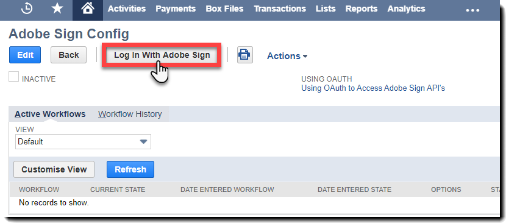
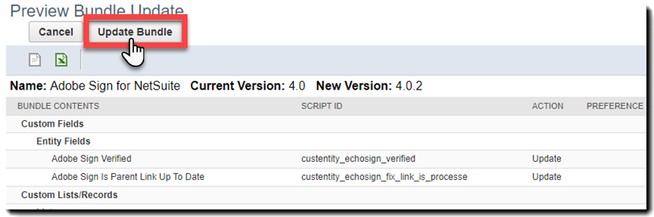

# [!DNL NetSuite] Installations- und Anpassungshandbuch (Version 4.0.4) {#install-customize-NetSuite}

## Übersicht {#overview}

Adobe Sign für [!DNL NetSuite] bietet eine vollständige eSignature-Integration mit [!DNL NetSuite]. Sie können Adobe Sign für [!DNL NetSuite] Integration, um Vereinbarungen wie Verträge, Angebote und andere Dokumente, für die elektronische Signaturen erforderlich sind, direkt von [!DNL NetSuite]. Sie können Adobe Sign-Verträge von Kunden, Leads, Angeboten und anderen erstellen und senden [!DNL NetSuite] Datensätze. Adobe Sign-Updates [!DNL NetSuite] mit dem Status von Vereinbarungen und speichert die Vereinbarungen mit dem zugehörigen [!DNL NetSuite] Datensätze, sobald sie vollständig ausgeführt wurden. Sie können den Verlauf aller Vereinbarungen anzeigen, die von [!DNL NetSuite] aus dem Produkt.

Weitere Informationen finden Sie unter [Adobe Sign für [!DNL NetSuite] Versionshinweise](https://experienceleague.adobe.com/docs/sign-integrations/using/netsuite/release-notes.html?lang=en) für weitere Informationen.

## Bundle installieren und OAuth konfigurieren {#install}

Nur ein [!DNL NetSuite] Administrator kann das Bundle installieren oder aktualisieren. Um OAuth zu konfigurieren, [!DNL NetSuite] Administrator muss Administratorzugriff auf Adobe Sign haben. Bevor Sie das Bundle in Ihrem Produktionskonto installieren, sollten Sie das Bundle in einem [!DNL NetSuite] Sandbox-Konto.

Siehe [Adobe Sign-Abkommen erstellen](#createagreement) für weitere Informationen zu Testen.

>[!CAUTION]
>
>Kunden, die auf Version 4.0.4 aktualisieren, sollten ihren vorhandenen API-Schlüssel NICHT entfernen.
>
>Siehe [Benutzerdefinierte Voreinstellungen festlegen](#configure) für weitere Informationen zur Verwendung des API-Schlüssels.

### Bundle zum ersten Mal installieren

1. Navigieren Sie zu [!UICONTROL **Anpassung > SuiteBundler > Pakete suchen und installieren**].

1. Auf der *Pakete suchen und installieren* Seite, geben Sie **Adobe Sign** als Schlüsselwort und wählen Sie **[!UICONTROL Suchen]**.

1. Wählen Sie das **Adobe Sign** Bundle-Name.

   

1. Auf der *[!UICONTROL Bündeldetails]* Seite, wählen Sie **[!UICONTROL Installieren]**.
1. In der *[!UICONTROL Vorschau der Bundle-Installation]* Seite, wählen Sie **[!UICONTROL Paket installieren]**.

   (Die Standardwerte auf der Seite müssen nicht geändert werden.)

   

1. Wählen Sie im angezeigten Dialogfeld Installieren die Option **[!UICONTROL OK]** um fortzufahren.

   Während des Installationsvorgangs wird der Status des Pakets als *[!UICONTROL Ausstehend]* angezeigt.

   

1. Um einen aktualisierten Status anzuzeigen, wählen Sie **[!UICONTROL Aktualisieren]**.

   Nach Abschluss der Paketinstallation wird *Adobe Sign für[!DNL NetSuite]* auf der Seite *[!UICONTROL Installierte Pakete]* angezeigt.

   

1. Wenn Sie bereits ein Adobe Sign-Kundenkonto haben, führen Sie die folgenden Schritte aus:  [OAuth nach der Installation oder Aktualisierung konfigurieren](#oauth).

   Wenn Sie kein Adobe Sign-Konto haben, können Sie [Für eine Unternehmenstestversion registrieren](https://esign.adobe.com/adobe-sign-[!DNL NetSuite]-trial-registration.html), um das System zu testen. Führen Sie die Online-Registrierungsschritte aus, um Ihr Adobe Sign-Konto zu aktivieren.

## OAuth nach der Installation oder Aktualisierung konfigurieren {#oauth}

Adobe Sign verwendet OAuth 2.0 zur Authentifizierung Ihres Adobe Sign-Kontos in [!DNL NetSuite].

Dieses Protokoll autorisiert Ihre installierte [!DNL NetSuite] Bundle, um mit Adobe Sign zu kommunizieren, ohne Ihr Kennwort anzufordern. Da vertrauliche Informationen nicht direkt zwischen den Anwendungen ausgetauscht werden, ist die Wahrscheinlichkeit geringer, dass Ihr Konto unerlaubt benutzt wird.

Diese Authentifizierung wirkt sich nicht auf Ihre Implementierung aus, Sie müssen jedoch nach der Installation oder Aktualisierung des Bundles in Ihrem Produktions- oder Sandbox-Konto eine einmalige Konfiguration durchführen.

Die [!DNL NetSuite] -Administrator, der OAuth konfiguriert, muss auch über Administratorzugriff auf Kontoebene für Adobe Sign verfügen.

1. In [!DNL NetSuite], navigieren Sie zum *Adobe Sign Config* Listenseite.

1. Suchen nach **[!UICONTROL Adobe Sign Config]** (ein benutzerdefinierter Datensatztyp) mithilfe des Suchfelds in der Kopfzeile.

1. Wählen Sie auf der Seite &quot;Suchergebnisse&quot;die Option **Ansicht** für die *Adobe Sign Config* aufzeichnen.

   .

1. Wählen Sie auf der Seite Adobe Sign Config List die Option **[!UICONTROL Ansicht]** für die *Verwenden von OAuth für den Zugriff auf Adobe Sign-APIs* aufzeichnen.

   

1. Wählen Sie auf der Seite Adobe Sign Config die Option **[!UICONTROL Bei Adobe Sign anmelden]**

   

1. Geben Sie auf der angezeigten Adobe Sign-Anmeldeseite Ihre Anmeldeinformationen ein und wählen Sie **[!UICONTROL Anmelden]**.

   

1. Wählen Sie auf der angezeigten Seite Zugriff bestätigen (für OAuth) die Option **[!UICONTROL Zugriff zulassen]**

   

1. Wenn die Autorisierung abgeschlossen ist, werden Sie zurück zur Adobe Sign-Konfigurationsseite in [!DNL NetSuite], wie unten gezeigt.

   

   >[!NOTE]
   >
   >Wenn Sie OAuth in Ihrem Sandbox-Konto konfigurieren, wird nach Abschluss der Autorisierung möglicherweise der Fehler &quot;Kunden-Comp-ID konnte nicht ermittelt werden&quot;angezeigt.
   >
   >
   >Um fortzufahren, müssen Sie den Teil der Kontodomäne der URL (System) ändern.[!DNL NetSuite].com) in Ihrem Browser, um auf die [!DNL NetSuite] Sandbox wie folgt:
   >
   >
   >Ändern:
   >
   >
   >system.[!DNL NetSuite].com/app/site/hosting/scriptlet.nl?script=745&amp;deploy=1&amp;web_access_point=https://echosign.com
   >
   >
   >An:
   >
   >
   >System.**sandbox.**[!DNL NetSuite].com/app/site/hosting/scriptlet.nl?script=745&amp;deploy=1&amp;web_access_point=https://echosign.com

## Bundle aktualisieren (vorhandene Benutzer)

[!DNL NetSuite] Bundle-Updates werden regelmäßig von der Adobe veröffentlicht. Benutzer der Adobe Sign für [!DNL NetSuite] kann auf das neueste Bundle aktualisiert werden.

>[!CAUTION]
>
>Kunden, die auf eine neuere Version aktualisieren, sollten ihren vorhandenen API-Schlüssel NICHT entfernen.
>
>Weitere Informationen zur Verwendung des API-Schlüssels finden Sie unter [Festlegen benutzerdefinierter Voreinstellungen](#configure).

### Voraussetzungen {#prerequisites}

Die Zeit, die zum Aktualisieren auf das Paket Version 4.0.4 benötigt wird, hängt von der Anzahl der Vereinbarungen ab, die derzeit den Status &quot;Zur Signatur versandt&quot;haben. In der Regel dauert es 7 bis 10 Minuten, um 100 Vereinbarungen zu aktualisieren. Notieren Sie sich die Anzahl der Datensätze, um die Aktualisierungsdauer abzuschätzen.

So bestimmen Sie die Anzahl der Vereinbarungen, die zur Signatur gesendet werden:

1. Navigieren Sie zu **[!UICONTROL Customization > Lists, Records, and Files > Record Types]** und suchen Sie dann *Adobe Sign-Abkommen.*

   Oder suchen Sie in der Suchleiste nach Adobe Sign-Vereinbarungen.

1. Für die [!UICONTROL Adobe Sign-Abkommen] aufzeichnen, wählen Sie **[!UICONTROL Suchen]**.

   

1. Aus dem **[!UICONTROL Status]** wählen Sie **[!UICONTROL Zur Signatur versandt]** und wählen Sie dann **[!UICONTROL Senden]**.

   

   Notieren Sie sich die Anzahl der Datensätze, um die Aktualisierungsdauer abzuschätzen.

   

### Bundle aktualisieren {#updating-the-bundle}

1. Navigieren Sie zu **[!UICONTROL Customization > SuiteBundler > Search &amp; Install > List]** und finden Sie Ihr aktuelles Bundle, wie unten gezeigt.

   >[!NOTE]
   >
   >Wenn eine neue Version des Bundles vorhanden ist, wird rechts neben dem *Version* Nummer Ihres aktuellen Bundles.

1. Wählen Sie im Dropdown-Menü Aktion die Option **[!UICONTROL Aktualisieren]**.

   

1. Wählen Sie auf der Seite &quot;Aktualisierung des Vorschaupakets&quot;die Option **[!UICONTROL Paket aktualisieren]** ohne die auf der Seite angezeigten Standardwerte zu ändern.

   Während der Installation wird der Status des Bundles als *Ausstehend*.

   .

   >[!NOTE]
   >
   >Beim Aktualisieren des Bundles erhalten Sie möglicherweise eine Warnmeldung, wie unten dargestellt. Wenn Sie Ihre [!DNL NetSuite] e-Signaturdatensätze, können Sie fortfahren. Wenn Sie sich nicht sicher sind, sollten Sie das Bundle auf einem Sandbox-Konto installieren, um es zunächst zu testen, bevor Sie das Bundle in einem Produktionskonto aktualisieren.

   

1. Um einen aktualisierten Status anzuzeigen, wählen Sie **[!UICONTROL Aktualisieren]**.

   

   >[!NOTE]
   >
   >Wenn das Update aufgrund mehrerer Vereinbarungen mit einem *Zur Signatur versandt* können Sie die **[!UICONTROL Ausführungsprotokoll]** Unterregisterkarte für die *Adobe Sign Bundle-Installation* , um den Fortschritt der Aktualisierung zu ermitteln. Siehe [Bestimmen des Aktualisierungsfortschritts](#determineprogress) für weitere Informationen.

   Nach Abschluss der Paketaktualisierung wird *Adobe Sign für[!DNL NetSuite]* auf der Seite *Installierte Pakete* angezeigt.

   

## Bundle konfigurieren {#configure}

### Benutzerdefinierte Voreinstellungen festlegen  {#set-custom-preferences}

Sie können benutzerdefinierte Voreinstellungen verwenden, um festzulegen, wie Vereinbarungen erstellt und gespeichert werden in [!DNL NetSuite]. Darüber hinaus *Benutzer automatisch bereitstellen in Adobe Sign* können Sie angeben, ob [!DNL NetSuite] Benutzer werden automatisch in Sign-Dienste bereitgestellt, wenn sie Vereinbarungen von [!DNL NetSuite].

1. Navigieren Sie zu **[!UICONTROL Einrichtung > Unternehmen > Allgemeine Voreinstellungen]**.
1. Scrollen Sie auf der Seite nach unten und wählen Sie dann die **[!UICONTROL Benutzerdefinierte Voreinstellungen]** Unterregisterkarte.

   

1. Aktivieren und konfigurieren Sie Ihre Adobe Sign-Voreinstellungen nach Bedarf:

   * **EchoSign-API-Schlüssel für Ihr Konto eingeben**: Fügen Sie in diesem Feld keinen Wert hinzu oder bearbeiten Sie ihn.
   * **Übergeordnete Datensatzkontakte als Unterzeichner verwenden**: Wenn diese Option aktiviert ist, wird der übergeordnete Datensatz-Kontakt beim Erstellen von Vereinbarungen standardmäßig als erster Unterzeichner verwendet. Der Absender kann vor dem Senden einfach den Standardunterzeichner entfernen oder bearbeiten oder zusätzliche Unterzeichner zur Vereinbarung hinzufügen.
   * **Transaktionskontakt Als Unterzeichner kontaktieren, falls vorhanden**: Diese Voreinstellung ist nur gültig, wenn die Option *Übergeordnete Datensatzkontakte als Unterzeichner verwenden* ist ebenfalls aktiviert. Wenn diese Option aktiviert ist, wird beim Generieren einer Vereinbarung aus einem Transaktionsdatensatz (z. B. Angebot) der primäre Transaktionskontakt als erster Unterzeichner standardmäßig verwendet. Weitere Informationen finden Sie unter [Transaktionsdatensätze. ](#transrecords) Wenn kein primärer Transaktionskontakt vorhanden ist oder wenn vom [!DNL NetSuite] Objektdatensatz (z. B. Kundendatensatz, Partnerdatensatz), ist der Standardempfänger der primäre Kontakt für die Kunden-E-Mail. Der Absender kann vor dem Senden einfach den Standardunterzeichner entfernen oder bearbeiten oder zusätzliche Unterzeichner zur Vereinbarung hinzufügen.
   * **Markierung von Empfängern als Genehmiger zulassen**: Wenn aktiviert, können Absender Empfänger als Genehmiger markieren. Als Genehmiger markierte Empfänger können Vereinbarungen überprüfen und genehmigen, müssen sie jedoch nicht unterschreiben. Während des Genehmigungsprozesses müssen Genehmiger möglicherweise Daten in Felder eingeben.
   * **Bevorzugte Vereinbarungsordner-ID**: Wird verwendet, um den Ordner anzugeben, in dem die endgültigen signierten Vereinbarungen gespeichert werden. Wenn Sie keinen Wert für dieses Feld festlegen, werden die endgültig unterzeichneten Vereinbarungen standardmäßig im selben Ordner wie die ursprüngliche Dokumentdatei gespeichert. Die Ordner-ID muss eine Zahl sein.
   * **PDF &quot;Transaktion automatisch anhängen&quot;**: Wenn diese Option aktiviert ist, werden Transaktions-PDF automatisch an Vereinbarungen angehängt, wenn neue Vereinbarungen aus Transaktionsdatensätzen erstellt werden.
   * **Signierte PDF als hinzufügen (Anhang oder Link)**: Wenn *Liste* in der Dropdown-Liste ausgewählt ist, wird die signierte PDF automatisch als Hyperlink zur Datei hinzugefügt. Wenn im Dropdown-Menü *Anhang* &quot; ausgewählt wird, wird die signierte PDF-Datei in als Anhang zum Vereinbarungsdatensatz gespeichert.[!DNL NetSuite]
   * **Audit-Protokoll-PDF mit Vereinbarung einschließen**: Wenn diese Option aktiviert ist, werden PDF des Prüfprotokolls automatisch an Vereinbarungsdatensätze angehängt, nachdem die Vereinbarungen signiert wurden.
   * **Die Methode zur Identitätsbestätigung gilt für**: Wenn Sie eine der Methoden zur Identitätsüberprüfung aktivieren, wird festgelegt, auf wen die Methode zur Identitätsbestätigung angewendet wird. Die Optionen sind *Alle Unterzeichner, nur externe Unterzeichner* oder *Nur interne Unterzeichner*.

   **Identitätsbestätigungsmethoden** {#identity-verification-methods}

   Beim Erstellen einer Vereinbarung können Sie eine oder mehrere Identitätsbestätigungsmethoden auswählen. Wenn hier mehrere Methoden zur Identitätsprüfung aktiviert sind, wird auf der Seite &quot;Adobe Sign Agreement&quot;ein **[!UICONTROL Unterzeichneridentität bestätigen]** Option.

   * **Kennwort zum Unterschreiben aktivieren**: Unterzeichner müssen ein einmaliges Kennwort eingeben, das Sie angeben.

   * **Wissensbasierte Authentifizierung aktivieren**: Unterzeichner auffordern, ihren Namen, ihre Adresse und optional die letzten vier Stellen ihres SSN anzugeben und dann eine Liste von Fragen zu beantworten, in denen die von ihnen bereitgestellten Informationen überprüft werden. Nur in den USA erhältlich.

   * **Webidentitätsauthentifizierung aktivieren**: Unterzeichner auffordern, ihre Identität zu bestätigen, indem Sie sich bei einer der folgenden Websites anmelden: Facebook, Google, LinkedIn, Microsoft Live, Twitter oder Yahoo!..

   * **Benutzer automatisch bereitstellen in Adobe Sign**: Wenn aktiviert, Benutzer, die Vereinbarungen senden [!DNL NetSuite] automatisch mit einem Adobe Sign-Benutzerkonto bereitgestellt werden.

1. Auswählen **[!UICONTROL Speichern]** , um Ihre Voreinstellungen zu speichern.

## Automatische Statusaktualisierungen konfigurieren {#asu}

Mit dem Adobe Sign Integrations-Bundle können Sie automatisch Updates in der [!DNL NetSuite] über den Status der Vereinbarungen, die von [!DNL NetSuite]. Wenn diese Funktion aktiviert ist, [!DNL NetSuite] immer den Status Ihrer Vereinbarungen widerspiegelt. Sie können automatische Statusaktualisierungen wie folgt aktivieren:

1. Navigieren Sie zu **[!UICONTROL Einrichtung > Unternehmen > Funktionen aktivieren].**
1. Wählen Sie das **[!UICONTROL SuiteCloud]** Unterregisterkarte.
1. Aktivieren Sie die folgenden Optionen:

   * Aktivieren Sie im Abschnitt SuiteBuilder die Option **[!UICONTROL Benutzerdefinierte Datensätze]**.

   * Aktivieren Sie im Abschnitt SuiteScript die Optionen **[!UICONTROL Client SuiteScript]** und **[!UICONTROL Server SuiteScript]** und stimmen Sie den Nutzungsbedingungen für beide zu.

1. Auswählen **[!UICONTROL Speichern]**.

   Ihre Optionen werden wie im Bild angezeigt festgelegt.

   

## Objekte und Datensatztypen {#objects}

Das Adobe Sign-Integrationspaket stellt bereits das Adobe Sign Agreement-Objekt mit vielen Standardwerten zur Verfügung [!DNL NetSuite] Objekte, einschließlich: Datensätze zu Kunden, Schätzungen, Lead, Opportunity und Partnern. Sie können das Adobe Sign-Paket auch mit anderen Datensatztypen verwenden, einschließlich benutzerdefinierter Datensätze.

Die Registerkarte &quot;Vereinbarung&quot;kann mit zwei Arten von [!DNL NetSuite] Datensätze: Entitäts- und Transaktionsdatensätze. In der Regel wird davon ausgegangen, dass ein Transaktionsdatensatz ein Datensatz (z. B. ein Angebot) ist, der in ein PDF-Dokument konvertiert werden kann. während ein Entitätsdatensatz nicht in eine PDF konvertiert werden kann.

## Transaktionsdatensätze {#transrecords}

Wenn die Vereinbarung aus einem Transaktionsdatensatz erstellt wird, ist das erste Dokument im Vereinbarungsdatensatz die PDF-Version des Datensatzes, aus dem sie stammt, und der erste Empfänger ist die E-Mail-Adresse des Datensatzes. Wenn das erste Dokument keine PDF-Version des Datensatzes sein soll, aus dem es stammt, gehen Sie zu **[!UICONTROL Setup > Unternehmen > Allgemeine Voreinstellungen > Unterregisterkarte Benutzerdefinierte Voreinstellungen]** und deaktivieren Sie die **[!UICONTROL PDF &quot;Transaktion automatisch anhängen&quot;]** Option. Siehe [Festlegen benutzerdefinierter Voreinstellungen](#configure) für weitere Informationen.

Unter „Benutzerdefinierte Voreinstellungen“ können Sie auch die Voreinstellung **[!UICONTROL Transaktionskontakt als ersten Unterzeichner verwenden]** aktivieren, wenn Sie möchten, dass der primäre Transaktionskontakt automatisch als erster Unterzeichner hinzugefügt wird. Wenn sie einem Transaktionsdatensatz zugeordnet sind, wird der **[!UICONTROL Vereinbarungen]** und **[!UICONTROL Send for Signature]** Schaltflächen.

## Entitätsdatensätze {#entity-records}

Wenn die Vereinbarung aus einem Entitätsdatensatz erstellt wird, ist der erste Empfänger die E-Mail-Adresse aus dem Datensatz. Bei einer Zuordnung zu einem Entitätsdatensatz wird nur die Registerkarte „Vereinbarungen“ angezeigt.

## Bundle anpassen {#customize}

Das Anpassen des Pakets umfasst Folgendes:

* Bereitstellen der Skripte für die Unterregisterkarte Vereinbarungen und die Schaltfläche Zur Signatur senden für die entsprechenden Datensatztypen
* Festlegen von Rollenberechtigungen für Ihre Adobe Sign-Datensatztypen
* Ändern der Berechtigungen zum Erteilen des Zugriffs auf die Unterregisterkarte *Vereinbarungen* und die Schaltfläche *Zur Signatur senden*.

### Adobe Sign-Vereinbarungen für zusätzliche Datensatztypen konfigurieren  {#configuring-adobe-sign-agreements-for-additional-record-types}

So stellen Sie *Vereinbarungen* und der *Send for Signature* für die entsprechenden Datensatztypen:

1. Navigieren Sie zu **[!UICONTROL Anpassung > Skripterstellung > Skripte].**

1. Auf der *Skripts* wird die Seite mit der Liste angezeigt, suchen Sie das Skript, das Sie bereitstellen müssen, und wählen Sie ****[!UICONTROL Ansicht]****.

   * Um *Send for Signature* wählen Sie **[!UICONTROL Schaltfläche &quot;Adobe Sign Schätzung&quot;]** Skript.

   * Um *Vereinbarungen* wählen Sie **[!UICONTROL Adobe Sign Agreement Loader]** Skript.

1. Wählen Sie auf der Seite &quot;Skript&quot;die Option **[!UICONTROL Skript bereitstellen]**.

   

1. Führen Sie auf der Seite Skriptbereitstellung die folgenden Schritte aus:

   * Wählen Sie in der Liste *Anwenden auf* den Datensatztyp aus.
   * Geben Sie optional die ID der Skriptbereitstellung ein.

      Weitere Informationen finden Sie unter *Erstellen einer benutzerdefinierten Bereitstellungs-ID für Skripts* im [!DNL NetSuite] Help Center für weitere Informationen. Wenn Sie keine ID eingeben, wird eine generiert.

   * Aktivieren Sie das Kontrollkästchen **[!UICONTROL Bereitgestellt]**.

   

   * Setzen Sie den *Status* auf **[!UICONTROL Freigegeben]**.

      Sie müssen keine *Ereignistyp* oder *Protokollebene*.

   * Aus dem [!UICONTROL *Als Rolle ausführen]* Dropdown, wählen Sie **[!UICONTROL Als Administrator ausführen]**.

   * Mit dem **[!UICONTROL Zielgruppe]** -Unterregisterkarte aktiv (standardmäßig aktiv) auswählen, welche Rollen oder Benutzer Sie Zugriff gewähren möchten. Wenn Sie allen Rollen und Benutzern Zugriff gewähren möchten, aktivieren Sie die die entsprechende Option **[!UICONTROL Alle auswählen]**.

   * Auswählen **[!UICONTROL Speichern]**. Wenn die Änderungsbestätigung angezeigt wird, wählen Sie **[!UICONTROL Zurück]**.

1. auswählen **[!UICONTROL Liste]** am oberen Rand der Seite &quot;Skripterstellung&quot;, um zum *Skripts* Listenseite.
1. Wiederholen Sie die Schritte 2 und 3 oben für das andere Skript.

## Festlegen von Rollenberechtigungen für Adobe Sign-Datensatztypen {#setting-role-permissions-for-adobe-sign-record-types}

Am [!DNL NetSuite] sollte die Berechtigung haben, Adobe Sign ohne zusätzliche Anpassung zu verwenden. Sie müssen jedoch möglicherweise Berechtigungen für alle zusätzlichen benutzerdefinierten Rollen gewähren, die erstellt wurden.

1. Navigieren Sie zu **[!UICONTROL Anpassung > Listen, Datensätze und Dateien > Datensatztypen]**.

   

   >[!NOTE]
   >
   >Wenn das Element *Datensatztypen* nicht angezeigt wird, navigieren Sie zu **[!UICONTROL Einrichtung > Unternehmen > Funktionen aktivieren > Registerkarte „Suite Cloud“]** und aktivieren Sie die Option *Benutzerdefinierte Datensätze*.

1. Auf der *Datensatztypen* Seite, wählen Sie **[!UICONTROL Adobe Sign-Abkommen]** um sie auszuwählen

   

1. Auf der *Benutzerdefinierter Datensatztyp* Seite, wählen Sie **[!UICONTROL Berechtigungsliste verwenden]** aus dem *Zugriffstyp* Dropdown-Liste.

   

   >[!NOTE]
   >
   >Der Datensatztyp *Adobe Sign-Vereinbarung* ist der einzige Adobe Sign-Datensatztyp, für den der Zugriffstyp *Berechtigungsliste verwenden* erforderlich ist.
   >
   >
   >Anweisungen zum Festlegen des Zugriffstyps für die anderen Adobe Sign-Datensatztypen finden Sie in Schritt 6.

1. Wählen Sie das **[!UICONTROL Berechtigungen]** Unterregisterkarte.

   Die Liste der Rollen und Berechtigungen wird angezeigt.

   

1. Legen Sie die Berechtigungen wie folgt für die zusätzlichen benutzerdefinierten Rollen fest, die dem &quot;[!UICONTROL Adobe Sign-Abkommen]&quot; Datensatz-Typ.

   >[!NOTE]
   >
   >Siehe *[Einrichten einer Berechtigungsliste für einen benutzerdefinierten Datensatztyp](https://system.[!DNL NetSuite].com/app/help/helpcenter.nl?fid=section_N2879931.html)* im [!DNL NetSuite] Help Center für weitere Informationen

   1. Wählen Sie die Rolle aus der Liste *Rolle* aus.
   1. Festlegen *Ebene* bis **[!UICONTROL Voll]**.
   1. Festlegen *Standardformular* bis **[!UICONTROL Benutzerdefiniertes EchoSign-Vereinbarungsformular]**.
   1. Auswählen **[!UICONTROL Formular beschränken]** aktivieren.
   1. Auswählen **[!UICONTROL Hinzufügen]** , um die Änderungen für die Rollenzeile zu speichern.

   

   Die neue Zeile wird wie folgt angezeigt:

   

   Wiederholen Sie die Schritte a bis e oben für alle zusätzlichen benutzerdefinierten Rollen.

   * auswählen **[!UICONTROL Speichern]** zu *Benutzerdefinierter Datensatztyp* Seite, wenn Berechtigungen für alle Rollen festgelegt wurden.
   Die *[!UICONTROL Kundendatensatz-Typ]* wird erneut angezeigt.

1. Wiederholen Sie die Schritte 1 bis 3 oben, um den *Zugriffstyp* für alle anderen Adobe Sign-Datensatztypen auf

   **[!UICONTROL Keine Berechtigung erforderlich].** festzulegen. Dies gilt für die folgenden Datensatztypen:

   * Adobe Sign Config
   * Adobe Sign-Dokument
   * Adobe Sign Event
   * Adobe Sign Language
   * Adobe Sign Script Errors
   * Adobe Sign Signed Agreement
   * Adobe Sign Signer

### Zugriff auf die Registerkarte &quot;Vereinbarung&quot;und die Schaltfläche &quot;Send for Signature&quot;gewähren  {#granting-access-to-the-agreement-tab-and-send-for-signature-button}

Das Adobe Sign-Integrationspaket stellt bereits das Adobe Sign Agreement-Objekt mit vielen Standardwerten zur Verfügung [!DNL NetSuite] Objekte (Kunde, Schätzung [Angebot], Lead und mehr). Die Unterregisterkarte *Vereinbarung* wird automatisch für die folgenden Objekttypen aktiviert: Kunde, Lead, Vertriebschance, Partner, Interessent, Angebot und Lieferantenrechnung.

Die *[!UICONTROL Send for Signature]* ist automatisch aktiviert **o[!UICONTROL Nur für das Angebotsobjekt]**.

[!DNL NetSuite] Administratoren können die Möglichkeit zum Erstellen von Vereinbarungen auf zusätzliche CRM-Objekte erweitern, indem sie Berechtigungen ändern, um die *Vereinbarung* Unterregisterkarte, *Send for Signature* oder beide auf diese Objekte anwenden.

#### Ändern von Berechtigungen, um Zugriff auf die Schaltfläche „Zur Signatur senden“ zu gewähren  {#modifying-permissions-to-grant-access-to-the-send-for-signature-button}

1. Navigieren Sie zu **[!UICONTROL Anpassung > Skripterstellung > Skripte]**.

   Die Seite mit der Liste der *Skripte* wird angezeigt.

   * Verwenden Sie bei Bedarf die Filter, um die Adobe Sign-Skripte zu finden

1. Auf der *Skripts* finden Sie die *Schaltfläche &quot;Adobe Sign Schätzung&quot;* Skript (steuert die *Send for Signature* und wählen Sie **Ansicht**.

   

1. Führen Sie auf der Seite *Skript* die folgenden Schritte aus:

   * wählen Sie **[!UICONTROL Bereitstellungen]** Unterregisterkarte

   * Unter &quot;*Gilt für* Wählen Sie den Link für die Entität aus, die Sie ändern möchten.

      * In diesem Beispiel ist das **[!UICONTROL Angebot]**.

   

   * wählen Sie **[!UICONTROL Bearbeiten]** auf der *Skripterstellung* Seite

   

   * Mit dem **[!UICONTROL Zielgruppe]** -Unterregisterkarte aktiv auswählen, wählen Sie die spezifischen Rollen oder Benutzer aus, auf die Sie Zugriff gewähren möchten.

      * Wenn Sie allen Rollen und Benutzern Zugriff gewähren möchten, aktivieren Sie die die entsprechende Option **[!UICONTROL Alle auswählen]**.
   * auswählen **[!UICONTROL Speichern]**

   

#### Ändern von Berechtigungen, um Zugriff auf die Registerkarte „Vereinbarungen“ zu gewähren  {#modifying-permissions-to-grant-access-to-the-agreements-tab}

1. Navigieren Sie zu **[!UICONTROL Anpassung > Skripterstellung > Skripte]**
1. Auf der [!UICONTROL Skripts] finden Sie die *[!UICONTROL Adobe Sign Agreement Loader]* Skript (steuert die *Registerkarte &quot;Vereinbarungen&quot;*) und wählen Sie dann **[!UICONTROL Ansicht]**.
1. Führen Sie auf der Seite *Skript* die folgenden Schritte aus:

   1. Wählen Sie das **[!UICONTROL Bereitstellungen]** Unterregisterkarte
   1. Unter &quot;*[!UICONTROL Gilt für]*&quot; wählen Sie den Link für die Entität aus, für die Sie den Zugriff ändern möchten
   1. Auf der *[!UICONTROL Skripterstellung]* wählen Sie die **[!UICONTROL Bearbeiten]** Schaltfläche
   1. Wählen Sie bei aktiver Unterregisterkarte **[!UICONTROL Zielgruppe]** (diese Registerkarte ist standardmäßig aktiv) die spezifischen Rollen oder Benutzer aus, denen Sie Zugriff gewähren möchten. Wenn Sie allen Rollen und Benutzern Zugriff gewähren möchten, aktivieren Sie die die entsprechende Option **[!UICONTROL Alle auswählen]**.
   1. auswählen **[!UICONTROL Speichern]**

## Verwenden der Adobe Sign für [!DNL NetSuite] Bundle

Um Vereinbarungen aus [!DNL NetSuite] und Updates für diese Vereinbarungen erhalten, müssen Benutzer dieselbe Anmelde-ID (E-Mail-Adresse) in [!DNL NetSuite] und in Adobe Sign.

### Erstellen einer Adobe Sign-Vereinbarung

Nach der Installation eines neuen Pakets in einem Sandbox- oder Produktionskonto sollten Sie das Paket testen, indem Sie eine neue Vereinbarung erstellen. Sie können Adobe Sign-Vereinbarungen aus einem Entitätsdatensatz, aus einem Transaktionsdatensatz oder als eigenständige Vereinbarung erstellen.

>[!NOTE]
>
>Der Vorgang zum Erstellen einer Vereinbarung unterscheidet sich je nach Erstellungsart leicht. Der allgemeine Prozess umfasst die Festlegung der Optionen für Ihre Vereinbarung, das Hinzufügen eines oder mehrerer Vereinbarungsdokumente und die Angabe der Empfänger. Bei dem unten beschriebenen Prozess wird unterstellt, dass Sie die Vereinbarung aus einem Kundendatensatz erstellen.

1. Wählen oder erstellen Sie einen Kundendatensatz aus, aus dem Sie einen Vertrag senden möchten, oder wählen Sie einen anderen [!DNL NetSuite] Datensatztyp, für den die Registerkarte Vereinbarungen aktiviert ist.

1. Wählen Sie im Datensatz die **[!UICONTROL Vereinbarungen]** Unterregisterkarte.
1. Auswählen **[!UICONTROL Neue Vereinbarung]**.

   

1. Auf der *[!UICONTROL Adobe Sign-Abkommen]* Seite, wählen Sie **[!UICONTROL Bearbeiten]**.

   

1. Legen Sie die Optionen für Ihre Vereinbarung wie folgt fest:

   * **Vereinbarungsname** — Geben Sie einen Namen für die Vereinbarung ein.
   * **Nachricht**-Geben Sie eine benutzerdefinierte Nachricht für den Empfänger ein.
   * **Signaturtyp**: Wählen Sie den Signaturtyp aus, der für das Dokument akzeptiert wird. Die Optionen sind *e-Signatur* und *Faxsignatur*.

   * **Ich muss diese Vereinbarung auch signieren** — Aktivieren Sie diese Option, um anzugeben, dass der Absender die Vereinbarung ebenfalls signieren muss.
   * **Signaturreihenfolge**-Wenn das *Ich muss diese Vereinbarung auch signieren* aktiviert ist, wählen Sie die Reihenfolge aus, in der der Absender und die Empfänger signieren sollen. Die Optionen sind „Ich unterzeichne zuerst, dann die Empfänger“ „Empfänger unterzeichnen zuerst, dann ich“ und „Keine“.

   * **Vorschau des Dokuments anzeigen oder Signaturen positionieren (oder Formularfelder)** — Aktivieren Sie diese Option, um Absendern zu erlauben, eine Vorschau der Vereinbarung anzuzeigen und ihnen zu erlauben, Felder (Unterschrift per Drag &amp; Drop, Initialfelder und andere Formularfelder) zur Vereinbarung hinzuzufügen, bevor sie an Empfänger gesendet werden.
   * **Unterzeichneridentität bestätigen** — Aktivieren Sie diese Option und wählen Sie dann eine der folgenden Optionen zur Identitätsverifizierung aus:

      * Diese Option wird nur angezeigt, wenn mehr als eine der drei unten aufgeführten Methoden zur Bestätigung der Unterzeichneridentität in den benutzerdefinierten Voreinstellungen aktiviert ist. (Siehe [Benutzerdefinierte Voreinstellungen festlegen](#customize) für weitere Informationen.) Wenn nur eine Voreinstellung aktiviert ist, wird die Option **[!UICONTROL Identität des Unterzeichners bestätigen]** nicht angezeigt.

   **Identitätsbestätigungsmethoden**

   * **Zum Unterschreiben Kennwort erforderlich** — Unterzeichner müssen ein einmaliges Kennwort eingeben, das Sie angeben.
   * **Wissensbasierte Authentifizierung** — Unterzeichner auffordern, ihren Namen, ihre Adresse und optional die letzten vier Stellen ihres SSN anzugeben und dann eine Liste von Fragen zu beantworten, in denen die von ihnen bereitgestellten Informationen überprüft werden. Nur in den USA erhältlich.
   * **Webidentitätsauthentifizierung** — Unterzeichner auffordern, ihre Identität zu bestätigen, indem Sie sich bei einer der folgenden Websites anmelden: Facebook, Google, LinkedIn, Twitter, Yahoo! oder Microsoft Live.
   * **Zum Anzeigen der PDF ist ein Kennwort erforderlich** — Aktivieren Sie diese Option, um festzulegen, dass ein Empfänger ein Kennwort eingeben muss, bevor eine PDF der Vereinbarung oder der signierten Vereinbarung geöffnet wird. Die PDF-Datei, die an alle gesendet wird, ist verschlüsselt und erfordert das Kennwort zum Öffnen. Verlieren Sie Ihr Kennwort nicht, denn es kann nicht wiederhergestellt werden. Wenn Sie das Kennwort verlieren, müssen Sie diese Transaktion löschen und erneut beginnen.
   * **Kennwort bestätigen/Kennwort bestätigen** — Wenn das *Zum Anzeigen der PDF ist ein Kennwort erforderlich* aktiviert ist, geben Sie das Kennwort ein, das zum Anzeigen der Vereinbarung verwendet werden soll.
   * **Empfänger zum Signieren erinnern** — Geben Sie an, ob und wie oft Erinnerungen an Empfänger gesendet werden. Die Optionen sind *Nie*, *Täglich* oder *Wöchentlich*.
   * **Sprache:** Geben Sie die Sprache an, in der die Signaturseite und E-Mail-Benachrichtigungen den Empfängern angezeigt werden.
   * **Hostsignatur für den ersten Unterzeichner** — Aktivieren Sie diese Option, um dem Absenderhost die persönliche Signatur für den ersten Unterzeichner zu erlauben.
   * **Tage bis Signaturfrist** — Geben Sie eine ganze Zahl ein, um die Frist für die Unterzeichnung des Vertrags anzugeben (Datum + Anzahl der Tage am heutigen Tag).
   * **Übergeordneter Datensatz** — Wählen Sie optional einen übergeordneten Datensatz aus, um ihn mit der Vereinbarung zu verknüpfen.

   

1. Wählen Sie das **[!UICONTROL Dokumente]** angezeigt.

   

1. Auf der *Dokumente* Unterregisterkarte ein vorhandenes Dokument aus der Dateikabine anhängen, indem Sie das *Adobe Sign-Dokument* und wählen Sie **[!UICONTROL Anhängen]**.

   Oder klicken Sie auf **[!UICONTROL Neues Adobe Sign-Dokument]** um auf die *[!UICONTROL Adobe Sign-Dokument]* und geben Sie dann den Namen eines Dokuments in Ihrem [!DNL NetSuite] , wählen Sie Dateien aus Ihrem Transaktionsdatensatz (falls zutreffend) oder hängen Sie ein neues Dokument an.

   Sie können einer Vereinbarung mehrere Dokumente hinzufügen.

1. Auswählen **[!UICONTROL Empfänger]** und geben Sie den Empfänger an, indem Sie ihn entweder aus der Kontaktliste auswählen oder eine E-Mail-Adresse eingeben.

   

   Jeder Ihrer Empfänger kann als Unterzeichner oder CC-Partei markiert werden. Wenn die benutzerdefinierte Voreinstellung *Markierung von Empfängern als Genehmiger zulassen* aktiviert ist, können Empfänger ebenfalls als Genehmiger markiert werden. Siehe [Benutzerdefinierte Voreinstellungen festlegen](#customize) für weitere Informationen.

   * **Unterzeichner** müssen die Vereinbarung unterzeichnen.
   * **Genehmiger** muss die Vereinbarung genehmigen, aber nicht signieren und muss optional Daten zu einer Vereinbarung hinzufügen.
   * **CC-Empfänger** werden über Vereinbarungsaktualisierungen benachrichtigt und wenn die Vereinbarung signiert und abgeschlossen wird. Auf CC gesetzte Empfänger sind keine Partei des Signatur- oder Genehmigungsprozesses.

      Wenn die benutzerdefinierte Voreinstellung *Übergeordneten Datensatzkontakt als Unterzeichner verwenden* entweder alleine oder zusammen mit der Voreinstellung *Transaktionskontakt als Unterzeichner verwenden* aktiviert ist, wird der erste Empfänger standardmäßig als Unterzeichner vorgegeben. Diese Vorgabe kann jedoch geändert werden.

1. Auswählen **[!UICONTROL Hinzufügen]** nach Eingabe der einzelnen Empfänger.

1. Auswählen **[!UICONTROL Speichern]** , um die Vereinbarung zu speichern.

### Vereinbarungen zum Unterschreiben senden

Wenn die Vereinbarung gesendet werden kann, wählen Sie die Option **[!UICONTROL Send for Signature]** Schaltfläche.

* Wenn das *Dokument in der Vorschau anzeigen oder Signaturen positionieren* ist aktiviert, klicken Sie auf **[!UICONTROL Send for Signature]**. Zeigen Sie im daraufhin geöffneten Fenster eine Vorschau des Dokuments an oder ziehen Sie Formularfelder vor dem Senden in das Dokument. Auswählen **[!UICONTROL Senden]** , um die Vereinbarung an den Empfänger zu senden.

* Wenn das *[!UICONTROL Hostsignatur für ersten Unterzeichner]* ist aktiviert, klicken Sie auf **[!UICONTROL Send for Signature]**. Erlauben Sie dem Unterzeichner, das Dokument im daraufhin geöffneten Fenster mit dem Absender zu signieren.

   Neben dem Link *Hostsignatur für ersten Unterzeichner* wird auch der Link *Hostsignatur für aktuellen Unterzeichner* angezeigt, auf den zugegriffen werden kann, bis das Dokument signiert ist. Verwenden Sie diesen Link, um die Signatur der Vereinbarung für mehrere Unterzeichner zu hosten oder das Popup-Fenster erneut zu öffnen, wenn es versehentlich geschlossen wurde.

Sobald die Vereinbarung gesendet wurde, erhalten die Empfänger eine E-Mail, in der sie über die Dokumente informiert werden, die noch signiert werden müssen.

Nachdem die Empfänger das Dokument unterzeichnet haben, erhält der Absender eine Benachrichtigung per E-Mail, dass das Dokument signiert wurde.

#### Senden über ein Angebot

Adobe Sign hat eine direkte Integration mit Anführungszeichen in [!DNL NetSuite] , sodass automatisch eine PDF des Angebots generiert und an den Vereinbarungsdatensatz angehängt wird.

Wählen Sie beim Anzeigen eines Angebots **[!UICONTROL Send for Signature]**. Es wird das an die Vereinbarung angehängte Angebot generiert und angezeigt. Sie können auch die Schaltfläche *Zur Signatur senden* anderen Transaktionsdatensatztypen hinzufügen. Weitere Informationen finden Sie unter [Objekte und Datensatztypen.](#objects)

### Status verfolgen und Erinnerungen senden

Nachdem Sie eine Vereinbarung gesendet haben:

* Im Abschnitt „Vereinbarungsdetails“ ändert sich der Dokumentstatus in *Zur Signatur versandt*.
* Die *Send for Signature* erhält folgende drei Schaltflächen:

   * **Status aktualisieren** — Um den Status manuell zu aktualisieren, wenn keine Statusaktualisierungen konfiguriert wurden. Weitere Informationen finden Sie unter [Konfigurieren automatischer Statusaktualisierungen.](#asu)
   * **Erinnerung senden** — Um eine Erinnerung an den aktuellen Unterzeichner zu senden.
   * **Vereinbarung abbrechen** — Um eine Vereinbarung zu stornieren. Eine Vereinbarung kann storniert werden, nachdem sie zur Signatur gesendet wurde, wenn noch nicht alle Empfänger unterzeichnet haben.

Im Vereinbarungsdatensatz wird eine neue Unterregisterkarte *Ereignisse* angezeigt, auf der Sie den Vereinbarungsstatus verfolgen können.

Sie können den Verlauf der Vereinbarungsereignisse anzeigen, der Informationen darüber enthält, wann die Vereinbarung gesendet, angezeigt und unterzeichnet wurde.

Nach der Unterzeichnung der Vereinbarung:

* Der Status ändert sich in *Signiert*..
* Sie können über den Link zurück zum übergeordneten Datensatz für diese Vereinbarung verknüpfen.
* Sie können die Links &quot;Herunterladen&quot;unter &quot;Signiertes Dokument&quot;und &quot;Prüfprotokoll&quot;verwenden, um auf diese Dokumente zuzugreifen.
* Eine zusätzliche *Signiertes Dokument* wird untergeordnet angezeigt, um Miniaturansichten des signierten Dokuments anzuzeigen.

>[!NOTE]
>
>Nachdem eine Vereinbarung zum Unterschreiben gesendet wurde, können Sie den Datensatz nicht mehr bearbeiten. Dadurch werden die Ereignisdatensätze geschützt.

## Paket deinstallieren

Um das Paket zu deinstallieren, führen Sie die Schritte aus, die im [!DNL NetSuite] Hilfe. Siehe *[Deinstallieren eines Pakets](https://docs.oracle.com/cloud/latest/[!DNL NetSuite]cs_gs/NSBDL/NSBDL.pdf)* im [!DNL NetSuite] Help Center für weitere Informationen.

Wenn Sie das Paket deinstallieren, werden die nicht signierten Vereinbarungen gelöscht. Die signierten Verträge und die zugehörigen PDF-Prüfdateien sind davon nicht betroffen.

Deinstallieren Sie das Paket NICHT, wenn Sie Ihre nicht signierten Vereinbarungen beibehalten müssen.

## Fehlerbehebung

### Bestimmen Sie den Fortschritt der Aktualisierung.

Wenn das Update länger als erwartet dauert, können Sie auf der Unterregisterkarte „Ausführungsprotokoll“ für das Skript „Adobe Sign Bundle Installation“ den Fortschritt des Updates ermitteln, indem Sie wie folgt vorgehen:

1. Navigieren Sie zu **[!UICONTROL Anpassung > Skripterstellung > Skripte]**.
1. Auf der [!UICONTROL Skripts] finden Sie die *[!UICONTROL Adobe Sign Bundle-Installation]* Skript, wählen Sie dann **[!UICONTROL Bearbeiten]**.
1. Auf der [!UICONTROL Skripts] wählen Sie die **Ausführungsprotokoll** Unterregisterkarte.
1. auswählen **Aktualisieren**.

   Das Ausführungsprotokoll wird entsprechend dem Status aktualisiert. Die Spalte *Details* zeigt den Fortschritt der Aktualisierungen Ihrer Vereinbarungen an.

   

### Beheben von Zugriffstoken-Problemen

Sie können bei der Interaktion mit Vereinbarungen auf die Meldung &quot;Das angegebene Zugriffstoken ist ungültig oder abgelaufen&quot;stoßen.

Dieses Problem kann aus folgenden Gründen auftreten:

* Die [!DNL NetSuite]/Adobe Sign-Administrator, der OAuth konfiguriert hat, hat das Zugriffstoken widerrufen
* Das Zugriffstoken ist abgelaufen, da keine Vereinbarungen gesendet wurden von [!DNL NetSuite] in den letzten 60 Tagen
* Die [!DNL NetSuite]/Adobe Sign-Administrator hat die ursprüngliche OAuth-Konfiguration nicht erfolgreich abgeschlossen.

Um dieses Problem zu beheben, führen Sie den OAuth-Konfigurationsprozess erneut aus. Weitere Informationen finden Sie unter [Konfigurieren von OAuth nach der Installation oder dem Upgrade](#oauth).

### Probleme mit dem Dokumentstatus beheben {#resolvestatus}

Wenn [automatische Statusaktualisierungen](#asu) konfiguriert sind, aber der Vereinbarungsstatus nach dem Senden von Vereinbarungen nicht aktualisiert wird, versuchen Sie Folgendes:

1. Prüfen Sie im Ausführungsprotokoll der Bereitstellung für das Skript *Adobe Sign External Update*, ob Sie Aufrufe von Adobe Sign empfangen. Gehen Sie dafür wie folgt vor:

   1. Navigieren Sie zu **[!UICONTROL Anpassung > Skripterstellung > Skriptbereitstellungen]**.
   1. Auf der *Skriptbereitstellungen* finden Sie die *Adobe Sign External Update* Skript, wählen Sie dann **[!UICONTROL Bearbeiten]**
      1. Auf der *[!UICONTROL Skripterstellung]* wählen Sie die **[!UICONTROL Ausführungsprotokoll]** Unterregisterkarte.
      * Sie sollten eine *Aktualisierter Vereinbarungsdatensatz* für jede Vereinbarungs-ID

1. Prüfen Sie im Ausführungsprotokoll der Bereitstellung für das Skript *Adobe Sign Update Agreements*, ob folgende Fehler vorliegen. Gehen Sie dafür wie folgt vor:

   1. Navigieren Sie zu **[!UICONTROL Customization > Scripting > Script Deployments]**.
   1. Auf der [!UICONTROL Skriptbereitstellungen] finden Sie die *[!UICONTROL Adobe Sign Update Agreements]* Skript mit dem &quot;[!UICONTROL Geplant]&quot; status, dann wählen Sie **[!UICONTROL Bearbeiten]**.
   1. Auf der [!UICONTROL Skripterstellung] wählen Sie die **[!UICONTROL Ausführungsprotokoll]** Unterregisterkarte.
   1. Under [!UICONTROL Typ], wählen Sie **[!UICONTROL Fehler]** , um die Ergebnisse zu filtern.

1. Prüfen Sie schließlich das Ausführungsprotokoll für das Skript *Adobe Sign Manager* auf Fehler, indem Sie die Anweisungen in Schritt 2 oben befolgen.

### MIME-Fehler beheben  {#resolving-mime-type-errors}

Wenn beim Senden einer Vereinbarung ein MIME-Fehler auftritt, kann dies daran liegen, dass der Name im Feld &quot;Dateiname&quot;nicht mit dem Dateinamen und der Erweiterung der hochgeladenen Datei übereinstimmt. Wenn Sie das Feld &quot;Dateiname&quot;leer lassen, wird automatisch der richtige Dateiname und die richtige Erweiterung hinzugefügt.

### Skriptprotokolle anzeigen {#viewing-script-logs}

Sie können auch die Ausführungsprotokolle der Bereitstellung für Skripte anzeigen, die sich nicht auf Dokumentstatusprobleme beziehen. Weitere Informationen finden Sie unter [Beheben von Problemen mit dem Dokumentstatus.](#resolvestatus)

1. Navigieren Sie zu **[!UICONTROL Anpassung > Skripterstellung > Skripte]**.

   Die Seite mit der Liste der *Skripte* wird angezeigt. Verwenden Sie bei Bedarf die Filter, um das entsprechende Skript zu finden.

1. Wählen Sie **[!UICONTROL Anzeigen]** für das entsprechende Skript.

1. Wählen Sie das **[!UICONTROL Ausführungsprotokoll]** auf der Seite, um das Skript-Protokoll anzuzeigen.

## Support {#support}

Wechseln Sie zu [Adobe Sign Support Portal](https://adobe.com/go/adobesign-support-center_de) , um auf FAQs, Dokumentationen, Artikel aus der Wissensdatenbank zuzugreifen oder sich an den Support für Adoben zu wenden.
