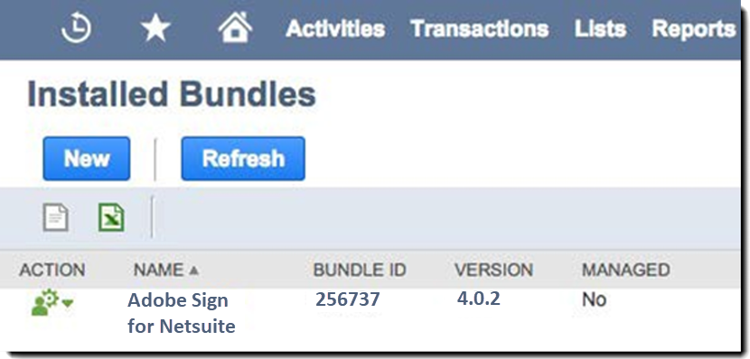
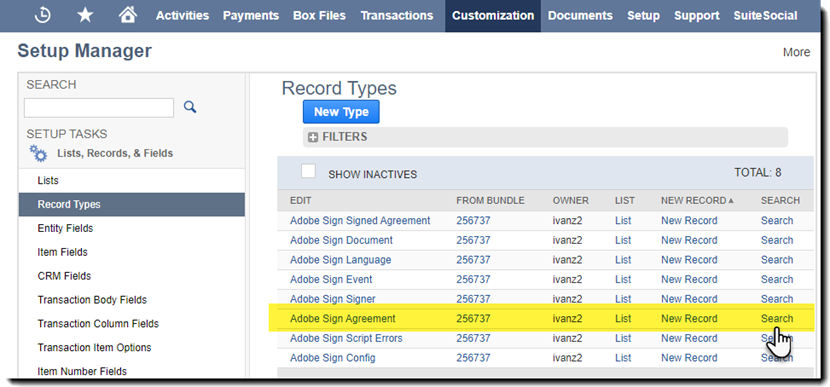
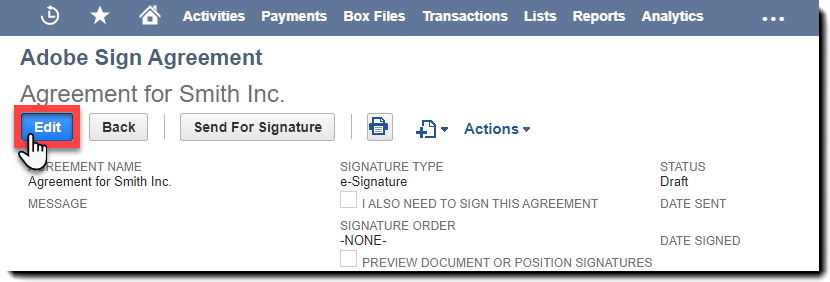

# [!DNL NetSuite] Installations- und Anpassungshandbuch (Version 4.0.4) {#install-customize-NetSuite}

## Übersicht {#overview}

Adobe Sign for [!DNL NetSuite] bietet eine vollständige eSignature-Integration mit [!DNL NetSuite]. Sie können Adobe Sign für [!DNL NetSuite]-Integration verwenden, um Vereinbarungen wie Verträge, Angebote und andere Dokumente, für die elektronische Signaturen erforderlich sind, direkt von [!DNL NetSuite] an Empfänger zu senden. Sie können Adobe Sign-Verträge von Kunden, Lead-, Angebots- und anderen [!DNL NetSuite]-Datensätzen erstellen und senden. Adobe Sign aktualisiert [!DNL NetSuite] mit dem Status von Vereinbarungen und speichert die Vereinbarungen mit den verknüpften [!DNL NetSuite]-Datensätzen, sobald sie vollständig ausgeführt wurden. Sie können den Verlauf aller Vereinbarungen anzeigen, die von [!DNL NetSuite] aus innerhalb des Produkts gesendet wurden.

Weitere Informationen finden Sie in den [Adobe Sign für  [!DNL NetSuite] Versionshinweise](https://experienceleague.adobe.com/docs/sign-integrations/using/netsuite/release-notes.html?lang=en).

## Bundle installieren und OAuth konfigurieren {#install}

Nur ein [!DNL NetSuite]-Administrator kann das Bundle installieren oder aktualisieren. Um OAuth zu konfigurieren, muss der [!DNL NetSuite]-Administrator Administratorzugriff auf Adobe Sign haben. Vor der Installation des Bundles in Ihrem Produktionskonto sollten Sie das Bundle in einem [!DNL NetSuite] Sandbox-Konto installieren und testen.

Weitere Informationen zum Testen finden Sie unter [Adobe Sign-Vertrag erstellen](#createagreement).

>[!CAUTION]
>
>Kunden, die auf Version 4.0.4 aktualisieren, sollten ihren vorhandenen API-Schlüssel NICHT entfernen.
>
>Weitere Informationen zur Verwendung des API-Schlüssels finden Sie unter [Benutzerdefinierte Voreinstellungen festlegen](#configure).

### Bundle zum ersten Mal installieren

1. Navigieren Sie zu [!UICONTROL **Anpassung > SuiteBundler > Pakete suchen und installieren**].

1. Geben Sie auf der Seite *Pakete suchen und installieren* **Adobe Sign** als Schlüsselwort ein und wählen Sie **[!UICONTROL Suchen]**.

1. Wählen Sie den Bundle-Namen **Adobe Sign**.

   

1. Wählen Sie auf der Seite *[!UICONTROL Paketdetails]* **[!UICONTROL Installieren]**.
1. Wählen Sie auf der Seite *[!UICONTROL Vorschau Bundle Install]* **[!UICONTROL Install Bundle]** aus.

   (Die Standardwerte auf der Seite müssen nicht geändert werden.)

   

1. Wählen Sie im daraufhin angezeigten Dialogfeld Installieren **[!UICONTROL OK]** aus, um fortzufahren.

   Während des Installationsvorgangs wird der Status des Pakets als *[!UICONTROL Ausstehend]* angezeigt.

   

1. Um einen aktualisierten Status anzuzeigen, wählen Sie **[!UICONTROL Aktualisieren]**.

   Nach Abschluss der Paketinstallation wird *Adobe Sign für[!DNL NetSuite]* auf der Seite *[!UICONTROL Installierte Pakete]* angezeigt.

   

1. Wenn Sie bereits ein Adobe Sign-Kundenkonto haben, führen Sie die Schritte unter [OAuth nach der Installation oder Aktualisierung von](#oauth) konfigurieren aus.

   Wenn Sie kein Adobe Sign-Konto haben, können Sie sich für ein Enterprise Test](https://esign.adobe.com/adobe-sign-[!DNL NetSuite]-trial-registration.html)-Konto anmelden, um das System zu testen. [ Führen Sie die Online-Registrierungsschritte aus, um Ihr Adobe Sign-Konto zu aktivieren.

## OAuth nach der Installation oder Aktualisierung konfigurieren {#oauth}

Adobe Sign verwendet OAuth 2.0 zur Authentifizierung Ihres Adobe Sign-Kontos in [!DNL NetSuite].

Dieses Protokoll autorisiert Ihr installiertes [!DNL NetSuite]-Bundle, mit Adobe Sign zu kommunizieren, ohne Ihr Kennwort anzufordern. Da vertrauliche Informationen nicht direkt zwischen den Anwendungen ausgetauscht werden, ist die Wahrscheinlichkeit geringer, dass Ihr Konto unerlaubt benutzt wird.

Diese Authentifizierung wirkt sich nicht auf Ihre Implementierung aus, Sie müssen jedoch nach der Installation oder Aktualisierung des Bundles in Ihrem Produktions- oder Sandbox-Konto eine einmalige Konfiguration durchführen.

Der [!DNL NetSuite]-Administrator, der OAuth konfiguriert, muss auch über Administratorzugriff auf Kontoebene auf Adobe Sign verfügen.

1. Navigieren Sie in [!DNL NetSuite] zur Listenseite *Adobe Sign Config*.

1. Suchen Sie mithilfe des Suchfelds in der Kopfzeile nach **[!UICONTROL Adobe Sign Config]** (einem benutzerdefinierten Datensatztyp).

1. Wählen Sie auf der Seite Suchergebnisse **Ansicht** für den Eintrag *Adobe Sign Config* aus.

   .

1. Wählen Sie auf der Seite Adobe Sign-Konfigurationsliste für den Eintrag *Verwenden von OAuth für den Zugriff auf Adobe Sign-APIs* die Option **[!UICONTROL Anzeigen]**.

   

1. Wählen Sie auf der Seite Adobe Sign Config die Option **[!UICONTROL Mit Adobe Sign anmelden]**

   

1. Geben Sie auf der angezeigten Adobe Sign-Anmeldeseite Ihre Anmeldeinformationen ein und wählen Sie **[!UICONTROL Anmelden]**.

   

1. Wählen Sie auf der Seite Zugriff bestätigen (für OAuth), die angezeigt wird, **[!UICONTROL Zugriff zulassen]**

   

1. Wenn die Autorisierung abgeschlossen ist, werden Sie zurück zur Adobe Sign-Konfigurationsseite in [!DNL NetSuite] weitergeleitet, wie unten dargestellt.

   

   >[!NOTE]
   >
   >Wenn Sie OAuth in Ihrem Sandbox-Konto konfigurieren, wird nach Abschluss der Autorisierung möglicherweise der Fehler &quot;Kunden-Comp-ID konnte nicht ermittelt werden&quot;angezeigt.
   >
   >
   >Um fortzufahren, müssen Sie den Teil der Kontodomäne der URL (System) ändern.[!DNL NetSuite].com) in Ihrem Browser, um wie folgt auf die  [!DNL NetSuite] Sandbox zurückzuverweisen:
   >
   >
   >Ändern:
   >
   >
   >system.[!DNL NetSuite].com/app/site/hosting/scriptlet.nl?script=745&amp;deploy=1&amp;web_access_point=https://echosign.com
   >
   >
   >An:
   >
   >
   >System.**sandbox.**[!DNL NetSuite].com/app/site/hosting/scriptlet.nl?script=745&amp;deploy=1&amp;web_access_point=https://echosign.com

## Bundle aktualisieren (vorhandene Benutzer)

[!DNL NetSuite] Bundle-Updates werden regelmäßig von der Adobe veröffentlicht. Vorhandene Benutzer der Adobe Sign für [!DNL NetSuite]-Integration können auf das neueste Paket aktualisieren.

>[!CAUTION]
>
>Kunden, die auf eine neuere Version aktualisieren, sollten ihren vorhandenen API-Schlüssel NICHT entfernen.
>
>Weitere Informationen zur Verwendung des API-Schlüssels finden Sie unter [Festlegen benutzerdefinierter Voreinstellungen](#configure).

### Voraussetzungen {#prerequisites}

Die Zeit, die zum Aktualisieren auf das Paket Version 4.0.4 benötigt wird, hängt von der Anzahl der Vereinbarungen ab, die derzeit den Status &quot;Zur Signatur versandt&quot;haben. In der Regel dauert es 7 bis 10 Minuten, um 100 Vereinbarungen zu aktualisieren. Notieren Sie sich die Anzahl der Datensätze, um die Aktualisierungsdauer abzuschätzen.

So bestimmen Sie die Anzahl der Vereinbarungen, die zur Signatur gesendet werden:

1. Navigieren Sie zu **[!UICONTROL Anpassung > Listen, Datensätze und Dateien > Datensatztypen]** und suchen Sie dann *Adobe Sign Agreement.*

   Oder suchen Sie in der Suchleiste nach Adobe Sign-Vereinbarungen.

1. Wählen Sie für den Datensatz [!UICONTROL Adobe Sign-Vereinbarungen] **[!UICONTROL Suchen]**.

   

1. Wählen Sie in der Dropdown-Liste **[!UICONTROL Status]** **[!UICONTROL Zum Unterschreiben gesendet]** aus und wählen Sie dann **[!UICONTROL Senden]**.

   

   Notieren Sie sich die Anzahl der Datensätze, um die Aktualisierungsdauer abzuschätzen.

   

### Bundle aktualisieren {#updating-the-bundle}

1. Navigieren Sie zu **[!UICONTROL Customization > SuiteBundler > Search &amp; Install > List]** und suchen Sie Ihr aktuelles Bundle, wie unten gezeigt.

   >[!NOTE]
   >
   >Wenn es eine neue Version des Bundles gibt, wird rechts neben der *Version*-Nummer des aktuellen Bundles ein Ausrufezeichen-Symbol angezeigt.

1. Wählen Sie im Dropdown-Menü Aktion **[!UICONTROL Aktualisieren]** aus.

   

1. Wählen Sie auf der Seite &quot;Vorschau-Bundle-Aktualisierung&quot;die Option **[!UICONTROL Paket aktualisieren]**, ohne die auf der Seite angezeigten Standardwerte zu ändern.

   Während der Installation wird der Status des Bundles als *Ausstehend* angezeigt.

   .

   >[!NOTE]
   >
   >Beim Aktualisieren des Bundles erhalten Sie möglicherweise eine Warnmeldung, wie unten dargestellt. Wenn Sie Ihre [!DNL NetSuite]-eSignaturdatensätze nicht angepasst haben, können Sie fortfahren. Wenn Sie sich nicht sicher sind, sollten Sie das Bundle auf einem Sandbox-Konto installieren, um es zunächst zu testen, bevor Sie das Bundle in einem Produktionskonto aktualisieren.

   

1. Um einen aktualisierten Status anzuzeigen, wählen Sie **[!UICONTROL Aktualisieren]**.

   

   >[!NOTE]
   >
   >Wenn das Update aufgrund mehrerer Vereinbarungen mit dem Status *Zur Signatur gesendet* lange dauert, können Sie auf der Unterregisterkarte **[!UICONTROL Ausführungsprotokoll]** für das Skript *Adobe Sign Bundle Installation* den Fortschritt Ihres Updates ermitteln. Weitere Informationen finden Sie unter [Bestimmen des Fortschritts des Updates](#determineprogress).

   Nach Abschluss der Paketaktualisierung wird *Adobe Sign für[!DNL NetSuite]* auf der Seite *Installierte Pakete* angezeigt.

   

## Bundle konfigurieren {#configure}

### Benutzerdefinierte Voreinstellungen festlegen  {#set-custom-preferences}

Sie können benutzerdefinierte Voreinstellungen verwenden, um anzugeben, wie Vereinbarungen in [!DNL NetSuite] erstellt und gespeichert werden. Darüber hinaus können Sie mit der Voreinstellung *Benutzer mit automatischer Bereitstellung in Adobe Sign* angeben, ob [!DNL NetSuite]-Benutzer automatisch in Sign-Dienste bereitgestellt werden, wenn sie Vereinbarungen von [!DNL NetSuite] senden.

1. Navigieren Sie zu **[!UICONTROL Einrichtung > Unternehmen > Allgemeine Voreinstellungen]**.
1. Scrollen Sie auf der Seite nach unten und wählen Sie die Unterregisterkarte **[!UICONTROL Benutzerdefinierte Voreinstellungen]** aus.

   

1. Aktivieren und konfigurieren Sie Ihre Adobe Sign-Voreinstellungen nach Bedarf:

   * **EchoSign-API-Schlüssel für Ihr Konto** eingeben: Fügen Sie in diesem Feld keinen Wert hinzu oder bearbeiten Sie ihn.
   * **Übergeordneten Datensatzkontakt als Unterzeichner** verwenden: Wenn diese Option aktiviert ist, wird der übergeordnete Datensatz-Kontakt beim Erstellen von Vereinbarungen standardmäßig als erster Unterzeichner verwendet. Der Absender kann vor dem Senden einfach den Standardunterzeichner entfernen oder bearbeiten oder zusätzliche Unterzeichner zur Vereinbarung hinzufügen.
   * **Transaktionskontakt Als Unterzeichner kontaktieren, wenn vorhanden: Diese Voreinstellung ist nur gültig, wenn die Voreinstellung *Übergeordneten Datensatz als Unterzeichner verwenden* ebenfalls aktiviert ist.** Wenn diese Option aktiviert ist, wird beim Generieren einer Vereinbarung aus einem Transaktionsdatensatz (z. B. Angebot) der primäre Transaktionskontakt als erster Unterzeichner standardmäßig verwendet. Weitere Informationen finden Sie unter [Transaktionsdatensätze. ](#transrecords) Wenn kein primärer Transaktionskontakt vorhanden ist oder wenn aus dem [!DNL NetSuite]-Objektdatensatz gesendet wird (z. B. Kundendatensatz, Partnerdatensatz), ist der Standardempfänger der primäre Ansprechpartner für die Kunden-E-Mail. Der Absender kann vor dem Senden einfach den Standardunterzeichner entfernen oder bearbeiten oder zusätzliche Unterzeichner zur Vereinbarung hinzufügen.
   * **Markieren von Empfängern als Genehmiger** zulassen: Wenn aktiviert, können Absender Empfänger als Genehmiger markieren. Als Genehmiger markierte Empfänger können Vereinbarungen überprüfen und genehmigen, müssen sie jedoch nicht unterschreiben. Während des Genehmigungsprozesses müssen Genehmiger möglicherweise Daten in Felder eingeben.
   * **Bevorzugte Vereinbarungsordner-ID**: Wird verwendet, um den Ordner anzugeben, in dem die endgültigen signierten Vereinbarungen gespeichert werden. Wenn Sie keinen Wert für dieses Feld festlegen, werden die endgültig unterzeichneten Vereinbarungen standardmäßig im selben Ordner wie die ursprüngliche Dokumentdatei gespeichert. Die Ordner-ID muss eine Zahl sein.
   * **Transaktions-PDF** automatisch anhängen: Wenn diese Option aktiviert ist, werden Transaktions-PDF automatisch an Vereinbarungen angehängt, wenn neue Vereinbarungen aus Transaktionsdatensätzen erstellt werden.
   * **Signierte PDF hinzufügen als (Anhang oder Link)**: Wenn Sie in der Dropdown-Liste  ** Listis auswählen, wird die signierte PDF automatisch als Hyperlink zur Datei hinzugefügt. Wenn im Dropdown-Menü *Anhang* &quot; ausgewählt wird, wird die signierte PDF-Datei in als Anhang zum Vereinbarungsdatensatz gespeichert.[!DNL NetSuite]
   * **Audit-Protokoll-PDF mit Vereinbarung** einschließen: Wenn diese Option aktiviert ist, werden PDF des Prüfprotokolls automatisch an Vereinbarungsdatensätze angehängt, nachdem die Vereinbarungen signiert wurden.
   * **Die Methode zur Identitätsbestätigung gilt für**: Wenn Sie eine der Methoden zur Identitätsüberprüfung aktivieren, wird festgelegt, auf wen die Methode zur Identitätsbestätigung angewendet wird. Die Optionen lauten *Alle Unterzeichner, Nur externe Unterzeichner* oder *Nur interne Unterzeichner*.

   **Identitätsbestätigungsmethoden** {#identity-verification-methods}

   Beim Erstellen einer Vereinbarung können Sie eine oder mehrere Identitätsbestätigungsmethoden auswählen. Wenn hier mehrere Methoden zur Identitätsüberprüfung aktiviert sind, wird auf der Seite &quot;Adobe Sign-Vereinbarung&quot;die Option **[!UICONTROL Identität des Unterzeichners überprüfen]** angezeigt.

   * **Kennwort zum Signieren** aktivieren: Unterzeichner müssen ein einmaliges Kennwort eingeben, das Sie angeben.

   * **Wissensbasierte Authentifizierung** aktivieren: Unterzeichner auffordern, ihren Namen, ihre Adresse und optional die letzten vier Stellen ihres SSN anzugeben und dann eine Liste von Fragen zu beantworten, in denen die von ihnen bereitgestellten Informationen überprüft werden. Nur in den USA erhältlich.

   * **Webidentitätsauthentifizierung** aktivieren: Unterzeichner auffordern, ihre Identität zu bestätigen, indem Sie sich bei einer der folgenden Websites anmelden: Facebook, Google, LinkedIn, Microsoft Live, Twitter oder Yahoo!..

   * **Benutzer für die automatische Bereitstellung in Adobe Sign**: Wenn diese Option aktiviert ist,  [!DNL NetSuite] werden Benutzer, die Vereinbarungen senden, automatisch mit einem Adobe Sign-Benutzerkonto bereitgestellt.

1. Wählen Sie **[!UICONTROL Speichern]**, um Ihre Voreinstellungen zu speichern.

## Automatische Statusaktualisierungen konfigurieren {#asu}

Mit dem Adobe Sign-Integrationspaket können Sie automatisch Updates in [!DNL NetSuite] bezüglich des Status der Vereinbarungen erhalten, die von [!DNL NetSuite] gesendet wurden. Wenn diese Funktion aktiviert ist, gibt [!DNL NetSuite] immer den Status Ihrer Vereinbarungen wieder. Sie können automatische Statusaktualisierungen wie folgt aktivieren:

1. Navigieren Sie zu **[!UICONTROL Einrichtung > Unternehmen > Funktionen aktivieren].**
1. Wählen Sie die Unterregisterkarte **[!UICONTROL SuiteCloud]**.
1. Aktivieren Sie die folgenden Optionen:

   * Aktivieren Sie im Abschnitt SuiteBuilder die Option **[!UICONTROL Benutzerdefinierte Datensätze]**.

   * Aktivieren Sie im Abschnitt SuiteScript die Optionen **[!UICONTROL Client SuiteScript]** und **[!UICONTROL Server SuiteScript]** und stimmen Sie den Nutzungsbedingungen für beide zu.

1. Wählen Sie **[!UICONTROL Speichern]**.

   Ihre Optionen werden wie im Bild angezeigt festgelegt.

   

## Objekte und Datensatztypen {#objects}

Das Adobe Sign-Integrationspaket zeigt das Adobe Sign Agreement-Objekt bereits mit vielen Standardobjekten an, darunter: Datensätze für Kunden, Schätzungen, Lead, Opportunity und Partner. [!DNL NetSuite] Sie können das Adobe Sign-Paket auch mit anderen Datensatztypen verwenden, einschließlich benutzerdefinierter Datensätze.

Die Registerkarte &quot;Vereinbarung&quot;kann mit zwei Arten von [!DNL NetSuite]-Datensätzen angezeigt werden: Entitäts- und Transaktionsdatensätze. In der Regel wird davon ausgegangen, dass ein Transaktionsdatensatz ein Datensatz (z. B. ein Angebot) ist, der in ein PDF-Dokument konvertiert werden kann. während ein Entitätsdatensatz nicht in eine PDF konvertiert werden kann.

## Transaktionsdatensätze {#transrecords}

Wenn die Vereinbarung aus einem Transaktionsdatensatz erstellt wird, ist das erste Dokument im Vereinbarungsdatensatz die PDF-Version des Datensatzes, aus dem sie stammt, und der erste Empfänger ist die E-Mail-Adresse des Datensatzes. Wenn das erste Dokument keine PDF-Version des Datensatzes sein soll, aus dem es stammt, gehen Sie zu **[!UICONTROL Setup > Unternehmen > Allgemeine Voreinstellungen > Unterregisterkarte Benutzerdefinierte Voreinstellungen]** und deaktivieren Sie die Option **[!UICONTROL Transaktion automatisch anhängen PDF]**. Weitere Informationen finden Sie unter [Benutzerdefinierte Voreinstellungen festlegen](#configure).

Unter „Benutzerdefinierte Voreinstellungen“ können Sie auch die Voreinstellung **[!UICONTROL Transaktionskontakt als ersten Unterzeichner verwenden]** aktivieren, wenn Sie möchten, dass der primäre Transaktionskontakt automatisch als erster Unterzeichner hinzugefügt wird. Wenn ein Transaktionsdatensatz verknüpft ist, werden die Schaltflächen **[!UICONTROL Agreements]** und **[!UICONTROL Send for Signature]** angezeigt.

## Entitätsdatensätze {#entity-records}

Wenn die Vereinbarung aus einem Entitätsdatensatz erstellt wird, ist der erste Empfänger die E-Mail-Adresse aus dem Datensatz. Bei einer Zuordnung zu einem Entitätsdatensatz wird nur die Registerkarte „Vereinbarungen“ angezeigt.

## Bundle anpassen {#customize}

Das Anpassen des Pakets umfasst Folgendes:

* Bereitstellen der Skripte für die Unterregisterkarte Vereinbarungen und die Schaltfläche Zur Signatur senden für die entsprechenden Datensatztypen
* Festlegen von Rollenberechtigungen für Ihre Adobe Sign-Datensatztypen
* Ändern der Berechtigungen zum Erteilen des Zugriffs auf die Unterregisterkarte *Vereinbarungen* und die Schaltfläche *Zur Signatur senden*.

### Adobe Sign-Vereinbarungen für zusätzliche Datensatztypen konfigurieren  {#configuring-adobe-sign-agreements-for-additional-record-types}

So stellen Sie die Unterregisterkarte *Vereinbarungen* und die Schaltfläche *Send for Signature* für die entsprechenden Datensatztypen bereit:

1. Navigieren Sie zu **[!UICONTROL Anpassung > Skripterstellung > Skripte].**

1. Suchen Sie auf der angezeigten Listenseite *Skripts* nach dem Skript, das Sie bereitstellen müssen, und wählen Sie ****[!UICONTROL Ansicht]****.

   * Um die Schaltfläche *Send for Signature* hinzuzufügen, wählen Sie das Skript **[!UICONTROL Adobe Sign Estimate Button]** aus.

   * Um die Registerkarte *Vereinbarungen* hinzuzufügen, wählen Sie das Skript **[!UICONTROL Adobe Sign Agreement Loader]**.

1. Wählen Sie auf der Seite &quot;Skript&quot;die Option **[!UICONTROL Skript bereitstellen]**.

   

1. Führen Sie auf der Seite Skriptbereitstellung die folgenden Schritte aus:

   * Wählen Sie in der Liste *Anwenden auf* den Datensatztyp aus.
   * Geben Sie optional die ID der Skriptbereitstellung ein.

      Weitere Informationen finden Sie im *Erstellen einer benutzerdefinierten Script Deployment ID* im [!DNL NetSuite] Help Center. Wenn Sie keine ID eingeben, wird eine generiert.

   * Aktivieren Sie das Kontrollkästchen **[!UICONTROL Bereitgestellt]**.

   

   * Setzen Sie den *Status* auf **[!UICONTROL Freigegeben]**.

      Sie müssen keinen *Ereignistyp* oder *Log Level* angeben.

   * Wählen Sie in der Dropdown-Liste [!UICONTROL *Als Rolle ausführen]* **[!UICONTROL Als Administrator ausführen]** aus.

   * Wenn die Unterregisterkarte **[!UICONTROL Zielgruppe]** aktiv ist (standardmäßig aktiv), wählen Sie die spezifischen Rollen oder Benutzer aus, auf die Sie Zugriff gewähren möchten. Wenn Sie allen Rollen und Benutzern Zugriff gewähren möchten, aktivieren Sie die die entsprechende Option **[!UICONTROL Alle auswählen]**.

   * Wählen Sie **[!UICONTROL Speichern]**. Wenn die Änderungsbestätigung angezeigt wird, wählen Sie **[!UICONTROL Zurück]**.

1. Wählen Sie **[!UICONTROL List]** oben auf der Seite &quot;Skripterstellung&quot;aus, um zur Listenseite *Scripts* zurückzukehren.
1. Wiederholen Sie die Schritte 2 und 3 oben für das andere Skript.

## Festlegen von Rollenberechtigungen für Adobe Sign-Datensatztypen {#setting-role-permissions-for-adobe-sign-record-types}

Die meisten [!DNL NetSuite]-Rollen sollten über die Berechtigung verfügen, Adobe Sign ohne zusätzliche Anpassung zu verwenden. Sie müssen jedoch möglicherweise Berechtigungen für alle zusätzlichen benutzerdefinierten Rollen gewähren, die erstellt wurden.

1. Navigieren Sie zu **[!UICONTROL Anpassung > Listen, Datensätze und Dateien > Datensatztypen]**.

   

   >[!NOTE]
   >
   >Wenn das Element *Datensatztypen* nicht angezeigt wird, navigieren Sie zu **[!UICONTROL Einrichtung > Unternehmen > Funktionen aktivieren > Registerkarte „Suite Cloud“]** und aktivieren Sie die Option *Benutzerdefinierte Datensätze*.

1. Wählen Sie auf der Seite *Datensatztypen* **[!UICONTROL Adobe Sign Agreement]** aus, um sie auszuwählen

   

1. Wählen Sie auf der Seite *Benutzerdefinierter Datensatztyp* **[!UICONTROL Berechtigungsliste verwenden]** aus der Dropdown-Liste *Zugriffstyp*.

   

   >[!NOTE]
   >
   >Der Datensatztyp *Adobe Sign-Vereinbarung* ist der einzige Adobe Sign-Datensatztyp, für den der Zugriffstyp *Berechtigungsliste verwenden* erforderlich ist.
   >
   >
   >Anweisungen zum Festlegen des Zugriffstyps für die anderen Adobe Sign-Datensatztypen finden Sie in Schritt 6.

1. Wählen Sie die Unterregisterkarte **[!UICONTROL Berechtigungen]**.

   Die Liste der Rollen und Berechtigungen wird angezeigt.

   

1. Legen Sie die Berechtigungen wie folgt für die zusätzlichen benutzerdefinierten Rollen fest, die dem Datensatztyp &quot;[!UICONTROL Adobe Sign Agreement]&quot;hinzugefügt wurden.

   >[!NOTE]
   >
   >Siehe *[Einrichten einer Berechtigungsliste für einen benutzerdefinierten Datensatztyp](https://system.[!DNL NetSuite].com/app/help/helpcenter.nl?fid=section_N2879931.html)* topic in the  [!DNL NetSuite] Help Center for more information

   1. Wählen Sie die Rolle aus der Liste *Rolle* aus.
   1. Setzen Sie *Level* auf **[!UICONTROL Full]**.
   1. Legen Sie *Standardformular* auf **[!UICONTROL Benutzerdefiniertes EchoSign-Vereinbarungsformular]** fest.
   1. Aktivieren Sie das Kontrollkästchen **[!UICONTROL Formular einschränken]**.
   1. Wählen Sie **[!UICONTROL Hinzufügen]**, um die Änderungen für die Rollenzeile zu speichern.

   

   Die neue Zeile wird wie folgt angezeigt:

   

   Wiederholen Sie die Schritte a bis e oben für alle zusätzlichen benutzerdefinierten Rollen.

   * Wählen Sie **[!UICONTROL Speichern]** auf der Seite *Benutzerdefinierter Datensatztyp*, wenn Berechtigungen für alle Rollen festgelegt wurden.
   Die Seite *[!UICONTROL Customer Record Type]* wird erneut angezeigt.

1. Wiederholen Sie die Schritte 1 bis 3 oben, um den *Zugriffstyp* für alle anderen Adobe Sign-Datensatztypen auf

   **[!UICONTROL Keine Berechtigung erforderlich].** festzulegen. Dies gilt für die folgenden Datensatztypen:

   * Adobe Sign Config
   * Adobe Sign-Dokument
   * Adobe Sign Event
   * Adobe Sign Language
   * Adobe Sign Script Errors
   * Adobe Sign Signed Agreement
   * Adobe Sign Signer

### Zugriff auf die Registerkarte &quot;Vereinbarung&quot;und die Schaltfläche &quot;Send for Signature&quot;gewähren  {#granting-access-to-the-agreement-tab-and-send-for-signature-button}

Das Adobe Sign-Integrationspaket zeigt das Adobe Sign Agreement-Objekt bereits mit vielen standardmäßigen [!DNL NetSuite]-Objekten an (Kunde, Schätzung [Angebot], Lead und mehr). Die Unterregisterkarte *Vereinbarung* wird automatisch für die folgenden Objekttypen aktiviert: Kunde, Lead, Vertriebschance, Partner, Interessent, Angebot und Lieferantenrechnung.

Die Schaltfläche *[!UICONTROL Send for Signature]* wird automatisch **o[!UICONTROL nur für das Angebotsobjekt]** aktiviert.

[!DNL NetSuite] Administratoren können die Möglichkeit erweitern, Vereinbarungen auf weitere CRM-Objekte zu erstellen, indem sie Berechtigungen ändern, um die Unterregisterkarte  ** &quot;Vereinbarung&quot;oder die Schaltfläche &quot;Zum  *Unterschreiben* senden&quot;oder beide zu diesen Objekten hinzuzufügen.

#### Ändern von Berechtigungen, um Zugriff auf die Schaltfläche „Zur Signatur senden“ zu gewähren  {#modifying-permissions-to-grant-access-to-the-send-for-signature-button}

1. Navigieren Sie zu **[!UICONTROL Anpassung > Skripterstellung > Skripte]**.

   Die Seite mit der Liste der *Skripte* wird angezeigt.

   * Verwenden Sie bei Bedarf die Filter, um die Adobe Sign-Skripte zu finden

1. Suchen Sie auf der Seite *Skripts* das Skript *Adobe Sign Estimate Button* (steuert die Schaltfläche *Send for Signature*) und wählen Sie **View**.

   

1. Führen Sie auf der Seite *Skript* die folgenden Schritte aus:

   * Wählen Sie die Unterregisterkarte **[!UICONTROL Bereitstellungen]** aus.

   * Wählen Sie unter &quot;*Wendet auf*&quot;den Link für die Entität aus, die Sie ändern möchten.

      * In diesem Beispiel ist das **[!UICONTROL Angebot]**.

   

   * Wählen Sie auf der Seite *Skripterstellung* die Schaltfläche **[!UICONTROL Bearbeiten]** aus.

   

   * Wählen Sie bei aktiver Unterregisterkarte **[!UICONTROL Zielgruppe]** die spezifischen Rollen oder Benutzer aus, auf die Sie Zugriff gewähren möchten.

      * Wenn Sie allen Rollen und Benutzern Zugriff gewähren möchten, aktivieren Sie die die entsprechende Option **[!UICONTROL Alle auswählen]**.
   * **[!UICONTROL Speichern]**

   

#### Ändern von Berechtigungen, um Zugriff auf die Registerkarte „Vereinbarungen“ zu gewähren  {#modifying-permissions-to-grant-access-to-the-agreements-tab}

1. Navigieren Sie zu **[!UICONTROL Anpassung > Skripterstellung > Skripte]**
1. Suchen Sie auf der Seite [!UICONTROL Skripts] das Skript *[!UICONTROL Adobe Sign Agreement Loader]* (steuert die Registerkarte *Vereinbarungen*) und wählen Sie **[!UICONTROL Ansicht]**.
1. Führen Sie auf der Seite *Skript* die folgenden Schritte aus:

   1. Wählen Sie die Unterregisterkarte **[!UICONTROL Bereitstellungen]** aus.
   1. Wählen Sie unter &quot;*[!UICONTROL Gilt für]*&quot;den Link für die Entität aus, für die Sie den Zugriff ändern möchten
   1. Wählen Sie auf der Seite *[!UICONTROL Skript-Bereitstellung]* die Schaltfläche **[!UICONTROL Bearbeiten]** aus.
   1. Wählen Sie bei aktiver Unterregisterkarte **[!UICONTROL Zielgruppe]** (diese Registerkarte ist standardmäßig aktiv) die spezifischen Rollen oder Benutzer aus, denen Sie Zugriff gewähren möchten. Wenn Sie allen Rollen und Benutzern Zugriff gewähren möchten, aktivieren Sie die die entsprechende Option **[!UICONTROL Alle auswählen]**.
   1. **[!UICONTROL Speichern]**

## Verwenden des Adobe Sign für [!DNL NetSuite]-Bundle

Um Vereinbarungen von [!DNL NetSuite] zu senden und Updates für diese Vereinbarungen zu erhalten, müssen Benutzer dieselbe Anmelde-ID (E-Mail-Adresse) in [!DNL NetSuite] und in Adobe Sign haben.

### Erstellen einer Adobe Sign-Vereinbarung

Nach der Installation eines neuen Pakets in einem Sandbox- oder Produktionskonto sollten Sie das Paket testen, indem Sie eine neue Vereinbarung erstellen. Sie können Adobe Sign-Vereinbarungen aus einem Entitätsdatensatz, aus einem Transaktionsdatensatz oder als eigenständige Vereinbarung erstellen.

>[!NOTE]
>
>Der Vorgang zum Erstellen einer Vereinbarung unterscheidet sich je nach Erstellungsart leicht. Der allgemeine Prozess umfasst die Festlegung der Optionen für Ihre Vereinbarung, das Hinzufügen eines oder mehrerer Vereinbarungsdokumente und die Angabe der Empfänger. Bei dem unten beschriebenen Prozess wird unterstellt, dass Sie die Vereinbarung aus einem Kundendatensatz erstellen.

1. Wählen Sie einen Kundendatensatz aus oder erstellen Sie einen Kundendatensatz, aus dem Sie einen Vertrag senden möchten, oder wählen Sie einen anderen Datensatz [!DNL NetSuite] aus, für den die Registerkarte &quot;Vereinbarungen&quot;aktiviert ist.

1. Wählen Sie im Datensatz die Unterregisterkarte **[!UICONTROL Vereinbarungen]** aus.
1. Wählen Sie **[!UICONTROL Neue Vereinbarung]**.

   

1. Wählen Sie auf der Seite *[!UICONTROL Adobe Sign Agreement]* **[!UICONTROL Edit]**.

   

1. Legen Sie die Optionen für Ihre Vereinbarung wie folgt fest:

   * **Vereinbarungsname** — Geben Sie einen Namen für die Vereinbarung ein.
   * **Nachricht** - Geben Sie eine benutzerdefinierte Nachricht für den Empfänger ein.
   * **Signaturtyp**: Wählen Sie den Signaturtyp aus, der für das Dokument akzeptiert wird. Die Optionen lauten *e-Signatur* und *Faxsignatur*.

   * **Ich muss diese Vereinbarung auch signieren** — Aktivieren Sie diese Option, um anzugeben, dass der Absender die Vereinbarung ebenfalls signieren muss.
   * **Signaturreihenfolge**: Wenn die Option  *Ich muss diese* Vereinbarung auch signieren aktiviert ist, wählen Sie die Reihenfolge aus, in der der Absender und die Empfänger signieren sollen. Die Optionen sind „Ich unterzeichne zuerst, dann die Empfänger“ „Empfänger unterzeichnen zuerst, dann ich“ und „Keine“.

   * **Vorschau von Dokumenten oder Signaturen positionieren (oder Formularfelder)** — Aktivieren Sie diese Option, um Absendern zu erlauben, eine Vorschau der Vereinbarung anzuzeigen und ihnen zu erlauben, Felder (Unterschrift per Drag &amp; Drop, Initialfelder und andere Formularfelder) zur Vereinbarung hinzuzufügen, bevor sie an Empfänger gesendet werden.
   * **Unterzeichneridentität**  bestätigen— Aktivieren Sie diese Option und wählen Sie dann eine der folgenden Optionen zur Identitätsverifizierung aus:

      * Diese Option wird nur angezeigt, wenn mehr als eine der drei unten aufgeführten Methoden zur Bestätigung der Unterzeichneridentität in den benutzerdefinierten Voreinstellungen aktiviert ist. (Weitere Informationen finden Sie unter [Benutzerdefinierte Voreinstellungen festlegen](#customize).) Wenn nur eine Voreinstellung aktiviert ist, wird die Option **[!UICONTROL Identität des Unterzeichners bestätigen]** nicht angezeigt.

   **Identitätsbestätigungsmethoden**

   * **Zum Unterschreiben**  erforderliches Kennwort: Unterzeichner müssen ein einmaliges Kennwort eingeben, das Sie angeben.
   * **Wissensbasierte Authentifizierung** — Unterzeichner auffordern, ihren Namen, ihre Adresse und optional die letzten vier Stellen ihres SSN anzugeben und dann eine Liste von Fragen zu beantworten, in denen die von ihnen bereitgestellten Informationen überprüft werden. Nur in den USA erhältlich.
   * **Web Identity Authentication** — Unterzeichner auffordern, ihre Identität zu bestätigen, indem Sie sich bei einer der folgenden Websites anmelden: Facebook, Google, LinkedIn, Twitter, Yahoo! oder Microsoft Live.
   * **Zum Anzeigen der PDF**  ist ein Kennwort erforderlich— Aktivieren Sie diese Option, um festzulegen, dass ein Empfänger ein Kennwort eingeben muss, bevor eine PDF der Vereinbarung oder der signierten Vereinbarung geöffnet wird. Die PDF-Datei, die an alle gesendet wird, ist verschlüsselt und erfordert das Kennwort zum Öffnen. Verlieren Sie Ihr Kennwort nicht, denn es kann nicht wiederhergestellt werden. Wenn Sie das Kennwort verlieren, müssen Sie diese Transaktion löschen und erneut beginnen.
   * **Kennwort bestätigen** — Wenn die Option  *Kennwort erforderlich, um* PDF-Datei anzuzeigen aktiviert ist, geben Sie das Kennwort ein, das zum Anzeigen der Vereinbarung verwendet werden soll.
   * **Empfänger zum Signieren**  erinnern— Geben Sie an, ob und wie oft Erinnerungen an Empfänger gesendet werden. Die Optionen sind *Nie*, *Täglich* oder *Wöchentlich*.
   * **Sprache:** Geben Sie die Sprache an, in der die Signaturseite und die E-Mail-Benachrichtigungen den Empfängern angezeigt werden.
   * **Hostsignatur für den ersten Unterzeichner** — Aktivieren Sie diese Option, um dem Absenderhost die persönliche Signatur für den ersten Unterzeichner zu erlauben.
   * **Tage bis zur Frist**  für die Unterschrift— Geben Sie eine ganze Zahl ein, um die Frist für die Unterzeichnung des Vertrags anzugeben (Datum + Anzahl der Tage am heutigen Tag).
   * **Übergeordnete Aufzeichnung** — Wählen Sie optional einen übergeordneten Datensatz aus, um ihn mit der Vereinbarung zu verknüpfen.

   

1. Wählen Sie die Registerkarte **[!UICONTROL Dokumente]**.

   

1. Hängen Sie auf der Unterregisterkarte *Dokumente* mithilfe der Dropdown-Liste *Adobe Sign-Dokument* ein vorhandenes Dokument aus dem Dateigehäuse an und wählen Sie **[!UICONTROL Anhängen]**.

   Oder klicken Sie auf **[!UICONTROL Neues Adobe Sign-Dokument]**, um auf die Seite *[!UICONTROL Adobe Sign-Dokument]* zuzugreifen. Geben Sie dann den Namen eines Dokuments in Ihr [!DNL NetSuite]-Dateigehäuse ein, wählen Sie Dateien aus Ihrem Transaktionsdatensatz (falls zutreffend) aus oder hängen Sie ein neues Dokument an.

   Sie können einer Vereinbarung mehrere Dokumente hinzufügen.

1. Wählen Sie die Unterregisterkarte **[!UICONTROL Empfänger]** und geben Sie den Empfänger an, indem Sie entweder aus der Kontaktliste auswählen oder eine E-Mail-Adresse eingeben.

   

   Jeder Ihrer Empfänger kann als Unterzeichner oder CC-Partei markiert werden. Wenn die benutzerdefinierte Voreinstellung *Markierung von Empfängern als Genehmiger zulassen* aktiviert ist, können Empfänger ebenfalls als Genehmiger markiert werden. Weitere Informationen finden Sie unter Festlegen benutzerdefinierter Voreinstellungen](#customize).[

   * **Unterzeichner** müssen die Vereinbarung unterzeichnen.
   * **** Genehmiger müssen die Vereinbarung genehmigen, aber nicht signieren und müssen optional Daten zu einer Vereinbarung hinzufügen.
   * **CC-** Empfänger werden über Vereinbarungsaktualisierungen benachrichtigt und wenn die Vereinbarung signiert und abgeschlossen wird. Auf CC gesetzte Empfänger sind keine Partei des Signatur- oder Genehmigungsprozesses.

      Wenn die benutzerdefinierte Voreinstellung *Übergeordneten Datensatzkontakt als Unterzeichner verwenden* entweder alleine oder zusammen mit der Voreinstellung *Transaktionskontakt als Unterzeichner verwenden* aktiviert ist, wird der erste Empfänger standardmäßig als Unterzeichner vorgegeben. Diese Vorgabe kann jedoch geändert werden.

1. Wählen Sie **[!UICONTROL Hinzufügen]**, nachdem Sie die einzelnen Empfänger eingegeben haben.

1. Wählen Sie **[!UICONTROL Speichern]**, um die Vereinbarung zu speichern.

### Vereinbarungen zum Unterschreiben senden

Wenn die Vereinbarung gesendet werden kann, wählen Sie die Schaltfläche **[!UICONTROL Send for Signature]**.

* Wenn die Option *Dokument in der Vorschau anzeigen oder Signaturen positionieren* aktiviert ist, klicken Sie auf **[!UICONTROL Send for Signature]**. Zeigen Sie im daraufhin geöffneten Fenster eine Vorschau des Dokuments an oder ziehen Sie Formularfelder vor dem Senden in das Dokument. Wählen Sie **[!UICONTROL Senden]**, um die Vereinbarung an den Empfänger zu senden.

* Wenn die Option *[!UICONTROL Hostsignatur für ersten Unterzeichner]* aktiviert ist, klicken Sie auf **[!UICONTROL Send for Signature]**. Erlauben Sie dem Unterzeichner, das Dokument im daraufhin geöffneten Fenster mit dem Absender zu signieren.

   Neben dem Link *Hostsignatur für ersten Unterzeichner* wird auch der Link *Hostsignatur für aktuellen Unterzeichner* angezeigt, auf den zugegriffen werden kann, bis das Dokument signiert ist. Verwenden Sie diesen Link, um die Signatur der Vereinbarung für mehrere Unterzeichner zu hosten oder das Popup-Fenster erneut zu öffnen, wenn es versehentlich geschlossen wurde.

Sobald die Vereinbarung gesendet wurde, erhalten die Empfänger eine E-Mail, in der sie über die Dokumente informiert werden, die noch signiert werden müssen.

Nachdem die Empfänger das Dokument unterzeichnet haben, erhält der Absender eine Benachrichtigung per E-Mail, dass das Dokument signiert wurde.

#### Senden über ein Angebot

Adobe Sign hat eine direkte Integration mit Anführungszeichen in [!DNL NetSuite], sodass automatisch eine PDF des Anführungszeichens generiert und an den Vereinbarungsdatensatz angehängt wird.

Wählen Sie bei der Anzeige eines Angebots **[!UICONTROL Send for Signature]**. Es wird das an die Vereinbarung angehängte Angebot generiert und angezeigt. Sie können auch die Schaltfläche *Zur Signatur senden* anderen Transaktionsdatensatztypen hinzufügen. Weitere Informationen finden Sie unter [Objekte und Datensatztypen.](#objects)

### Status verfolgen und Erinnerungen senden

Nachdem Sie eine Vereinbarung gesendet haben:

* Im Abschnitt „Vereinbarungsdetails“ ändert sich der Dokumentstatus in *Zur Signatur versandt*.
* Die Schaltfläche *Send for Signature* erhält folgende drei Schaltflächen:

   * **Status**  aktualisieren— Um den Status manuell zu aktualisieren, wenn keine Statusaktualisierungen konfiguriert wurden. Weitere Informationen finden Sie unter [Konfigurieren automatischer Statusaktualisierungen.](#asu)
   * **Erinnerung senden** — Um eine Erinnerung an den aktuellen Unterzeichner zu senden.
   * **Vertrag**  abbrechen— Um eine Vereinbarung zu stornieren. Eine Vereinbarung kann storniert werden, nachdem sie zur Signatur gesendet wurde, wenn noch nicht alle Empfänger unterzeichnet haben.

Im Vereinbarungsdatensatz wird eine neue Unterregisterkarte *Ereignisse* angezeigt, auf der Sie den Vereinbarungsstatus verfolgen können.

Sie können den Verlauf der Vereinbarungsereignisse anzeigen, der Informationen darüber enthält, wann die Vereinbarung gesendet, angezeigt und unterzeichnet wurde.

Nach der Unterzeichnung der Vereinbarung:

* Der Status ändert sich in *Signiert*..
* Sie können über den Link zurück zum übergeordneten Datensatz für diese Vereinbarung verknüpfen.
* Sie können die Links &quot;Herunterladen&quot;unter &quot;Signiertes Dokument&quot;und &quot;Prüfprotokoll&quot;verwenden, um auf diese Dokumente zuzugreifen.
* Eine weitere Unterregisterkarte *Signiertes Dokument* wird angezeigt, um Miniaturansichten des signierten Dokuments anzuzeigen.

>[!NOTE]
>
>Nachdem eine Vereinbarung zum Unterschreiben gesendet wurde, können Sie den Datensatz nicht mehr bearbeiten. Dadurch werden die Ereignisdatensätze geschützt.

## Paket deinstallieren

Um das Bundle zu deinstallieren, führen Sie die Schritte in der [!DNL NetSuite]-Hilfe aus. Weitere Informationen finden Sie im Thema *[Deinstallieren eines Pakets](https://docs.oracle.com/cloud/latest/[!DNL NetSuite]cs_gs/NSBDL/NSBDL.pdf)* im [!DNL NetSuite]-Hilfecenter.

Wenn Sie das Paket deinstallieren, werden die nicht signierten Vereinbarungen gelöscht. Die signierten Verträge und die zugehörigen PDF-Prüfdateien sind davon nicht betroffen.

Deinstallieren Sie das Paket NICHT, wenn Sie Ihre nicht signierten Vereinbarungen beibehalten müssen.

## Fehlerbehebung

### Bestimmen Sie den Fortschritt der Aktualisierung.

Wenn das Update länger als erwartet dauert, können Sie auf der Unterregisterkarte „Ausführungsprotokoll“ für das Skript „Adobe Sign Bundle Installation“ den Fortschritt des Updates ermitteln, indem Sie wie folgt vorgehen:

1. Navigieren Sie zu **[!UICONTROL Anpassung > Skripterstellung > Skripte]**.
1. Suchen Sie auf der Seite [!UICONTROL Skripts] das Skript *[!UICONTROL Adobe Sign Bundle Installation]* und wählen Sie **[!UICONTROL Bearbeiten]**.
1. Wählen Sie auf der Seite [!UICONTROL Skripts] die Unterregisterkarte **Ausführungsprotokoll** aus.
1. wählen Sie **Aktualisieren**.

   Das Ausführungsprotokoll wird entsprechend dem Status aktualisiert. Die Spalte *Details* zeigt den Fortschritt der Aktualisierungen Ihrer Vereinbarungen an.

   

### Beheben von Zugriffstoken-Problemen

Sie können bei der Interaktion mit Vereinbarungen auf die Meldung &quot;Das angegebene Zugriffstoken ist ungültig oder abgelaufen&quot;stoßen.

Dieses Problem kann aus folgenden Gründen auftreten:

* Der [!DNL NetSuite]/Adobe Sign-Administrator, der OAuth konfiguriert hat, hat das Zugriffstoken widerrufen
* Das Zugriffstoken ist abgelaufen, da in den letzten 60 Tagen keine Vereinbarungen von [!DNL NetSuite] gesendet wurden
* Der [!DNL NetSuite]/Adobe Sign-Administrator hat die ursprüngliche OAuth-Konfiguration nicht erfolgreich abgeschlossen.

Um dieses Problem zu beheben, führen Sie den OAuth-Konfigurationsprozess erneut aus. Weitere Informationen finden Sie unter [Konfigurieren von OAuth nach der Installation oder dem Upgrade](#oauth).

### Probleme mit dem Dokumentstatus beheben {#resolvestatus}

Wenn [automatische Statusaktualisierungen](#asu) konfiguriert sind, der Vereinbarungsstatus jedoch nach dem Senden von Vereinbarungen nicht aktualisiert wird, versuchen Sie Folgendes:

1. Prüfen Sie im Ausführungsprotokoll der Bereitstellung für das Skript *Adobe Sign External Update*, ob Sie Aufrufe von Adobe Sign empfangen. Gehen Sie dafür wie folgt vor:

   1. Navigieren Sie zu **[!UICONTROL Anpassung > Skripterstellung > Skriptbereitstellungen]**.
   1. Suchen Sie auf der Seite *Script Deployments* das Skript *Adobe Sign External Update* und wählen Sie **[!UICONTROL Edit]** aus.
      1. Wählen Sie auf der Seite *[!UICONTROL Skriptbereitstellung]* die Unterregisterkarte **[!UICONTROL Ausführungsprotokoll]** aus.
      * Für jede Vereinbarungs-ID sollte ein *Aktualisierter Vereinbarungsdatensatz*-Eintrag angezeigt werden.

1. Prüfen Sie im Ausführungsprotokoll der Bereitstellung für das Skript *Adobe Sign Update Agreements*, ob folgende Fehler vorliegen. Gehen Sie dafür wie folgt vor:

   1. Navigieren Sie zu **[!UICONTROL Anpassung > Skripterstellung > Skriptbereitstellungen]**.
   1. Suchen Sie auf der Seite [!UICONTROL Script Deployments] das Skript *[!UICONTROL Adobe Sign Update Agreements]* mit dem Status &quot;[!UICONTROL Geplant]&quot;und wählen Sie **[!UICONTROL Bearbeiten]**.
   1. Wählen Sie auf der Seite [!UICONTROL Skriptbereitstellung] die Unterregisterkarte **[!UICONTROL Ausführungsprotokoll]** aus.
   1. Wählen Sie unter [!UICONTROL Type] **[!UICONTROL Error]** aus, um die Ergebnisse zu filtern.

1. Prüfen Sie schließlich das Ausführungsprotokoll für das Skript *Adobe Sign Manager* auf Fehler, indem Sie die Anweisungen in Schritt 2 oben befolgen.

### MIME-Fehler beheben  {#resolving-mime-type-errors}

Wenn beim Senden einer Vereinbarung ein MIME-Fehler auftritt, kann dies daran liegen, dass der Name im Feld &quot;Dateiname&quot;nicht mit dem Dateinamen und der Erweiterung der hochgeladenen Datei übereinstimmt. Wenn Sie das Feld &quot;Dateiname&quot;leer lassen, wird automatisch der richtige Dateiname und die richtige Erweiterung hinzugefügt.

### Skriptprotokolle anzeigen {#viewing-script-logs}

Sie können auch die Ausführungsprotokolle der Bereitstellung für Skripte anzeigen, die sich nicht auf Dokumentstatusprobleme beziehen. Weitere Informationen finden Sie unter [Beheben von Problemen mit dem Dokumentstatus.](#resolvestatus)

1. Navigieren Sie zu **[!UICONTROL Anpassung > Skripterstellung > Skripte]**.

   Die Seite mit der Liste der *Skripte* wird angezeigt. Verwenden Sie bei Bedarf die Filter, um das entsprechende Skript zu finden.

1. Wählen Sie **[!UICONTROL Anzeigen]** für das entsprechende Skript.

1. Wählen Sie die Unterregisterkarte **[!UICONTROL Ausführungsprotokoll]** auf der Seite aus, um das Skriptprotokoll anzuzeigen.

## Support {#support}

Rufen Sie das [Adobe Sign Support-Portal](https://adobe.com/go/adobesign-support-center_de) auf, um auf FAQs, Dokumentationen, Artikel aus der Wissensdatenbank zuzugreifen oder sich an den Support für Adoben zu wenden.
