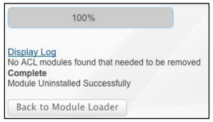

# [!DNL SugarCRM] Installationshandbuch {#sugarcrm-install-guide}

[Kundenunterstützung kontaktieren](https://adobe.com/go/adobesign-support-center_de)

Die Adobe [!DNL EchoSign] für [!DNL SugarCRM] ist eine führende eSignature- und Web-Vertragslösung, die elektronische Signaturautomatisierung in [!DNL SugarCRM] für e-Signaturen und Faxsignaturen bereitstellt. Benutzer können Verträge direkt über SugarCRM senden, den Vertragsverlauf anzeigen und eSigned-Verträge mit verknüpften Konten, Kontakten, Angeboten und mehr speichern.
Die Adobe [!DNL EchoSign] für [!DNL SugarCRM] ist für alle unterstützten SugarCRM-Versionen verfügbar, einschließlich 6.3-6.7 für On-Demand- oder lokale Lösungen.

In diesem Dokument erfahren Administratoren, wie Sie die [!DNL SugarCRM]-Adobe [!DNL EchoSign] für [!DNL SugarCRM]-Plugin installieren und konfigurieren.

## Plug-In installieren {#install-plugin}

1. Rufen Sie die Adobe [!DNL EchoSign] für die Archivdatei [!DNL SugarCRM] aus dem [SugarExchange-Listing](http://www.sugarexchange.com/product_details.php?product=1123) ab.
1. Melden Sie sich mit Ihrem Administratorkonto bei [!DNL SugarCRM] an.
1. Wechseln Sie zu **[!UICONTROL Administration]** > **[!UICONTROL Modul-Loader]**.

   

1. Um die Archivdatei der Adobe [!DNL EchoSign] für [!DNL SugarCRM]-Plug-In hochzuladen, wählen Sie **[!UICONTROL Durchsuchen]**, wählen Sie dann die Archivdatei und dann **[!UICONTROL Hochladen]**.
1. Nachdem die Archivdatei hochgeladen wurde, wählen Sie **[!UICONTROL Install]**, um die Installation zu starten.
1. Überprüfen Sie die Nutzungsbedingungen und wählen Sie **[!UICONTROL Akzeptieren]** > **[!UICONTROL Commit]**.
1. Wenn das Plug-In erfolgreich installiert wurde, zeigt die Fortschrittsleiste 100 % Erfolg an.  Wenn die Fortschrittsleiste nicht 100 % erreicht, wählen Sie **[!UICONTROL Protokoll anzeigen]**, um den Fehler anzuzeigen, der bei SugarCRM aufgetreten ist.

   

1. Klicken Sie nach der Installation auf **[!UICONTROL Administration > Reparieren]** und wählen Sie **[!UICONTROL Schnellreparatur und neu erstellen]**.

>[!NOTE]
>
>Wenn Sie das Plugin auf [!DNL SugarCRM] OnDemand installieren, stellen Sie ein Support-Ticket mit [!DNL SugarCRM] ein, um die Einschränkungen des Paketinspektors für OnDemand vorübergehend zu entfernen, sodass das Paket installiert werden kann. Dies ist Teil des Standardprozesses.

## Zusatzmodul aktualisieren {#upgrade-plugin}

Wenn Sie die Adobe [!DNL EchoSign] für [!DNL SugarCRM]-Plugin auf eine neuere Version aktualisieren, sollten Sie das Plug-In installieren, ohne die vorherige Version zu deinstallieren.
Nach dem Upgrade des Plug-ins gehen Sie zu **[!UICONTROL Administration]** > **[!UICONTROL Reparieren]** und wählen **[!UICONTROL Schnellreparatur und neu erstellen]**.

**Hinweis:** Wenn Sie ein früheres Plug-In deinstallieren, entfernen Sie die Tabellen während der Deinstallation nicht. Andernfalls verlieren Sie möglicherweise die [!DNL EchoSign]-Vereinbarungsdaten.

## Zusatzmodul konfigurieren {#configure-plugin}

1. Wenn Sie bereits Adobe [!DNL EchoSign] sind, fahren Sie mit Schritt 2 fort.

   Wenn Sie kein [!DNL EchoSign]-Konto haben, [Registrieren Sie sich für eine kostenlose 14-Tage-Testversion](https://sugarcrmintegration.echosign.com/public/login) und befolgen Sie die Online-Registrierungsschritte, um Ihre Adobe [!DNL EchoSign] zu aktivieren.
1. Melden Sie sich bei [Echo Sign-Konto](http://www.echosign.com) an und führen Sie die folgenden Schritte aus:
   1. Wählen Sie die Registerkarte **[!UICONTROL Konto]**.
   1. Wählen Sie links unten **[!UICONTROL EchoSign-API]** aus.
   1. Wählen Sie **[!UICONTROL API-Zugriff aktivieren]** und rufen Sie den API-Schlüssel von der Seite ab.

   

1. Gehen Sie in SugarCRM zu **[!UICONTROL Administration]** > **[!UICONTROL Adobe EchoSign Settings]** und geben Sie den API-Schlüssel in das Feld **[!UICONTROL EchoSign-API-Schlüssel]** ein.
1. Optional können Sie das Plug-In mit den folgenden Einstellungen konfigurieren:

   1. PDF automatisch anhängen, wenn Sie eine Vereinbarung aus einem Angebot erstellen: Wählen Sie aus, ob automatisch eine PDF des Angebots angehängt werden soll, wenn ein [!DNL SugarCRM]-Benutzer eine EchoSign-Vereinbarung über das Anführungsmodul erstellt.
   1. Empfängerliste verwalten: Wählen Sie aus, welche Module im Unterfeld Empfänger im [!DNL EchoSign]-Vereinbarungsmodul angezeigt werden. Dadurch wird diesen Modulen auch das Unterfeld [!DNL EchoSign] Vereinbarungen hinzugefügt.
   1. Fügen Sie den folgenden Modulen die Schaltflächen zum Senden hinzu: Wählen Sie diese Option, wenn die Schaltfläche/Aktion [!DNL EchoSign] Vereinbarung erstellen in die primären Aktionen des Angebotsmoduls einbezogen werden soll.
   1. Wählen Sie **[!UICONTROL Speichern]**, um Ihre Einstellungen zu speichern.

**Hinweis:** Die Adobe  [!DNL EchoSign] für das  [!DNL SugarCRM] Plugin erfordert die  [PHP SOAP-Erweiterung](http://www.php.net/manual/en/book.soap.php). Um die SOAP-Unterstützung zu aktivieren, konfigurieren Sie PHP mit enable-soap.

## Vereinbarungs-Updates abrufen (für [!DNL SugarCRM] Versionen 6.3 oder höher) {#get-agreement-updates}

Für Version 6.3 und höher können Sie die folgenden beiden Optionen verwenden, um Vereinbarungsaktualisierungen zu erhalten. In früheren Versionen von SugarCRM bietet das Plug-In standardmäßig nur die Rückrufmethode (Option 1).

### Option 1: Einrichten der Rückrufmethode zum Übertragen von Updates an EchoSign

Wenn Ihre Website öffentlich sichtbar ist, kann Adobe EchoSign Ihre [!DNL SugarCRM]-Instanz pingen lassen, wenn ein neues Ereignis eintritt. [!DNL SugarCRM] aktualisiert dann den Vereinbarungsstatus, Ereignisse und lädt das signierte Dokument (sofern signiert) automatisch und in Echtzeit herunter. (Wenn Sie sich hinter einer Firewall befinden, müssen Sie die [!DNL EchoSign]-Server-IP-Adressen in die Positivliste aufnehmen oder die geplante Auftragsmethode zum Aktualisieren von EchoSign-Vereinbarungen verwenden, wie im nächsten Abschnitt dieses Handbuchs beschrieben.)

1. Gehen Sie zu **[!UICONTROL Administration]** > **[!UICONTROL Adobe EchoSign Settings]**.
1. Aktivieren Sie das Kontrollkästchen **[!UICONTROL EchoSign-Rückrufmethode]** verwenden, um Ereignisse und Status von Vereinbarungen zu aktualisieren.
1. Wählen Sie **[!UICONTROL Speichern]**.

### Option 2: Einrichten eines geplanten Auftrags für [!DNL SugarCRM]-Instanzen hinter einer Firewall

Das [!DNL EchoSign]-Plugin für [!DNL SugarCRM] kann auch einen geplanten Auftrag verwenden, um [!DNL EchoSign] nach Updates für Vereinbarungen abzufragen, die zur Signatur gesendet wurden. Geplante Auftragsabfragemethode kann verwendet werden, wenn sich eine lokale [!DNL SugarCRM]-Installation hinter einer Firewall befindet.

Einrichten:

1. Gehen Sie zu **[!UICONTROL Administration]** > **[!UICONTROL Scheduler]**.
1. Wählen Sie im Dropdown-Menü der Registerkarte **[!UICONTROL Scheduler erstellen]**.
1. Geben Sie einen Auftragsnamen ein.
1. Wählen Sie im Feld &quot;Auftrag&quot;die Option **[!UICONTROL Adobe EchoSign Status Updater]**.
1. Legen Sie den Auftrag so oft wie nötig fest. Wir empfehlen, dass die Ausführung alle 10 Minuten erfolgt. Das bedeutet, dass nach dem Öffnen, Lesen oder Unterschreiben einer Vereinbarung bis zu 10 Minuten dauern kann, bis [!DNL SugarCRM] mit diesen Informationen aktualisiert wird.

   **Hinweis:** Wenn Sie viele Vereinbarungen zur Signatur versendet haben, kann es zu Verzögerungen beim Ausführen des Programms kommen.

   

1. Gehen Sie zu **[!UICONTROL Administration]** > **[!UICONTROL Adobe EchoSign Settings]**.
1. Deaktivieren Sie das Kontrollkästchen **[!UICONTROL EchoSign-Rückrufmethode]** verwenden, um Ereignisse und Status von Vereinbarungen zu aktualisieren.
1. Wählen Sie **[!UICONTROL Speichern]**.
Hinweis: Aktivieren Sie die Zeitplaner in [!DNL SugarCRM], damit dies funktioniert.

Hinzufügen von EchoSign-Vereinbarungen zu anderen [!DNL SugarCRM]-Modulen:

1. Gehen Sie zu **[!UICONTROL Administration]** > **[!UICONTROL Studio]**.
1. Wählen Sie in der linken Spaltenordnerstruktur das Modul zum Hinzufügen von [!DNL EchoSign]-Vereinbarungen aus.
1. Wählen Sie **[!UICONTROL Beziehungen]** **[!UICONTROL Beziehungen hinzufügen]**.
1. Wählen Sie im Dropdown-Menü &quot;Typ&quot;als **[!UICONTROL Ein bis viele]** und &quot;Modul&quot;als **[!UICONTROL EchoSign-Vereinbarungen]**.
1. Wählen Sie **[!UICONTROL Speichern und Bereitstellen]**.

   

   [!DNL EchoSign] Vereinbarungen werden jetzt im Modul angezeigt und Vereinbarungen können dort erstellt und verfolgt werden.

   

**Weitere Konfigurationsschritte**

* **Ausblenden von  [!DNL EchoSign] Modulen**: Sie können die  [!DNL EchoSign] Empfänger- und  [!DNL EchoSign] Ereignismodule ausblenden, indem Sie die Registerkarten und Unterfenster des Administrationsmoduls öffnen und in die ausgeblendete Spalte verschieben.
* **Deaktivieren von packageScan**: Wenn Sie packageScan auf Ihrem eigenen System aktiviert haben, müssen Sie es während der Installation deaktivieren. Wenn Sie [!DNL SugarCRM] On-Demand verwenden, wenden Sie sich an den [!DNL SugarCRM]-Support, um packageScan für Sie zu deaktivieren.

## Plug-In deinstallieren {#uninstall-plugin}

1. Melden Sie sich mit Ihrem Administratorkonto bei [!DNL SugarCRM] an.
1. Wechseln Sie zu **[!UICONTROL Administration]** > **[!UICONTROL Modul-Loader]**.
1. Wählen Sie **[!UICONTROL Deinstallieren]** neben dem [!UICONTROL EchoSign für SugarCRM-Plugin].
1. Wählen Sie **[!UICONTROL Commit]**, um die Deinstallation zu starten. Sie können auch die Datenbanktabellen entfernen, die für das Plug-In erstellt wurden.

   

   Wenn das Plug-In erfolgreich deinstalliert wird, zeigt die Fortschrittsleiste einen 100%igen Erfolg an. Wenn die Fortschrittsleiste nicht 100 % erreicht, wählen Sie [!UICONTROL Protokoll anzeigen], um den Fehler anzuzeigen, der bei SugarCRM aufgetreten ist.

   

## Adobe [!DNL EchoSign] für [!DNL SugarCRM] verwenden {#use-echosign-for-sugarcrm}

Sie können eine [!DNL EchoSign]-Adobe erstellen, die einem Konto, einem Kontakt, einem Angebot oder anderen [!DNL SugarCRM]-Modulen zugeordnet ist. Sie können Dateien anhängen, Empfänger angeben und zum Unterschreiben senden. Adobe [!DNL EchoSign] aktualisiert [!DNL SugarCRM] mit dem aktuellen Status des Vertrags und speichert den signierten Vertrag in [!DNL SugarCRM], sobald er vollständig ausgeführt wurde.

### Erstellen und Bearbeiten einer Adobe [!DNL EchoSign]-Vereinbarung {#create-edit-agreements}

Sie können Vereinbarungen über das [!DNL EchoSign]-Vereinbarungsmodul oder über Module erstellen, die von einem [!DNL SugarCRM]-Administrator konfiguriert wurden.

1. Wählen Sie in der Liste [!UICONTROL Aktionen] auf der Registerkarte [!UICONTROL EchoSign-Vereinbarungen] **[!UICONTROL EchoSign-Vereinbarung erstellen]** aus.
1. Geben Sie im Hauptabschnitt der [!DNL EchoSign]-Vereinbarung die folgenden Informationen ein oder wählen Sie aus verschiedenen Vereinbarungsoptionen:

   1. **[!UICONTROL Name:]** Geben Sie einen Namen für die Vereinbarung ein.
   1. **[!UICONTROL Signaturtyp:]** Wählen Sie den Signaturtyp aus, der für das Dokument akzeptiert wird. Die Optionen sind e-Signatur und Faxsignatur.
   1. **[!UICONTROL Ich muss diese Vereinbarung auch signieren:]** Geben Sie an, ob der Absender die Vereinbarung ebenfalls signieren muss.
   1. **[!UICONTROL Signaturreihenfolge:]** Wenn die vorherige Option Ich muss diese Vereinbarung ebenfalls signieren aktiviert ist, wählen Sie auch die Reihenfolge aus, in der der Absender und die Empfänger diese Vereinbarung signieren sollen.
   1. **[!UICONTROL Empfänger zum Signieren erinnern:]** Wählen Sie aus, wie oft ein Empfänger daran erinnert werden soll, ein Dokument zu signieren. Die Optionen lauten &quot;Täglich&quot;oder &quot;Wöchentlich&quot;.
   1. **[!UICONTROL Tage bis zum Signaturtermin:]** Geben Sie die Anzahl der Tage an, bis die Vereinbarung signiert werden muss.
   1. **[!UICONTROL Vorschau anz., Signatur platzieren od. Formularfelder hinzufüg.:]**  Wählen Sie diese Option, um die Vereinbarung vor dem Senden in der Vorschau anzuzeigen, oder ziehen Sie Signaturfelder, Initialfelder oder andere Formularfelder per Drag &amp; Drop in die Vereinbarung, bevor sie an Empfänger gesendet wird. Nachdem Sie eine Vorschau des Dokuments angezeigt oder die gewünschten Felder in das Dokument gezogen haben, müssen Sie die Schaltfläche Senden auswählen, um die Vereinbarung an den Empfänger zu senden.
   1. **[!UICONTROL Hostsignatur für den ersten Unterzeichner:]** Geben Sie an, ob der Absender die Vereinbarung persönlich unterschreiben möchte.
      * **[!UICONTROL Nachricht:]** Fügen Sie eine Nachricht für den Empfänger ein.
      * **[!UICONTROL Konto, Opportunity, Angebot:]** Wählen oder ändern Sie das Konto, die Opportunity oder das Angebot, das mit dieser Vereinbarung verknüpft ist.
      * **[!UICONTROL Sprache:]** Geben Sie die Sprache an, in der die Signaturseite und die E-Mail-Benachrichtigungen den Empfängern angezeigt werden.

      

1. Geben Sie im Abschnitt [!UICONTROL Sicherheitsoptionen] der [!UICONTROL EchoSign-Vereinbarung] die folgenden Informationen ein:

   a) **[!UICONTROL Zum Unterschreiben erforderliches Kennwort: Geben Sie an, ob ein Kennwort eingegeben werden muss, bevor ein Empfänger ein Dokument signieren kann.]**
b) **[!UICONTROL Kennwort zum Öffnen erforderlich:]** Geben Sie an, ob ein Kennwort eingegeben werden muss, bevor ein Empfänger eine PDF der Vereinbarung oder der signierten Vereinbarung öffnen kann.
c) **[!UICONTROL Kennwort:]** Geben Sie das Kennwort an, mit dem ein Dokument signiert oder geöffnet werden soll.
d) **[!UICONTROL Kennwort bestätigen: Bestätigen Sie das Kennwort zum Unterschreiben oder Öffnen eines Dokuments.]**

1. Geben Sie im Abschnitt Andere der [!DNL EchoSign]-Vereinbarung die folgenden Informationen ein:

   a) **[!UICONTROL Benutzer:]** Geben Sie einen [!DNL SugarCRM]-Benutzer an. Der Standardbenutzer ist der Benutzer, der derzeit beim System angemeldet ist.
b) **[!UICONTROL Teams:]** Um die primäre Teamzuweisung zu ändern, geben Sie den Namen des neuen primären Teams ein. Um dem Datensatz weitere Teams zuzuweisen, klicken Sie auf **[!UICONTROL Auswählen]** und wählen Sie in der Team-Liste ein Team aus oder wählen Sie **[!UICONTROL Zu]** hinzufügen, um Teamfelder hinzuzufügen und die Teamnamen einzugeben. Weitere Informationen finden Sie unter &quot;Benutzern und Teams Datensätze zuweisen&quot;im [!DNL SugarCRM]-Anwendungshandbuch.

1. Wählen Sie **[!UICONTROL Speichern]**.

### [!DNL EchoSign] Vereinbarungsdetailansicht {#agreement-detail-view}

Nachdem eine [!DNL EchoSign]-Vereinbarung gespeichert wurde, enthält die Detailansicht der Vereinbarung die folgenden Unterfenster:

* **[!UICONTROL Empfänger:]** Alle in diesem Unterfenster aufgeführten Kontakte erhalten die im Unterfenster &quot;Dokumente&quot;angegebenen Dokumente. Sie müssen einen oder mehrere Empfänger hinzufügen, bevor Sie die Vereinbarung senden.
* **[!UICONTROL Dokumente:]** Laden Sie ein neues Dokument hoch oder wählen Sie ein Dokument aus, in das bereits ein Dokument hochgeladen wurde,  [!DNL SugarCRM] um es zum Unterschreiben zu senden.
* **[!UICONTROL Ereignisse:]** Alle Aktionen in Bezug auf die Vereinbarung, z. B. wenn die Vereinbarung zum Unterschreiben gesendet, angezeigt oder unterschrieben wurde, werden in diesem Unterfenster aufgeführt.
Um eine [!DNL EchoSign]-Vereinbarung zu bearbeiten, wählen Sie die Schaltfläche [!UICONTROL Bearbeiten] in der [!UICONTROL Detailansicht] der Vereinbarung aus.

**Hinweis:** Nachdem eine Vereinbarung zum Unterschreiben gesendet wurde, wird die Schaltfläche &quot;  Bearbeiten&quot;aus der Detailansicht entfernt, um den Ereignisdatensatz beizubehalten. Sie können jedoch die Schaltfläche Bearbeiten aktivieren. Gehen Sie dazu zu [!UICONTROL Admin] > [!UICONTROL Adobe EchoSign Settings] und deaktivieren Sie die Option *[!UICONTROL Nachdem eine Vereinbarung zum Unterschreiben gesendet wurde, deaktivieren Sie die Möglichkeit zum Bearbeiten oder Löschen]*.

### Dokument zu einer [!DNL EchoSign]-Vereinbarung hinzufügen {#add-document}

[!DNL SugarCRM] Benutzer können ein neues Dokument hochladen oder ein Dokument auswählen, das bereits hochgeladen wurde,  [!DNL SugarCRM] indem sie das Unterfenster Dokumente eines EchoSign-Vereinbarungsdatensatzes verwenden.
Um ein Dokument hochzuladen, wählen Sie **[!UICONTROL Dokument hochladen]** im Unterfeld [!UICONTROL Dokumente] aus.

Weitere Informationen zu den einzelnen Feldern des Formulars finden Sie im Abschnitt &quot;Dokumentmodul&quot;des [!DNL SugarCRM]-Anwendungshandbuchs.

Um ein Dokument auszuwählen, klicken Sie im Unterfenster &quot;Dokumente&quot;auf **[!UICONTROL Auswählen]**. Weitere Informationen zum Verwalten von zugehörigen Informationen in Unterfenstern finden Sie unter &quot;Anzeigen und Verwalten von Datensatzinformationen&quot;im [!DNL SugarCRM]-Anwendungshandbuch.

### Empfänger für eine [!DNL EchoSign]-Vereinbarung angeben {#specify-recipient}

1. Wählen Sie im Unterfeld [!UICONTROL Empfänger] einer [!DNL EchoSign]-Vereinbarung **[!UICONTROL Empfänger hinzufügen]** aus.
1. Geben Sie die folgenden Informationen ein:
a) [!UICONTROL Empfänger:] Wählen Sie im Dropdown-Menü den Empfängertyp aus. Geben Sie den Namen oder die E-Mail-Adresse des Empfängers in das Textfeld ein. [!DNL SugarCRM] sucht bei der Eingabe nach dem Namen und zeigt eine Liste der Auswahlen an. Wählen Sie einen Namen aus, wenn eine Übereinstimmung gefunden wird. Sie können auch das Pfeilsymbol auswählen, um einen Namen aus einem Popup-Fenster auszuwählen. Um den Namen aus dem Feld zu löschen, wählen Sie das Symbol **[!UICONTROL X]** aus.
b) [!UICONTROL Rolle:] Wählen Sie im Dropdown-Menü eine Rolle aus. Die Optionen lauten &quot;Unterzeichner&quot;und &quot;CC&quot;und &quot;Genehmiger&quot;. Ein Genehmiger muss das Dokument nicht signieren.
1. Wählen Sie Speichern.

### Vereinbarungen zum Unterschreiben senden {#send-for-signature}

Wenn Vereinbarungen zum Signieren gesendet werden können, wählen Sie im Dropdown-Menü oben links auf der Seite **[!UICONTROL Send for Signature]** aus. Die Empfänger erhalten dann eine E-Mail, in der sie über die Dokumente informiert werden, die ihre Signatur abwarten. Nachdem die Empfänger das Dokument signiert haben, erhält der Absender eine E-Mail-Benachrichtigung.
Wenn die Option [!UICONTROL Hostsignatur für ersten Unterzeichner] aktiviert ist, können Sie **[!UICONTROL Send for Signature]** auswählen, damit der Unterzeichner das Dokument mit dem vorhandenen Absender signieren kann.

Neben dem Link [!UICONTROL Hostsignatur für ersten Unterzeichner] wird auch der Link **[!UICONTROL Hostsignatur für aktuellen Unterzeichner]** angezeigt, auf den zugegriffen werden kann, bis das Dokument signiert ist. Sie können diesen Link verwenden, um die Vereinbarungssignatur für mehrere Unterzeichner zu hosten oder um das Popup-Fenster erneut zu öffnen, wenn es versehentlich geschlossen wurde.
Wenn die Option [!UICONTROL Vorschau anz., Signatur platzieren od. Formularfelder hinzufüg.] aktiviert ist, wählen Sie **[!UICONTROL Send for Signature]** aus, damit der Absender das Dokument in der Vorschau anzeigen oder Felder auf das Dokument ziehen kann, bevor es gesendet wird. Sie müssen **[!UICONTROL Senden]** in diesem Fenster auswählen, um die Vereinbarung an den Empfänger zu senden.

Abbildung 5: Wählen Sie Send for Signature, um ein Dokument zum Unterschreiben an einen Empfänger zu senden.

### Aus einem Angebotsdatensatz senden {#send-from-quote-record}

Die Adobe [!DNL EchoSign] verfügt über eine direkte Integration mit Anführungszeichen in [!DNL SugarCRM], sodass die PDF des Anführungszeichens automatisch generiert und an den Vereinbarungsdatensatz angehängt wird.
Wenn Sie ein Angebot anzeigen, wählen Sie **[!UICONTROL EchoSign-Vereinbarung erstellen]**, um das Angebot zu generieren und automatisch an die Vereinbarung anzuhängen. Die neue Vereinbarung verknüpft außerdem automatisch alle zugehörigen Opportunity-, Konto- oder Angebotsoptionen.

Um die automatische Anfügung des Angebots an die PDF zu deaktivieren, gehen Sie zu **[!UICONTROL Administration]** > **[!UICONTROL Adobe EchoSign Settings]** und deaktivieren Sie das Kontrollkästchen *[!UICONTROL PDF automatisch anhängen, wenn Sie eine Vereinbarung aus einem Angebot erstellen]*.

### Eine Vereinbarung abbrechen {#cancel-agreement}

Sie können eine [!DNL EchoSign]-Vereinbarung abbrechen, nachdem sie zur Signatur gesendet wurde, wenn noch nicht alle Empfänger das Dokument signiert haben. Eine Schaltfläche [!UICONTROL Vereinbarung abbrechen] wird in der Detailansicht einer Vereinbarung angezeigt, nachdem ein Dokument zum Unterschreiben gesendet wurde. Wählen Sie **[!UICONTROL Vereinbarung abbrechen]**, um die Vereinbarung abzubrechen.

Hinweis: Wenn eine [!DNL EchoSign]-Vereinbarung zum Unterschreiben gesendet und der Datensatz gelöscht wird, müssen Sie die Vereinbarung vor dem Löschen abbrechen.

### Signaturen verfolgen {#track-signatures}

Das Unterfeld [!UICONTROL Ereignisse] einer [!DNL EchoSign]-Vereinbarung verfolgt den Status von Vereinbarungen, die zum Unterschreiben gesendet werden. Um die neuesten Updates für eine [!DNL EchoSign]-Vereinbarung anzuzeigen, wählen Sie **[!UICONTROL Status aktualisieren]**. Die Schaltfläche [!UICONTROL Status aktualisieren] ist erst verfügbar, nachdem eine Vereinbarung zum Unterschreiben gesendet wurde.

Nachdem eine Vereinbarung zur Signatur gesendet wurde, wählen Sie **[!UICONTROL Status aktualisieren]**, um den neuesten Status abzurufen.

### Erinnerungen senden {#send-reminders}

Um dem aktuellen Unterzeichner nach dem Senden der Vereinbarung eine Erinnerung zu senden, wählen Sie **[!UICONTROL Erinnerung senden]**. Es wird sofort eine E-Mail-Erinnerung an den aktuellen Unterzeichner über die Vereinbarung gesendet, die auf die Signatur wartet.

