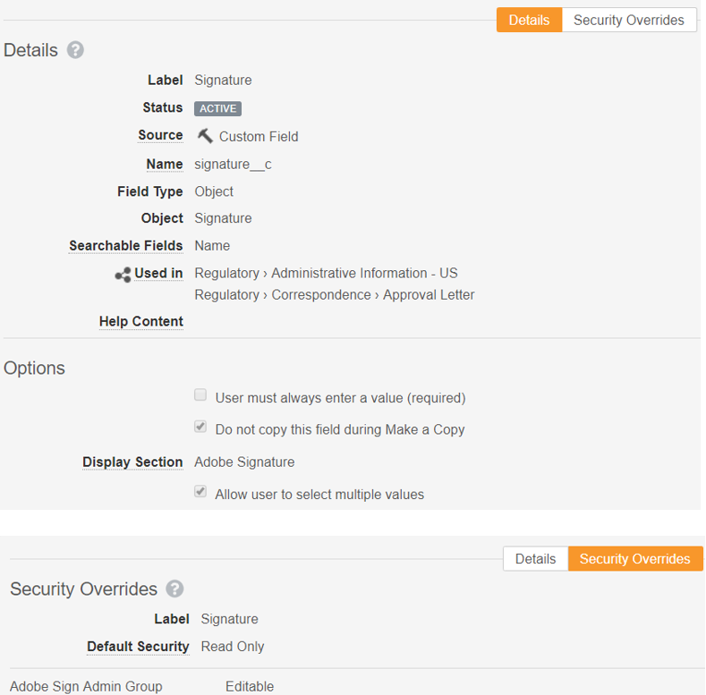

# [!DNL Veeva Vault] Installationshandbuch{#veeva-installation-guide}

[**Adobe Sign-Support kontaktieren**](https://adobe.com/go/adobesign-support-center_de)

## Übersicht {#overview}

In diesem Dokument wird beschrieben, wie Sie die Integration von Adobe Sign mit [!DNL Veeva Vault]-Plattform einrichten. [!DNL Veeva Vault] ist eine ECM-Plattform (Enterprise Content Management), die für Biowissenschaften entwickelt wurde. Ein &quot;Vault&quot;ist ein Inhalts- und Datenspeicher mit typischer Verwendung für behördliche Anmeldungen, Recherchenberichte, Finanzhilfeanträge, allgemeine Verträge und mehr. Ein einzelnes Unternehmen kann über mehrere &quot;Standardwerte&quot;verfügen, die separat verwaltet werden müssen.

Die wichtigsten Schritte zum Abschluss der Integration sind:

* Aktivieren Sie Ihr Administratorkonto in Adobe Sign (nur neue Kunden).
* Erstellen Sie Objekte, um den Verlauf eines Vereinbarungslebenszyklus in Vault zu verfolgen.
* Erstellen Sie ein neues Sicherheitsprofil.
* Konfigurieren Sie eine Gruppe in Adobe Sign, um den [!DNL Veeva Vault]-Integrationsbenutzer zu verwenden.
* Erstellen Sie Dokumentfelder und Darstellungen.
* Konfigurieren Sie Webaktionen und aktualisieren Sie den Dokumentlebenszyklus.
* Erstellen Sie die Benutzer- und Benutzerrolle des Dokumenttyps.

>[!NOTE]
>
>Der Adobe Sign-Administrator muss die Adobe Sign-Einrichtungsschritte in Adobe Sign ausführen.

## Konfigurieren Sie [!DNL Veeva Vault]

Um [!DNL Veeva Vault] für die Integration mit Adobe Sign zu konfigurieren, erstellen wir bestimmte Objekte, die den Verlauf eines Vereinbarungslebenszyklus in Vault verfolgen helfen. Administratoren müssen die folgenden Objekte erstellen:

* Signatur
* Unterschrift
* Signaturereignis
* Prozesssperre

### Signaturobjekt erstellen  {#create-signature-object}

Signaturobjekt wird erstellt, um Informationen zu einer Vereinbarung zu speichern. Ein Signaturobjekt ist eine Datenbank, die Informationen in den folgenden spezifischen Feldern enthält:

**Unterschriftsobjektfelder**

| Feld | Bezeichnung | Type | Beschreibung |
| --- | --- | ---| --- | 
| external_id__c | Vereinbarungs-ID | Zeichenfolge (100) | Enthält die eindeutige Vereinbarungs-ID der Adobe Sign |
| file_hash_c | Datei-Hash | Zeichenfolge (50) | Enthält die md5-Prüfsumme der Datei, die an Adobe Sign gesendet wurde |
| name__v | Name | Zeichenfolge (128) | Enthält den Vereinbarungsnamen |
| sender__c | Absender | Objekt (Benutzer) | Enthält den Verweis auf den Vault-Benutzer, der die Vereinbarung erstellt hat. |
| signature_status__c | Signaturstatus | Zeichenfolge (75) | Status des Abkommens in Adobe Sign |
| signature_type__c | Signaturtyp | Zeichenfolge (20) | Enthält den Signaturtyp des Vertrags in Adobe Sign (SCHRIFTLICHE oder ESIGN) |
| start_date__c | Anfangsdatum | Datum/Uhrzeit | Datum, an dem die Vereinbarung zum Unterschreiben gesendet wurde |
| cancelation_date__c | Kündigungsdatum | Datum/Uhrzeit | Enthält das Datum, an dem die Vereinbarung abgebrochen wurde. |
| completion_date__c | Abschlussdatum | Datum/Uhrzeit | Enthält das Datum, an dem die Vereinbarung abgeschlossen wurde. |
| viewable_rendition_used__c | Verwendete sichtbare Darstellung | Boolescher Wert | Markierung, die anzeigt, ob eine sichtbare Wiedergabe zum Unterschreiben gesendet wurde. (standardmäßig ist es true) |

### Signaturobjekt erstellen {#create-signatory-object}

Ein Signaturobjekt wird erstellt, um Informationen zu den Teilnehmern einer Vereinbarung zu speichern. Es enthält Informationen zu den folgenden spezifischen Feldern:

**Unterschriftsobjektfelder**

| Feld | Bezeichnung | Typ | Beschreibung |
| --- | --- | ---| --- | 
| email__c | E-Mail | Zeichenfolge (120) | Enthält die eindeutige Vereinbarungs-ID der Adobe Sign |
| external_id__c | Teilnehmer-ID | Zeichenfolge (80) | Kennnummer des eindeutigen Adobe Sign-Teilnehmers |
| name__v | Name | Zeichenfolge (128) | Name des Adobe Sign-Teilnehmers |
| order__c | Auftrag | Zahl | Enthält die Bestellnummer des Adobe Sign-Vereinbarungsteilnehmers |
| role__c | Rolle | Zeichenfolge (30) | Rolle des Adobe Sign-Vereinbarungsteilnehmers |
| signature__c | Signatur | Objekt (Signatur) | Enthält den Verweis auf den übergeordneten Unterschriftsdatensatz |
| signature_status__c | Signaturstatus | Zeichenfolge (100) | Status des Adobe Sign-Vereinbarungsteilnehmers |
| user__c | Benutzer | Objekt (Benutzer) | Enthält den Verweis auf den Benutzerdatensatz des Unterzeichners, wenn Teilnehmer ein Vault-Benutzer ist. |

### Signaturereignisobjekt erstellen  {#create-signature-event}

Das Signaturereignisobjekt wird erstellt, um die ereignisbezogenen Informationen einer Vereinbarung zu speichern. Es enthält Informationen zu den folgenden spezifischen Feldern:

| Feld | Bezeichnung | Typ | Beschreibung |
| --- | --- | ---| --- | 
| act_user_email_c | Aktive Benutzer-E-Mail | Zeichenfolge | Enthält die E-Mail des Adobe Sign-Benutzers, der die Aktion ausgeführt hat, durch die das Ereignis generiert wurde. |
| act_user_name__c | Acting-Benutzername | Zeichenfolge | Enthält den Namen des Adobe Sign-Benutzers, der die Aktion ausgeführt hat, durch die das Ereignis generiert wurde |
| description__c | Beschreibung | Zeichenfolge | Enthält die Beschreibung des Adobe Sign-Ereignisses |
| event_date__c | Ereignisdatum | Datum/Uhrzeit | Enthält das Datum und die Uhrzeit des Adobe Sign-Ereignisses |
| event_type__c | Ereignistyp | Zeichenfolge | Enthält den Ereignistyp &quot;Adobe Sign&quot; |
| name__v | Name | Zeichenfolge | Automatisch generierter Ereignisname |
| participant_comment__c | Kommentar des Teilnehmers | Zeichenfolge | Enthält den Kommentar des Adobe Sign-Teilnehmers, sofern vorhanden |
| participant_email_c | Teilnehmer-E-Mail | Zeichenfolge | Enthält die E-Mail des Adobe Sign-Teilnehmers |
| participant_role__c | Rolle des Teilnehmers | Zeichenfolge | Rolle des Adobe Sign-Teilnehmers |
| signature__c | Signatur | Objekt (Signatur) | Enthält den Verweis auf den übergeordneten Unterschriftsdatensatz |

### Process Locker-Objekt erstellen  {#create-process-locker}

Ein Process Locker-Objekt wird erstellt, um den Adobe Sign-Integrationsprozess zu sperren. Es sind keine benutzerdefinierten Felder erforderlich.

## Erstellen von Sicherheitsprofilen{#security-profiles}

Für eine erfolgreiche Integration des Vault wird ein neues Sicherheitsprofil mit dem Namen *Adobe Sign-Integrationsprofil* erstellt, dessen Berechtigung für *Adobe Sign Admin Actions* festgelegt ist. Das Adobe Sign Integrationsprofil wird dem Systemkonto zugewiesen und von der Integration beim Aufrufen von Vault-APIs verwendet. Dieses Profil ermöglicht Berechtigungen für:

* Vault-APIs
* Lesen, Erstellen, Bearbeiten und Löschen: Objekte Signatur, Unterzeichner, Signaturereignisse und Prozesssperre

Sicherheitsprofile von Benutzern, die einen Zugriff auf den Adobe Sign-Verlauf in Vault benötigen, müssen über Leseberechtigungen für Signatur-, Signatur- und Signaturereignisobjekte verfügen.

## Gruppe erstellen {#create-group}

Um Adobe Sign für [!DNL Vault] zu konfigurieren, wird eine neue Gruppe mit dem Namen *Adobe Sign Admin Group* erstellt. Diese Gruppe wird verwendet, um die Sicherheit auf Dokumentebene für Adobe Sign-bezogene Felder festzulegen und sollte standardmäßig *Adobe Sign-Integrationsprofil* enthalten.

## Benutzer erstellen {#create-user}

Der Vault-Systemkontobenutzer der Adobe Sign-Integration muss:

* Adobe Sign-Integrationsprofil
* Sicherheitsprofil
* Legen Sie eine bestimmte Sicherheitsrichtlinie fest, die den Ablauf des Kennworts deaktiviert
* Seien Sie Mitglied der Adobe Sign Admin Group.

Um sicherzustellen, dass der Systemkonto-Benutzer für den jeweiligen Dokumentlebenszyklus zur Adobe Sign Admin Group gehört, müssen Sie Benutzerrollen-Setup-Datensätze erstellen.

## Anwendungsrollen erstellen {#create-application-roles}

Sie müssen die Anwendungsrolle *Adobe Sign-Administratorrolle* erstellen. Diese Rolle muss im Lebenszyklus jedes Dokumenttyps definiert werden, der für die Signatur der Adobe geeignet ist. Für jeden Adobe Sign-spezifischen Lebenszyklusstatus wird die Adobe Sign-Administratorrolle hinzugefügt und mit den entsprechenden Berechtigungen konfiguriert.

## Dokumentfelder erstellen {#create-fields}

Um die Integration mit Adobe Sign herzustellen, müssen Administratoren die folgenden zwei neuen freigegebenen Dokumentfelder erstellen:

* Signatur (signature__c)
* Adobe Sign-Benutzeraktionen zulassen (allow_adobe_sign_user_actions__c)

Diese freigegebenen Felder müssen allen Dokumenttypen hinzugefügt werden, die für die Signatur der Adobe infrage kommen. Beide Felder sollten über eine bestimmte Sicherheit verfügen, die es nur Mitgliedern der Adobe Sign Admin Group ermöglicht, ihre Werte zu aktualisieren.

Administratoren müssen das vorhandene freigegebene Feld *Vault-Überlagerungen deaktivieren (disable_vault_overlays__v)* hinzufügen und es für alle Dokumenttypen, die für die Signatur der Adobe infrage kommen, auf Aktiv setzen. Optional kann das Feld eine bestimmte Sicherheit aufweisen, die es nur Mitgliedern der Adobe Sign Admin Group ermöglicht, ihren Wert zu aktualisieren.

## Dokumentwiedergaben erstellen {#create-renditions}

Administratoren müssen einen neuen Darstellungstyp mit dem Namen *Adobe Sign Rendition (adobe_sign_rendition__c)* erstellen, der von der Vault-Integration verwendet wird, um signierte PDF-Dokumente auf Adobe Sign hochzuladen. Die Adobe Sign-Darstellung sollte für jeden Dokumenttyp deklariert werden, der für die Adobe Signature geeignet ist.

## Webaktionen konfigurieren {#web-actions}

Für die Integration von Adobe Sign und Vault müssen Sie die folgenden zwei Webaktionen erstellen und konfigurieren:

* **Adobe Sign** erstellen: Es wird eine Adobe Sign-Vereinbarung erstellt oder angezeigt.

   Typ: Dokument
Ziel: Im Vault anzeigen
URL: <https://{integrationDomain}/adobe-sign-int/signature?docId=${Document.id}&majVer=${Document.major_version_number__v}&minVer=${Document.minor_version_number__v}&sessionId=${Session.id}&vaultId=${Vault.Id>

* **Adobe Sign** abbrechen: Sie kündigt eine bestehende Vereinbarung in Adobe Sign ab und stellt den Status eines Dokuments auf den ursprünglichen Status zurück.

   Typ: Dokument
Ziel: Im Vault anzeigen
URL: <https://{integrationDomain}/adobe-sign-int/cancel?docId=${Document.id}&majVer=${Document.major_version_number__v}&minVer=${Document.minor_version_number__v}&sessionId=${Session.id}&vaultId=${Vault.Id>

## Dokumentlebenszyklus aktualisieren {#document-lifecycle}

Für jeden Dokumenttyp, der für die Signatur der Adobe infrage kommt, muss der entsprechende Dokumentlebenszyklus aktualisiert werden, indem eine neue Lebenszyklusrolle und neue Status hinzugefügt werden.

### Lebenszyklusrolle {#lifecycle-role}

Die Rolle der Adobe Sign Admin-Anwendung muss in allen Lebenszyklen hinzugefügt werden, die von Dokumenten verwendet werden, die für die Adobe Signature infrage kommen. Diese Rolle sollte mit den folgenden Optionen erstellt werden:

* Dynamische Zugriffssteuerung aktivieren
* Regeln für die Dokumentfreigabe, die nur die Gruppe &quot;Dokumenttyp&quot;enthalten

### Lebenszyklusstatus {#lifecycle-states}

Der Adobe Sign-Vereinbarungslebenszyklus hat folgende Status:

* ENTWURF
* AUTHORING or DOCUMENTS_NOT_YET_PROCESSED
* OUT_FOR_SIGNATURE oder OUT_FOR_APPROVAL
* UNTERZEICHNET ODER GENEHMIGT
* ABGEBROCHEN
* ABGELAUFEN

Wenn ein Vault-Dokument an Adobe Sign gesendet wird, sollte sein Status dem Status entsprechen, in dem sich die Vereinbarung befindet. Fügen Sie dazu in jedem Lebenszyklus, der von Dokumenten verwendet wird, die zur Signatur der Adobe berechtigt sind, folgende Status hinzu:

* **Vor Signatur**  der Adobe (überprüft): Dies ist ein Platzhaltername für den Status, von dem aus das Dokument an Adobe Sign gesendet werden kann. Je nach Dokumenttyp kann es sich um den Status &quot;Entwurf&quot;oder &quot;Geprüft&quot;handeln. Die Beschriftung des Dokumentstatus kann gemäß den Anforderungen des Kunden angepasst werden. Vor der Adobe muss der Signaturstatus die folgenden zwei Benutzeraktionen definieren:

   * Aktion, die den Status des Dokuments in den Status *In Adobe Sign Draft* ändert. Der Name dieser Benutzeraktion muss für alle Dokumenttypen für jeden Lebenszyklus gleich sein. Bei Bedarf können die Kriterien für diese Aktion auf &quot;Adobe Sign-Benutzeraktionen zulassen entspricht Ja&quot;festgelegt werden.
   * Aktion, die die Webaktion &quot;Adobe Sign&quot;nennt. Dieser Status muss über eine Sicherheitsfunktion verfügen, die es der Adobe Sign-Administratorrolle ermöglicht, Anzeigen von Dokumenten, Anzeigen von Inhalten, Bearbeiten von Feldern, Bearbeiten von Beziehungen, Herunterladen von Quellen, Verwalten von sichtbaren Darstellungen und Ändern des Status.

   

* **In Adobe Sign Draft**: Dies ist ein Platzhaltername für den Status, der angibt, dass das Dokument bereits nach Adobe Sign hochgeladen wurde und dass sich die Vereinbarung in einem ENTWURF-Status befindet. Dies ist ein erforderlicher Status. Dieser Status muss die folgenden fünf Benutzeraktionen ablehnen:

   * Aktion, die den Status des Dokuments in *In Adobe Sign Authoring*-Status ändert. Der Name dieser Benutzeraktion muss für alle Dokumenttypen für jeden Lebenszyklus gleich sein. Bei Bedarf können die Kriterien für diese Aktion auf &quot;Adobe Sign-Benutzeraktionen zulassen entspricht Ja&quot;festgelegt werden.
   * Aktion, die den Dokumentstatus in *In Adobe Signing state* ändert. Der Name dieser Benutzeraktion muss für alle Dokumenttypen für jeden Lebenszyklus gleich sein. Bei Bedarf können die Kriterien für diese Aktion auf &quot;Adobe Sign-Benutzeraktionen zulassen entspricht Ja&quot;festgelegt werden.
   * Aktion, die den Status des Dokuments in den Status *Abgebrochene Adobe Sign* ändert. Der Name dieser Benutzeraktion muss für alle Dokumenttypen für jeden Lebenszyklus gleich sein. Bei Bedarf können die Kriterien für diese Aktion auf &quot;Adobe Sign-Benutzeraktionen zulassen entspricht Ja&quot;festgelegt werden.
   * Aktion, die die Webaktion &quot;Adobe Sign&quot;aufruft.
   * Aktion, die die Webaktion &quot;Adobe Sign abbrechen&quot;aufruft. Dieser Status muss über eine Sicherheit verfügen, die der Adobe Sign-Administratorrolle Folgendes ermöglicht: Anzeigen von Dokumenten, Anzeigen von Inhalten, Bearbeiten von Feldern, Bearbeiten von Beziehungen, Herunterladen von Quellen, Verwalten von sichtbaren Darstellungen und Ändern des Status.

   

* **Adobe Sign Authoring**: Dies ist ein Platzhaltername für den Status, der angibt, dass das Dokument bereits nach Adobe Sign hochgeladen wurde und dass die Vereinbarung im Status AUTHORING oder DOCUMENTS_NOT_YET_PROCESSED vorliegt. Dies ist ein erforderlicher Status. Für diesen Status müssen die folgenden vier Benutzeraktionen definiert sein:

   * Aktion, die den Status des Dokuments in den Status &quot;Abgebrochen&quot;von Adobe Sign ändert. Der Name dieser Benutzeraktion muss für alle Dokumenttypen gleich sein, unabhängig davon, welchen Lebenszyklus sie hat. Bei Bedarf können die Kriterien für diese Aktion auf &quot;Adobe Sign-Benutzeraktionen zulassen entspricht Ja&quot;festgelegt werden.
   * Aktion, die den Dokumentstatus in den Status &quot;Signatur in Adobe&quot;ändert. Der Name dieser Benutzeraktion muss für alle Dokumenttypen gleich sein, unabhängig davon, welchen Lebenszyklus sie hat. Bei Bedarf können die Kriterien für diese Aktion auf &quot;Adobe Sign-Benutzeraktionen zulassen entspricht Ja&quot;festgelegt werden.
   * Aktion, die die Webaktion &quot;Adobe Sign&quot;aufruft
   * Aktion, die die Webaktion &quot;Adobe Sign abbrechen&quot;aufruft. Dieser Status muss über eine Sicherheit verfügen, die der Adobe Sign-Administratorrolle Folgendes ermöglicht: Anzeigen von Dokumenten, Anzeigen von Inhalten, Bearbeiten von Feldern, Bearbeiten von Beziehungen, Herunterladen von Quellen, Verwalten von sichtbaren Darstellungen und Ändern des Status.

   

* **In Adobe Signieren**: Dies ist ein Platzhaltername für den Status, der angibt, dass das Dokument nach Adobe Sign hochgeladen wird und dass der Vertrag bereits an die Teilnehmer gesendet wurde (OUT_FOR_SIGNATURE- oder OUT_FOR_APPROVAL-Status). Dies ist ein erforderlicher Status. Für diesen Status müssen die folgenden fünf Benutzeraktionen definiert sein:

   * Aktion, die den Status des Dokuments in den Status &quot;Abgebrochen&quot;von Adobe Sign ändert. Der Zielstatus dieser Aktion kann unabhängig von den Kundenanforderungen sein und kann für verschiedene Typen unterschiedlich sein. Der Name dieser Benutzeraktion muss für alle Dokumenttypen gleich sein, unabhängig davon, welchen Lebenszyklus sie hat. Bei Bedarf können die Kriterien für diese Aktion auf &quot;Adobe Sign-Benutzeraktionen zulassen entspricht Ja&quot;festgelegt werden.
   * Aktion, die den Status des Dokuments in den Status &quot;Adobe Sign-abgelehnt&quot;ändert. Der Zielstatus dieser Aktion kann unabhängig von den Kundenanforderungen sein und kann für verschiedene Typen unterschiedlich sein. Der Name dieser Benutzeraktion muss für alle Dokumenttypen gleich sein, unabhängig davon, welchen Lebenszyklus sie hat. Bei Bedarf können die Kriterien für diese Aktion auf &quot;Adobe Sign-Benutzeraktionen zulassen entspricht Ja&quot;festgelegt werden.
   * Aktion, die den Status des Dokuments in den Status &quot;Adobe signiert&quot;ändert. Der Zielstatus dieser Aktion kann unabhängig von den Kundenanforderungen sein und kann für verschiedene Typen unterschiedlich sein. Der Name dieser Benutzeraktion muss jedoch für alle Dokumenttypen gleich sein, unabhängig davon, welcher Lebenszyklus abgeschlossen wird. Bei Bedarf können die Kriterien für diese Aktion auf &quot;Adobe Sign-Benutzeraktionen zulassen entspricht Ja&quot;festgelegt werden.
   * Aktion, die die Webaktion *Adobe Sign* aufruft.
   * Aktion, die die Webaktion *Adobe Sign abbrechen* aufruft. Dieser Status muss über eine Sicherheit verfügen, die der Adobe Sign-Administratorrolle Folgendes ermöglicht: Anzeigen von Dokumenten, Anzeigen von Inhalten, Bearbeiten von Feldern, Bearbeiten von Beziehungen, Herunterladen von Quellen, Verwalten von sichtbaren Darstellungen und Ändern des Status.

   

* **Signierte (genehmigte)** Adobe: Dies ist ein Platzhaltername für den Status, der angibt, dass das Dokument nach Adobe Sign hochgeladen wird und dass die Vereinbarung abgeschlossen ist (Status &quot;SIGNIERT&quot;oder &quot;GENEHMIGT&quot;). Es handelt sich um einen erforderlichen Status und kann ein vorhandener Lebenszyklusstatus sein, z. B. &quot;Genehmigt&quot;.
Für diesen Status sind keine Benutzeraktionen erforderlich. Dieser Status muss über eine Sicherheitsfunktion verfügen, die es der Adobe Sign-Administratorrolle ermöglicht, Dokumente anzeigen, Inhalte anzeigen und Felder bearbeiten.

Das folgende Diagramm zeigt die Zuordnungen zwischen Adobe Sign-Vereinbarungs- und Vault-Dokumentstatus, wobei der Status &quot;Vor Adobe Signatur&quot;Entwurf ist.

## Gruppe &quot;Dokumenttyp erstellen&quot;und &quot;Benutzerrolle einrichten&quot;  {#document-type-group-user-role}

### Gruppe &quot;Dokumenttyp erstellen&quot; {#create-document-type-group}

Administratoren müssen einen neuen Dokumenttyp-Gruppendatensatz mit dem Namen &quot;Adobe Sign Document&quot;erstellen. Diese Dokumenttypgruppe wird für alle Dokumentklassifizierungen hinzugefügt, die für Adobe Sign-Prozesse infrage kommen. Da die Eigenschaft &quot;Gruppe&quot;des Dokumenttyps nicht von Typ zu Untertyp oder vom Untertyp zu Klassifizierungsebene geerbt wird, muss sie für die Klassifizierung jedes Dokuments festgelegt werden, die für Adobe Sign infrage kommt.

### Benutzerrollen-Setup erstellen {#create-user-role-setup}

Sobald der (die) Lebenszyklus(e) ordnungsgemäß konfiguriert ist (sind), sollte das System sicherstellen, dass der Adobe Sign Admin-Benutzer von DAC für alle Dokumente hinzugefügt wird, die für den Adobe Sign-Prozess infrage kommen. Dazu erstellen Sie den entsprechenden Datensatz für die Benutzerrolle-Definition, der Folgendes angibt:

* Dokumenttyp-Gruppe als &quot;Adobe Sign-Dokument&quot;,
* Anwendungsrolle als &quot;Adobe Sign-Administratorrolle&quot;und
* Integrationsbenutzer.

>[!NOTE]
>
>Wenn das Objekt &quot;Benutzerrolle einrichten&quot;nicht das Feld enthält, das auf das Objekt &quot;Dokumenttyp-Gruppe&quot;verweist, sollte dieses Feld hinzugefügt werden.

## [!DNL Veeva Vault] mit Middleware an Adobe Sign anschließen {#connect-middleware}

Ein Adobe Sign-Kontoadministrator muss die folgenden Schritte ausführen, um [!DNL Veeva Vault] mithilfe der Middleware mit Adobe Sign zu verbinden:

1. Rufen Sie die Adobe Sign-Startseite für [!DNL Veeva Vault] auf.
1. Wählen Sie **[!UICONTROL Anmelden]** in der oberen rechten Ecke aus.

   

1. Geben Sie auf der daraufhin angezeigten Adobe Sign-Anmeldeseite die E-Mail-Adresse und das Kennwort des Kontoadministrators ein und wählen Sie **[!UICONTROL Anmelden]**.

   

   Nach erfolgreicher Anmeldung werden auf der Seite die zugehörige E-Mail-ID und eine Registerkarte &quot;Einstellungen&quot;angezeigt, wie unten dargestellt.

   

1. Wählen Sie die Registerkarte **[!UICONTROL Einstellungen]**.

   Die Seite &quot;Einstellungen&quot;zeigt die verfügbaren Verbindungen an und zeigt im Falle der ersten Verbindungseinrichtung keine Verbindungen an (siehe unten).

   

1. Wählen Sie **[!UICONTROL Verbindung hinzufügen]**, um eine neue Verbindung hinzuzufügen.

1. Geben Sie im daraufhin angezeigten Dialogfeld Verbindung hinzufügen die erforderlichen Details einschließlich der [!DNL Veeva Vault]-Anmeldedaten ein.

   Die Adobe Sign-Anmeldeinformationen werden automatisch mit der ursprünglichen Adobe Sign-Anmeldung ausgefüllt.

   

1. Wählen Sie **[!UICONTROL Validieren]**, um die Kontodetails zu überprüfen.

   Bei erfolgreicher Validierung wird eine Benachrichtigung &quot;Benutzer erfolgreich validiert&quot;angezeigt, wie unten dargestellt.

   

1. Um die Verwendung auf eine bestimmte Adobe Sign-Gruppe zu beschränken, erweitern Sie die Dropdownliste **[!UICONTROL Gruppe]** und wählen Sie eine der verfügbaren Gruppen aus.

   

1. Wählen Sie **[!UICONTROL Speichern]**, um Ihre neue Verbindung zu speichern.

   Die neue Verbindung wird auf der Registerkarte &quot;Einstellungen&quot;angezeigt und zeigt eine erfolgreiche Integration zwischen [!DNL Veeva Vault] und Adobe Sign an.

   

## Lebenszyklus der Paketbereitstellung {#deployment-lifecycle}

### Allgemeiner Bereitstellungslebenszyklus {#general-deployment}

**Schritt 1.** Erstellen Sie eine neue Anwendungsrolle namens &quot;Adobe Sign-Administratorrolle&quot;.

**Schritt 2.** Erstellen Sie eine neue Dokumenttyp-Gruppe mit dem Namen &quot;Adobe Sign Document&quot;.

**Schritt 3.** Stellen Sie das Paket bereit.

**Schritt 4** Erstellen Sie eine neue benutzerdefinierte Gruppe mit dem Namen &quot;Adobe Sign Admin Group&quot;.

**Schritt 5** Erstellen Sie ein Integrationsbenutzerprofil mit dem Sicherheitsprofil &quot;Adobe Sign Integration Profile&quot;und weisen Sie es der Adobe Sign Admin Group zu.

**Schritt 6.** Weisen Sie Benutzern, die Zugriff auf den Adobe Sign-Verlauf in Vault benötigen, Leseberechtigung für alle Sicherheitsprofile den Objekten Signatur, Signatur und Signatur zu.

**Schritt 7** Definieren Sie die Adobe Sign-Administratorrolle im Lebenszyklus für jeden Dokumenttyp, der für die Adobe-Signatur geeignet ist. Für jeden Adobe Sign-spezifischen Lebenszyklusstatus wird diese Rolle hinzugefügt und mit den entsprechenden Berechtigungen konfiguriert.

**Schritt 8** Deklarieren Sie Adobe Sign-Darstellung für jeden Dokumenttyp, der für die Adobe Signature geeignet ist.

**Schritt 9.** Aktualisieren Sie für jeden Dokumenttyp, der für die Signatur der Adobe infrage kommt, den entsprechenden Dokumentlebenszyklus, indem Sie eine neue Lebenszyklusrolle und neue Status hinzufügen.

**Schritt 10** Fügen Sie die Dokumenttypgruppe &quot;Adobe Sign Document&quot;für alle Dokumentklassifizierungen hinzu, die für Adobe Sign-Prozesse infrage kommen.

**Schritt 11** Sobald alle Konfigurationen abgeschlossen sind, sollte das System sicherstellen, dass der Adobe Sign Admin-Benutzer von DAC für alle Dokumente hinzugefügt wird, die für den Adobe Sign-Prozess infrage kommen. Dazu erstellen Sie den entsprechenden Datensatz für die Benutzerrolle, der die Gruppe &quot;Dokumenttyp&quot;als &quot;Adobe Sign-Dokument&quot;, die Anwendungsrolle als &quot;Adobe Sign-Administratorrolle&quot;und einen Integrationsbenutzer angibt.

### Spezifischer Bereitstellungszyklus {#specific-deployment}

**Schritt 1.** Erstellen Sie eine neue Anwendungsrolle namens &quot;Adobe Sign-Administratorrolle&quot;.

**Schritt 2.** Erstellen Sie eine neue Dokumenttyp-Gruppe mit dem Namen &quot;Adobe Sign Document&quot;.

**Schritt 3.** Stellen Sie das Paket bereit.

**Schritt 4** Erstellen Sie eine neue Gruppe mit dem Namen &quot;Adobe Sign Admin Group&quot;.

**Schritt 5** Erstellen Sie ein Integrations-Benutzerprofil mit dem Sicherheitsprofil &quot;Adobe Sign Integration Profile&quot;und weisen Sie es der Adobe Sign Admin Group zu.
