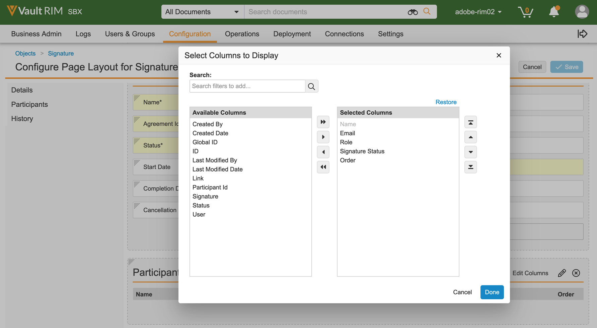
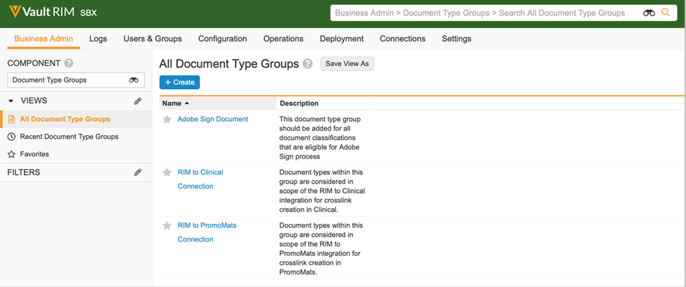
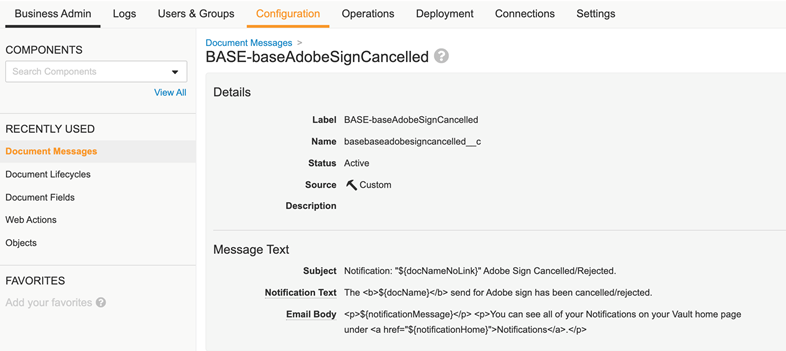

# [!DNL Veeva Vault] Installationshandbuch{#veeva-installation-guide}

[****](https://adobe.com/go/adobesign-support-center_de)

## Übersicht {#overview}

[!DNL Veeva Vault] [!DNL Veeva Vault] A &quot;Vault&quot; is a content and data repository with typical usage for regulatory filings, research reporting, grants applications, general contracting, and more. A single enterprise can have multiple &#39;vaults&#39; that must be maintained separately.

The high-level steps to complete the integration are:

* Activate your Administrative account in Adobe Acrobat Sign (New Customers Only).
* Create objects to track the history of an agreement lifecycle in Vault.
* Create a new Security profile.
* [!DNL Veeva Vault]
* Create document fields and renditions.
* Configure web actions and update the document lifecycle.
* Create document type user and user role setup.
* Connect Veeva Vault to Adobe Acrobat Sign using middleware.

>[!NOTE]
>
>Adobe Sign admin must perform the Adobe Acrobat Sign setup steps within Adobe Acrobat Sign.

## Konfigurieren Sie [!DNL Veeva Vault] {#configure-veeva}

[!DNL Veeva Vault]

### Schritt 1. Create Group {#create-group}

[!DNL Vault]** **

### Schritt 2. Deploy the package {#deploy-package}

 Once deployed, the package creates:

* Custom objects: Signature object, Signatory object, Signature Event object, Process Locker object
* Signature object page layout
* Signature Event object page layout
* Signatory object page layout
* Process Locker object page layout
* Adobe Sign Integration Task Log object page layout
* Adobe Sign Rendition type
* Original Rendition type
* Shared field signature__c
* Adobe Sign Web Action
* Cancel Adobe Sign Web Action
* Adobe Sign Admin Actions Permission set
* Adobe Sign Integration Profile security profile
* Application role Adobe Sign Admin Role
* Document type group &#39;Adobe Sign Document&#39;
* Adobe Sign Integration Task log object

#### Signature object {#signature-object}

Signature object is created to store agreement-related information. A Signature object is a database that contains information under following specific fields:

****

| Feld | Bezeichnung | Typ | Beschreibung |
| --- | --- | ---| --- | 
| external_id__c | Vereinbarungs-ID | String (100) | Holds the Adobe Acrobat Sign’s unique agreement id |
| file_hash__c | File Hash | String (50) | Holds the md5 checksum of the file that has been sent to Adobe Acrobat Sign |
| name__v | Name | String (128) | Holds the agreement name |
| sender__c | Absender | Object (User) | Holds the reference to the Vault user that has created the agreement |
| signature_status__c | Signature Status | String (75) | Holds the agreement’s status in Adobe Acrobat Sign |
| signature_type__c | Signaturtyp | String (20) | Holds the agreement’s signature type in Adobe Acrobat Sign (WRITTEN or ESIGN) |
| start_date__c | Anfangsdatum | Datum/Uhrzeit | Date when agreement has been sent for signature |
| cancellation_date__c | Cancellation Date | Datum/Uhrzeit | Holds the date when agreement has been cancelled. |
| completion_date__c | Completion Date | Datum/Uhrzeit | Holds the date when agreement has been completed. |
| viewable_rendition_used__c | Viewable Rendition Used | Boolescher Wert | Flag that indicates if viewable rendition has been sent for signature. (by default, it is true) |
| plugin_version__c | Plugin Version | Text (10) | It is used to allow the appropriate processing of all agreements created before a new version 4.0 is deployed. Note: After 4.0 custom web application version is deployed, this field will be set to 4.0 each time Signature record is created. |
| external_environment__c | External Environment | Text (20) | Holds the Adobe Sign’s environment name in which the agreement has been created. |

#### Signatory object {#signatory-object}

Signatory object is created to store information related to the participants in an agreement. It contains information under following specific fields:

****

| Feld | Bezeichnung | Typ | Beschreibung |
| --- | --- | ---| --- | 
| email__c | E-Mail | String (120) | Holds the Adobe Acrobat Sign’s unique agreement id |
| external_id__c | Participant Id | String (80) | Holds Adobe Acrobat Sign unique participant’s identifier |
| name__v | Name | String (128) | Holds Adobe Acrobat Sign participant’s name |
| order__c | Auftrag | Zahl | Holds Adobe Acrobat Sign agreement participant’s order number |
| role__c | Rolle | String (30) | Holds Adobe Acrobat Sign agreement participant’s role |
| signature__c | Signatur | Object (Signature) | Holds the reference to the signature parent record |
| signature_status__c | Signature Status | String (100) | Holds Adobe Acrobat Sign agreement participant’s status |
| user__c | Benutzer | Object (User) | Holds the reference to the signatory’s user record if participant is a Vault user |

#### Signature Event object {#signature-event}

Signature Event object is created to store an agreement&#39;s event-related information. It contains information under following specific fields:

Signature Event Object Fields

| Feld | Bezeichnung | Typ | Beschreibung |
| --- | --- | ---| --- | 
| acting_user_email__c | Aktive Benutzer-E-Mail | Zeichenfolge | Holds the email of Adobe Acrobat Sign user that performed the action that caused event to be generated |
| acting_user_name__c | Acting User Name | Zeichenfolge | Holds the name of Adobe Acrobat Sign user that performed the action that caused event to be generated |
| description__c | Beschreibung | Zeichenfolge | Holds the Adobe Acrobat Sign event’s description |
| event_date__c | Ereignisdatum | Datum/Uhrzeit | Holds the Adobe Acrobat Sign event’s date and time |
| event_type__c | Event type | Zeichenfolge | Holds the Adobe Acrobat Sign event’s type |
| name__v | Name | Zeichenfolge | Auto-generated event name |
| participant_comment__c | Participant comment | Zeichenfolge | Holds the Adobe Acrobat Sign participant’s comment if any |
| participant_email__c | Teilnehmer-E-Mail | Zeichenfolge | Holds the Adobe Acrobat Sign participant’s email |
| participant_role__c | Rolle des Teilnehmers | Zeichenfolge | Holds the Adobe Acrobat Sign participant’s role |
| signature__c | Signatur | Object (Signature) | Holds the reference to the signature parent record |
| external_id__c | External ID | Text (200) | Holds Agreement Event identifier generated by Adobe Sign. |

#### Process Locker object {#process-locker}

A Process Locker object is created to lock the Adobe Acrobat Sign integration process. It does not require any custom fields.

#### Adobe Sign Integration Task Log Object {#task-log}

Create Adobe Sign Integration Task Log (as_int_task_log__c). It is high volume object that is used to trace the execution of AgreementsEventsSynchronizerJob and AgreementsEventsProcessingJob.
AgreementsEventsSynchronizerJob: This task ensures that all missing Agreement Events from Adobe Sign are created as active Signature Events in Vault for all Signatures created in Vault in the past N days.
AgreementsEventsProcessingJob: This task ensures that all Documents with active Signature Event records are processed depending on event type.

Adobe Sign Integration Task Log Object Fields

| Feld | Bezeichnung | Typ | Beschreibung |
|---|---|---|---| 
| start_date__c | Anfangsdatum | Datum/Uhrzeit | Task Start date |
| end_date__c | Enddatum | Datum/Uhrzeit | Task End date |
| task_status__c | Task Status | Picklist | Holds task status: Completed (task_completed__c) Completed With Errors (task_completed_with_errors__c) Failed (task_failed__c) |
| task_type__c | Task Type | Picklist | Holds task type: Agreements Events Synchronization (agreements_events_synchronization__c) Agreements Events Processing (agreements_events_processing__c) |
| messages__c | Nachricht | Long (32000) | Holds task message |

The Signature, Signatory, Signature Event, Process Locker, and Task Log objects that come as a part of the deployment package have the &#39;Audit data changes for this object&#39; property enabled by default.

**** This setting is off by default. Once you enable this setting and create records, you can no longer disable it. If this setting is off and records exist, only a Vault Owner can update the setting.

#### **** {#display-participants-history}

 The Page Layout has sections for Participants and History.

* **

   

* You can edit the columns to be displayed for the Participants, as shown below.

   

* **

   

* You can edit the columns to be displayed for the History, as shown below.

   

#### **** {#view-participants-audit-history}

* To view Participants and Audit history for the Adobe Acrobat Sign document, select the link in the &#39;Adobe Signature&#39; section of the document.

   

* The page that opens displays the Participants and History for the Adobe Acrobat Sign document, as shown below.

   

* View the audit trail for Signature as shown below.

   

### Schritt 3. Setup Security profiles {#security-profiles}

Successful package deployment in Step 2 creates Adobe Sign Integration profile. The Adobe Sign Integration Profile is assigned to the system account and is used by the integration when calling Vault APIs. This profile allows permissions for:

* Vault APIs
* Reading, creating, editing, and deleting: Signature, Signatory, Signature Events, and Process Locker objects

You must update the Adobe Sign Admin Group (created in Step 1) by setting the included security profile to Adobe Sign Integration Profile, as shown in the image below.

### Schritt 4. Benutzer erstellen {#create-user}

The Vault system account user of Adobe Acrobat Sign integration must:

* Have an Adobe Sign Integration Profile
* Have a Security profile
* Have Specific security policy that disables password expiration
* Be a member of Adobe Sign Admin Group.

To do so, follow the steps below:

1. Create Vault system account user of Adobe Acrobat Sign integration.

   

2. Add the user to the Adobe Sign Admin Group.

   

### Schritt 5. Configure Document Type Group {#create-document-type-group}

When you deploy the Adobe Acrobat Sign package, it creates a Document Type Group record called &#39;Adobe Sign Document&#39;.

You must add this document type group for all document classifications that are eligible for Adobe Acrobat Sign process. Since document type group property is not inherited from type to subtype nor from subtype to classification level, it must be set for each document’s classification that is eligible for Adobe Acrobat Sign.

**** ************

### Schritt 6. Create User Role Setup {#create-user-role-setup}

Once lifecycles is(are) properly configured, the system should ensure that Adobe Sign Admin user is added by DAC for all documents that are eligible for Adobe Acrobat Sign process. This is done by creating the appropriate User Role Setup record that specifies:

* Document Type Group as Adobe Sign Document
* Application Role as Adobe Sign Admin Role
* Integration user

### Schritt 7. Setup Document Fields {#create-fields}

The package deployment creates following new shared document field that are required for establishing the integration:

* Signature (signature__c)

To set up Document Fields:

1. ********
1. ********

   

1. ****
1. Add the two shared fields to all document types that are eligible for Adobe Acrobat Signature. ********

   

   

   

1. Both fields must have a specific security that allows only members of Adobe Sign Admin Group to update their values.

   

Disable Vault Overlays (disable_vault_overlays__v) is an existing shared field. Optionally, the field can have a specific security that allows only members of Adobe Sign Admin group to update its value.

### Schritt 8. Declare Document Renditions {#declare-renditions}

** You must declare the Adobe Sign rendition for each document type that is eligible for Adobe Acrobat Signature.

**

### Schritt 9. Update Web Actions {#web-actions}

Adobe Acrobat Sign and Vault integration requires you to create and configure following two web actions:

* ****

   <https://api.na1.adobesign.com/api/gateway/veevavaultintsvc/partner/agreement?docId=${Document.id}&majVer=${Document.major_version_number__v}&minVer=${Document.minor_version_number__v}&vaultid=${Vault.id}&useWaitPage=true>

   

* ****

   <https://api.na1.adobesign.com/api/gateway/veevavaultintsvc/partner/agreement/cancel?docId=${Document.id}&majVer=${Document.major_version_number__v}&minVer=${Document.minor_version_number__v}&vaultid=${Vault.id}&useWaitPage=true>

   

### Schritt 10. Update document lifecycle {#document-lifecycle}

For each document type eligible for Adobe Signature, you must update corresponding document lifecycle by adding new lifecycle role and states.

Adobe Acrobat Sign agreement lifecycle has following states:

* DRAFT
* AUTHORING or DOCUMENTS_NOT_YET_PROCESSED
* OUT_FOR_SIGNATURE or OUT_FOR_APPROVAL
* SIGNED or APPROVED
* ABGEBROCHEN
* ABGELAUFEN

To update document lifecycle, follow the steps below:

1. Add Lifecycle role. Adobe Sign Admin application role must be added in all lifecycles used by documents eligible for Adobe  Acrobat Signature, as shown below.

   

   The admin role should be created with the following options:

   * Enabled Dynamic Access Control.
   * Document sharing rules that include only Document Type Group, as shown in the image below.

   

2. Create Lifecycle states. ************************ Next, create the following states:

   * In Adobe Sign Draft

   

   * In Adobe Sign Authoring

   

   * In Adobe Signing

   

3. Add User Actions to the below listed states.

   When a Vault document is sent to Adobe Acrobat Sign, its state should correspond to the state in which the agreement is. To do so, add following states in every lifecycle used by documents eligible for Adobe Signature:

   * **** Based on the document type, it can be Draft state or Reviewed. Document state label can be customized as per the customer’s requirements. Before Adobe Signature state must define following two user actions:

      * ** The name of this user action must be the same for all document types for any lifecycle.
      * Action that calls the Web Action ‘Adobe Sign’. This state must have security that allows Adobe Sign Admin Role to: view document, view content, edit fields, edit relationships, download source, manage viewable rendition, and change state.

      

      * ******
      ******************** ******

      
      
      

   * **** It is a required state. This state must define following five user actions:

      * ** The name of this user action must be the same for all document types for any lifecycle.
      * ** The name of this user action must be the same for all document types for any lifecycle.
      * ** The name of this user action must be the same for all document types for any lifecycle.
      * **
      * ** This state must have security that allows Adobe Sign Admin role to: view document, view content, edit fields, edit relationships, download source, manage viewable rendition, and change state.

      

      * ********
      ******************** ******

      

   * **** It is a required state. This state must have following four user actions defined:

      * Action that changes the state of document to Adobe Sign Cancelled state. The name of this user action must be the same for all document types no matter what lifecycle is.
      * Action that changes the state of document to In Adobe Signing state. The name of this user action must be the same for all document types no matter what lifecycle is.
      * Action that calls the Web Action ‘Adobe Sign’
      * Action that calls the Web Action ‘Cancel Adobe Sign’. This state must have security that allowsAdobe Sign Admin role to: view document, view content, edit fields, edit relationships, download source, manage viewable rendition, and change state.

      

      * ******
      ******************** ******

      

   * **** It is a required state. This state must have following five user actions defined:

      * Action that changes the state of document to Adobe Sign Cancelled state. The target state of this action can be whatever customer requirement is and it can be different for different types. The name of this user action must be the same for all document types no matter what lifecycle is.
      * Action that changes the state of document to Adobe Sign Rejected state. The target state of this action can be whatever customer requirement is and it can be different for different types. The name of this user action must be the same for all document types no matter what lifecycle is.
      * Action that changes the state of document to Adobe Signed state. The target state of this action can be whatever customer requirement is and it can be different for different types. However, the name of this user action must be the same for all document types no matter what lifecycle is.
      * **
      * ** This state must have security that allowsAdobe Sign Admin role to: view document, view content, edit fields, edit relationships, download source, manage viewable rendition, and change state.

      

      * ********
      ******************** ******

      

      * **** It is a required state and it can be an existing lifecycle state, like Approved.
This state does not require user actions. It must have security that allows Adobe Sign Admin role to: view documents, view content, and edit fields.

   Following diagram illustrates the mappings between Adobe Acrobat Sign agreement and Vault document states, where the ‘Before Adobe Signature’ state is Draft.

   

### Schritt 11. Add Adobe Sign stage to General Lifecycle in Lifecycle Stage groups

### Schritt 12. Set permissions for User Role in Lifecycle state

You must set appropriate permissions for each User Role in Lifecycle State, as shown in the image below.

### Schritt 13. Set up atomic security based on the document state and the user role

### Schritt 14. Create Document messages for Adobe Sign Cancel

## [!DNL Veeva Vault] {#connect-middleware}

[!DNL Veeva Vault] [!DNL Veeva Vault][!DNL Veeva Vault]
[!DNL Veeva Vault]`adobe.for.veeva@xyz.com``bob.smith@xyz.com`

[!DNL Veeva Vault]

1. [ [!DNL Veeva Vault] ](https://static.adobesigncdn.com/veevavaultintsvc/index.html)
1. ****

   

1. ****

   

   After successful signing in, the page displays the associated email id and a Settings tab, as shown below.

   

1. ****

   **

   

1. ****

1. [!DNL Veeva Vault]

   The Adobe Acrobat Sign Credentials are autopopulated from the initial Adobe Sign login.

   

1. ****

   On successful validation, you see a &#39;User validated successfully&#39; notification, as shown below.

   

1. ****

   

1. ****

   

1. ****

   ********[!DNL Veeva Vault]

   

1. ****

   

1. ****

   [!DNL Veeva Vault]

   

