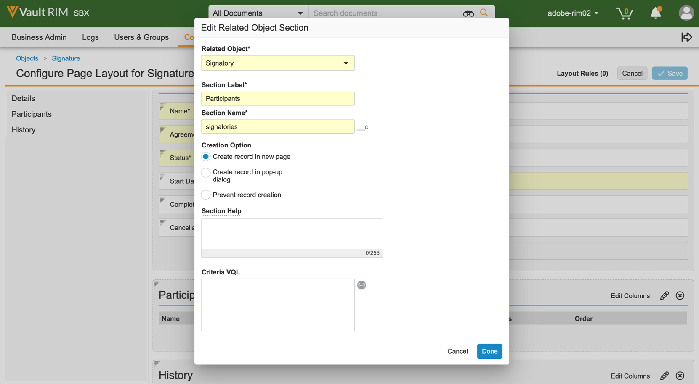
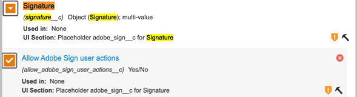

# [!DNL Veeva Vault] Installationshandbuch{#veeva-installation-guide}

[**Adobe Sign-Support kontaktieren**](https://adobe.com/go/adobesign-support-center_de)

## Übersicht {#overview}

In diesem Dokument wird erläutert, wie Sie die Integration von Adobe Sign mit [!DNL Veeva Vault] Plattform. [!DNL Veeva Vault] ist eine Enterprise Content Management (ECM)-Plattform für Life Sciences. Ein &quot;Tresor&quot; ist ein Content- und Daten-Repository mit typischer Verwendung für behördliche Anmeldungen, Forschungsberichte, Finanzhilfeanträge, allgemeine Vertragsabschlüsse und mehr. Ein einzelnes Unternehmen kann mehrere Tresore haben, die separat verwaltet werden müssen.

Die allgemeinen Schritte zum Abschließen der Integration sind:

* Aktivieren Sie Ihr Administratorkonto in Adobe Sign (nur für neue Kunden).
* Erstellen Sie Objekte, um den Verlauf eines Vereinbarungslebenszyklus in Vault zu verfolgen.
* Erstellen Sie ein neues Sicherheitsprofil.
* Konfigurieren Sie eine Gruppe in Adobe Sign für die [!DNL Veeva Vault] Integrationsbenutzer.
* Erstellen Sie Dokumentfelder und Ausgabedarstellungen.
* Konfigurieren Sie Webaktionen und aktualisieren Sie den Dokumentenlebenszyklus.
* Erstellen Sie die Einrichtung des Dokumenttyps für Benutzer und Benutzerrollen.
* Verbinden Sie Veeva Vault mit Adobe Sign über Middleware.

>[!NOTE]
>
>Der Adobe Sign-Administrator muss die Adobe Sign-Setup-Schritte in Adobe Sign ausführen.

## Konfigurieren Sie [!DNL Veeva Vault] {#configure-veeva}

So konfigurieren Sie [!DNL Veeva Vault] für die Integration mit Adobe Sign müssen Sie die unten aufgeführten Schritte implementieren.

### Schritt 1. Gruppe erstellen {#create-group}

So konfigurieren Sie Adobe Sign für [!DNL Vault]eine neue Gruppe mit dem Namen *Adobe Sign Admin Group* erstellt. Diese Gruppe wird verwendet, um die Sicherheit auf Dokumentfeldebene für Adobe Sign-bezogene Felder festzulegen. Sie sollte Folgendes umfassen: *Adobe Sign-Integrationsprofil* standardmäßig aktiviert ist.

### Schritt 2. Paket bereitstellen {#deploy-package}

[Paket bereitstellen](https://helpx.adobe.com/content/dam/help/en/PKG-AdobeSign-Integration.zip) und führen Sie die Schritte aus. Nach der Bereitstellung erstellt das Paket Folgendes:

* Benutzerdefinierte Objekte: Signaturobjekt, Signaturobjekt, Signaturereignisobjekt, Prozessschließfach-Objekt
* Seitenlayout des Signaturobjekts
* Seitenlayout des Signaturereignisobjekts
* Seitenlayout des Unterzeichnerobjekts
* Seitenlayout des Process Locker-Objekts
* Adobe Sign-Darstellungstyp
* Ursprünglicher Darstellungstyp
* Signatur für gemeinsam genutzte Felder__c , allow_adobe_sign_user_actions__c
* Adobe Sign Web Action
* Adobe Sign Web-Aktion abbrechen
* Berechtigungssatz für Adobe Sign-Administratoraktionen
* Sicherheitsprofil des Adobe Sign-Integrationsprofils
* Anwendungsrolle Adobe Sign-Administratorrolle
* Dokumenttypgruppe &quot;Adobe Sign-Dokument&quot;

#### Signaturobjekt {#signature-object}

Das Signaturobjekt wird erstellt, um Vereinbarungsinformationen zu speichern. Ein Signature -Objekt ist eine Datenbank, die Informationen zu folgenden spezifischen Feldern enthält:

**Signaturobjektfelder**

| Feld | Bezeichnung | Typ | Beschreibung |
| --- | --- | ---| --- | 
| external_id__c | Vereinbarungs-ID | Zeichenfolge (100) | Die eindeutige Vereinbarungs-ID der Adobe Sign |
| file_hash__c | Datei-Hash | Zeichenfolge (50) | Enthält die md5-Prüfsumme der Datei, die an Adobe Sign gesendet wurde. |
| name__v | Name | Zeichenfolge (128) | Der Name der Vereinbarung ist enthalten. |
| sender__c | Absender | Objekt (Benutzer) | Enthält den Verweis auf den Vault-Benutzer, der die Vereinbarung erstellt hat. |
| signature_status__c | Signaturstatus | Zeichenfolge (75) | Der Status der Vereinbarung in Adobe Sign |
| signature_type__c | Signaturtyp | Zeichenfolge (20) | Der Signaturtyp der Vereinbarung in Adobe Sign (WRITTEN oder ESIGN) |
| start_date__c | Anfangsdatum | Datum/Uhrzeit | Datum, an dem die Vereinbarung zur Signatur gesendet wurde |
| cancel_date__c | Kündigungsdatum | Datum/Uhrzeit | Enthält das Datum, an dem die Vereinbarung storniert wurde. |
| complete_date__c | Abschlussdatum | Datum/Uhrzeit | Enthält das Datum, an dem die Vereinbarung abgeschlossen wurde. |
| viewable_rendition_used__c | Verwendete sichtbare Darstellung | Boolescher Wert | Flag, das angibt, ob die anzeigbare Wiedergabe zur Signatur gesendet wurde. (standardmäßig ist es true) |

#### Unterzeichnerobjekt {#signatory-object}

Unterzeichnerobjekt wird erstellt, um Informationen zu den Teilnehmern einer Vereinbarung zu speichern. Er enthält Informationen zu folgenden spezifischen Bereichen:

**Unterzeichnende Objektfelder**

| Feld | Bezeichnung | Typ | Beschreibung |
| --- | --- | ---| --- | 
| email__c | E-Mail | Zeichenfolge (120) | Die eindeutige Vereinbarungs-ID der Adobe Sign |
| external_id__c | Teilnehmer-ID | Zeichenfolge (80) | Enthält die Kennung des eindeutigen Adobe Sign-Teilnehmers. |
| name__v | Name | Zeichenfolge (128) | Name des Adobe Sign-Teilnehmers |
| order__c | Auftrag | Zahl | Enthält die Bestellnummer des Adobe Sign-Vereinbarungsteilnehmers. |
| role__c | Rolle | Zeichenfolge (30) | Rolle des Adobe Sign-Vereinbarungsteilnehmers |
| signature__c | Signatur | Objekt (Signatur) | Enthält den Verweis auf den übergeordneten Signaturdatensatz. |
| signature_status__c | Signaturstatus | Zeichenfolge (100) | Status des Teilnehmers der Adobe Sign-Vereinbarung |
| user__c | Benutzer | Objekt (Benutzer) | Enthält den Verweis auf den Benutzerdatensatz des Unterzeichners, wenn der Teilnehmer ein Vault-Benutzer ist. |

#### Signaturereignisobjekt {#signature-event}

Das Signaturereignisobjekt wird erstellt, um die ereignisbezogenen Informationen einer Vereinbarung zu speichern. Er enthält Informationen zu folgenden spezifischen Bereichen:

| Feld | Bezeichnung | Typ | Beschreibung |
| --- | --- | ---| --- | 
| acting_user_email__c | Aktive Benutzer-E-Mail | Zeichenfolge | Enthält die E-Mail-Adresse des Adobe Sign-Benutzers, der die Aktion ausgeführt hat, die zum Generieren des Ereignisses geführt hat |
| acting_user_name__c | Amtierender Benutzername | Zeichenfolge | Enthält den Namen des Adobe Sign-Benutzers, der die Aktion ausgeführt hat, durch die das Ereignis generiert wurde. |
| description__c | Beschreibung | Zeichenfolge | Beschreibung des Adobe Sign-Ereignisses |
| event_date__c | Ereignisdatum | Datum/Uhrzeit | Datum und Uhrzeit der Adobe Sign-Veranstaltung |
| event_type__c | Ereignistyp | Zeichenfolge | Enthält den Typ des Adobe Sign-Ereignisses |
| name__v | Name | Zeichenfolge | Automatisch generierter Ereignisname |
| participant_comment__c | Kommentar des Teilnehmers | Zeichenfolge | Enthält den Kommentar des Adobe Sign-Teilnehmers, falls vorhanden |
| participant_email__c | Teilnehmer-E-Mail | Zeichenfolge | Enthält die E-Mail-Adresse des Adobe Sign-Teilnehmers. |
| participant_role__c | Rolle des Teilnehmers | Zeichenfolge | Enthält die Rolle des Adobe Sign-Teilnehmers |
| signature__c | Signatur | Objekt (Signatur) | Enthält den Verweis auf den übergeordneten Signaturdatensatz. |

#### Process Locker-Objekt {#process-locker}

Ein Process Locker -Objekt wird erstellt, um den Adobe Sign-Integrationsprozess zu sperren. Benutzerdefinierte Felder sind nicht erforderlich.

Bei den Objekten Signature, Signatory, Signature Event und Process Locker, die als Teil des Bereitstellungspakets bereitgestellt werden, ist die Eigenschaft &#39;Änderungen der Überwachungsdaten für dieses Objekt&#39; standardmäßig aktiviert.

**Hinweis:** Sie können Änderungen an den Vault-Objekt-Datensatzdaten in den Überwachungsprotokollen erfassen lassen, indem Sie die Einstellung Änderungen an den Überwachungsdaten aktivieren. Diese Einstellung ist standardmäßig deaktiviert. Sobald Sie diese Einstellung aktiviert und Datensätze erstellt haben, können Sie sie nicht mehr deaktivieren. Wenn diese Einstellung deaktiviert ist und Datensätze vorhanden sind, kann nur ein Vault-Eigentümer die Einstellung aktualisieren.

#### **Teilnehmer und Verlauf für das Signaturobjekt anzeigen** {#display-participants-history}

Das Signature -Objekt, das als Teil des Bereitstellungspakets bereitgestellt wird, wird mit dem [Signaturdetailseitenlayout](https://vvtechpartner-adobe-rim.veevavault.com/ui/#admin/content_setup/object_schema/pagelayout?t=signature__c&amp;d=signature_detail_page_layout__c). Das Seitenlayout enthält Abschnitte für Teilnehmer und Verlauf.

* Die *Teilnehmer* &quot; enthält den Abschnitt &quot;Zugehörige Objekte&quot;, der wie in der Abbildung unten gezeigt konfiguriert ist.

   

* Sie können die Spalten bearbeiten, die für die Teilnehmer angezeigt werden sollen, wie unten gezeigt.

   

* Die *Verlauf* &quot; enthält den Abschnitt &quot;Zugehörige Objekte&quot;, der wie in der Abbildung unten gezeigt konfiguriert ist.

   

* Sie können die Spalten, die für den Verlauf angezeigt werden sollen, wie unten gezeigt, bearbeiten.

   

#### **Teilnehmer- und Prüfverlauf für das Adobe Sign Dokument anzeigen** {#view-participants-audit-history}

* Um Teilnehmer und den Prüfverlauf für das Adobe Sign Dokument anzuzeigen, wählen Sie den Link im Abschnitt &quot;Signatur der Adobe&quot; des Dokuments aus.

   

* Auf der daraufhin geöffneten Seite werden die Teilnehmer und der Verlauf für das Adobe Sign Dokument angezeigt (siehe unten).

   

* Sehen Sie sich das Audit-Protokoll zur Signatur wie unten gezeigt an.

   

### Schritt 3. Einrichten von Sicherheitsprofilen {#security-profiles}

Eine erfolgreiche Paketbereitstellung in Schritt 2 erstellt ein Adobe Sign-Integrationsprofil. Das Adobe Sign-Integrationsprofil wird dem Systemkonto zugewiesen und wird von der Integration beim Aufrufen von Vault-APIs verwendet. Dieses Profil ermöglicht Berechtigungen für:

* Vault-APIs
* Lesen, Erstellen, Bearbeiten und Löschen: Signature-, Signatory-, Signature-Ereignisse und Process Locker-Objekte

Sie müssen die Adobe Sign Admin Group (erstellt in Schritt 1) aktualisieren, indem Sie das enthaltene Sicherheitsprofil wie in der Abbildung unten gezeigt auf Adobe Sign Integration Profile festlegen.

### Schritt 4. Benutzer erstellen {#create-user}

Der Vault-Systemkontobenutzer der Adobe Sign-Integration muss:

* Ihr habt ein Adobe Sign-Integrationsprofil?
* Haben Sie ein Sicherheitsprofil?
* über spezifische Sicherheitsrichtlinien verfügen, die das Ablaufen des Kennworts deaktivieren
* Werden Sie Mitglied der Adobe Sign Admin Group.

Führen Sie dazu die folgenden Schritte aus:

1. Erstellen Sie ein Vault-Systemkonto für den Benutzer der Adobe Sign-Integration.

   

2. Fügen Sie den Benutzer der Adobe Sign Admin Group hinzu.

   

### Schritt 5. Dokumenttypgruppe konfigurieren {#create-document-type-group}

Wenn Sie das Adobe Sign-Paket bereitstellen, wird ein Dokumenttyp-Gruppendatensatz mit dem Namen &quot;Adobe Sign Document&quot; erstellt.

Sie müssen diese Dokumenttypgruppe für alle Dokumentklassifizierungen hinzufügen, die für den Adobe Sign-Prozess infrage kommen. Da die Dokumenttypgruppeneigenschaft nicht von Typ zu Untertyp oder von Untertyp zu Klassifizierungsebene vererbt wird, muss sie für die Klassifizierung jedes Dokuments festgelegt werden, das für Adobe Sign in Frage kommt.

**Hinweis:** Wenn das Objekt Benutzerrollen einrichten das Feld nicht enthält, das auf das Objekt Dokumenttypgruppe verweist, müssen Sie das Feld hinzufügen. Gehen Sie dazu zu **[!UICONTROL Objekt]** > **[!UICONTROL Benutzerrollen einrichten]** > **[!UICONTROL Felder]** und führen Sie die erforderlichen Schritte aus, wie in der Abbildung unten gezeigt.

### Schritt 6. Benutzerrolleneinrichtung erstellen {#create-user-role-setup}

Sobald der/die Lebenszyklus(e) ordnungsgemäß konfiguriert ist/sind, sollte das System sicherstellen, dass der Adobe Sign-Administratorbenutzer von DAC für alle Dokumente hinzugefügt wird, die für den Adobe Sign-Prozess geeignet sind. Dazu erstellen Sie den entsprechenden Benutzerrollen-Setup -Datensatz, der Folgendes angibt:

* Dokumenttypgruppe als Adobe Sign-Dokument
* Anwendungsrolle als Adobe Sign-Administratorrolle
* Integrationsbenutzer

### Schritt 7. Dokumentfelder einrichten {#create-fields}

Durch die Paketbereitstellung werden die folgenden zwei neuen freigegebenen Dokumentfelder erstellt, die zum Einrichten der Integration erforderlich sind:

* Signatur (signature__c)
* Adobe Sign-Benutzeraktionen zulassen (allow_adobe_sign_user_actions__c)

So richten Sie Dokumentfelder ein:

1. Wechseln Sie zur Registerkarte Konfiguration und wählen Sie **[!UICONTROL Dokumentfelder]** > **[!UICONTROL Freigegebene Felder]**.
1. Wählen Sie im Feld Anzeigeabschnitt die Option **[!UICONTROL Anzeigeabschnitt erstellen]** und zuweisen **[!UICONTROL Signatur der Adobe]** als Abschnittsbeschriftung.

   

1. Aktualisieren Sie für die beiden freigegebenen Dokumentfelder (signature__c und allow_adobe_sign_user_actions__c) den Abschnitt &quot;Benutzeroberfläche&quot; mit **[!UICONTROL Signatur der Adobe]** als Abschnittsbezeichnung verwenden.
1. Fügen Sie die drei freigegebenen Felder allen Dokumenttypen hinzu, die für die Adobe Signatur berechtigt sind. Wählen Sie dazu auf der Seite &quot;Basisdokument&quot; **[!UICONTROL Hinzufügen]** > **[!UICONTROL Vorhandenes freigegebenes Feld]** in der rechten oberen Ecke.

   

   

   

1. Beachten Sie, dass beide Felder über eine spezifische Sicherheit verfügen müssen, die es nur Mitgliedern der Adobe Sign Admin Group ermöglicht, ihre Werte zu aktualisieren.

   

&quot;Vault Overlays deaktivieren&quot; (disable_vault_overlays__v) ist ein vorhandenes gemeinsames Feld. Optional kann das Feld über eine bestimmte Sicherheit verfügen, die nur Mitgliedern der Adobe Sign-Administratorgruppe das Aktualisieren ihres Werts ermöglicht.

### Schritt 8. Dokumentvarianten deklarieren {#declare-renditions}

Der neue Ausgabedarstellungstyp namens *Adobe Sign Rendition (adobe_sign_rendition__c)* wird von der Vault-Integration verwendet, um signierte PDF-Dokumente in Adobe Sign hochzuladen. Sie müssen die Adobe Sign-Ausgabedarstellung für jeden Dokumenttyp deklarieren, der für Adobe Signature qualifiziert ist.

Der neue Ausgabedarstellungstyp namens *Original Rendition (original_rendition__c)* wird von der Vault-Integration als Name der Ausgabedarstellung verwendet, mit der die ursprüngliche sichtbare Ausgabedarstellung gespeichert werden soll, wenn das signierte Dokument als sichtbare Ausgabedarstellung importiert wird.

### Schritt 9. Webaktionen aktualisieren {#web-actions}

Für die Adobe Sign- und Vault-Integration müssen Sie die folgenden zwei Webaktionen erstellen und konfigurieren:

* **Adobe Sign erstellen**: Der Adobe Sign-Vertrag wird erstellt oder angezeigt.

   Typ: Dokumentziel: Anzeige innerhalb der Vault-Anmeldedaten: Anmeldeinformationen nach der Sitzung über die URL nach der Nachricht aktivieren: <https://api.na1.adobesign.com/api/gateway/veevavaultintsvc/partner/agreement?docId=${Document.id}&majVer=${Document.major_version_number__v}&minVer=${Document.minor_version_number__v}&vaultid=${Vault.id}&useWaitPage=true>

   

* **Adobe Sign kündigen**: Mit dieser Option wird eine in Adobe Sign vorhandene Vereinbarung abgebrochen und der Status eines Dokuments auf den ursprünglichen zurückgesetzt.

   Typ: Dokumentziel: Anzeige innerhalb der Vault-Anmeldedaten: Anmeldeinformationen nach der Sitzung über die URL nach der Nachricht aktivieren: : <https://api.na1.adobesign.com/api/gateway/veevavaultintsvc/partner/agreement/cancel?docId=${Document.id}&majVer=${Document.major_version_number__v}&minVer=${Document.minor_version_number__v}&vaultid=${Vault.id}&useWaitPage=true>

   

### Schritt 10. Lebenszyklus von Dokumenten aktualisieren {#document-lifecycle}

Für jeden Dokumenttyp, der zur Signatur durch die Adobe berechtigt ist, müssen Sie den entsprechenden Dokumentlebenszyklus aktualisieren, indem Sie eine neue Lebenszyklusrolle und neue Status hinzufügen.

Der Lebenszyklus von Adobe Sign-Vereinbarungen hat folgende Status:

* ENTWURF
* AUTHORING oder DOCUMENTS_NOT_YET_PROCESSED
* OUT_FOR_SIGNATURE oder OUT_FOR_APPROVAL
* SIGNIERT ODER GENEHMIGT
* ABGEBROCHEN
* ABGELAUFEN

Führen Sie die folgenden Schritte aus, um den Dokumentenlebenszyklus zu aktualisieren:

1. Lebenszyklusrolle hinzufügen. Die Adobe Sign-Admin-Anwendungsrolle muss in allen Lebenszyklen hinzugefügt werden, die von Dokumenten verwendet werden, die für die Adobe Signature berechtigt sind, wie unten dargestellt.

   

   Die Administratorrolle sollte mit den folgenden Optionen erstellt werden:

   * Dynamische Zugriffssteuerung aktiviert.
   * Regeln für die Dokumentfreigabe, die nur die Gruppe Dokumenttyp enthalten, wie in der Abbildung unten gezeigt.

   

2. Lebenszyklusstatus erstellen. Gehen Sie dazu zu **[!UICONTROL Einstellungen]** > **[!UICONTROL Konfiguration]** > **[!UICONTROL Dokument-Lebenszyklen]** > **[!UICONTROL Allgemeine Lebenszyklen]** > **[!UICONTROL Zustände]** > **[!UICONTROL Erstellen]**. Erstellen Sie als Nächstes die folgenden Status:

   * In Adobe Sign Draft

   

   * In Adobe Sign Authoring

   

   * Signieren in Adobe

   

3. Fügen Sie den unten aufgeführten Status Benutzeraktionen hinzu.

   Wenn ein Vault-Dokument an Adobe Sign gesendet wird, sollte sein Status dem Status entsprechen, in dem sich die Vereinbarung befindet. Fügen Sie dazu in jedem Lebenszyklus, der von Dokumenten verwendet wird, die für die Adobe Signature berechtigt sind, folgende Status hinzu:

   * **Vor der Signatur der Adobe** (Überprüft): Dies ist ein Platzhaltername für den Status, von dem aus Dokumente an Adobe Sign gesendet werden können. Je nach Dokumenttyp kann der Status &quot;Entwurf&quot; oder &quot;Überprüft&quot; sein. Die Dokumentstatusbeschriftung kann gemäß den Anforderungen des Kunden angepasst werden. Vor dem Signaturstatus der Adobe müssen die folgenden zwei Benutzeraktionen definiert werden:

      * Aktion, die den Status des Dokuments in *In Adobe Sign Draft* Status. Der Name dieser Benutzeraktion muss für alle Dokumenttypen eines Lebenszyklus gleich sein. Bei Bedarf können die Kriterien für diese Aktion auf &quot;Adobe Sign-Benutzeraktionen zulassen gleich Ja&quot; festgelegt werden.
      * Aktion, die die Webaktion &quot;Adobe Sign&quot; aufruft. Dieser Status muss über eine Sicherheit verfügen, die es der Adobe Sign-Administratorrolle ermöglicht, Folgendes zu tun: Dokument anzeigen, Inhalt anzeigen, Felder bearbeiten, Beziehungen bearbeiten, Quelle herunterladen, Darstellung verwalten und Status ändern.

      

   * **In Adobe Sign Draft**: Dies ist ein Platzhaltername für den Status, der angibt, dass das Dokument bereits in Adobe Sign hochgeladen wurde und sich die zugehörige Vereinbarung im Status ENTWURF befindet. Dies ist ein erforderlicher Status. Dieser Status muss die folgenden fünf Benutzeraktionen definieren:

      * Aktion, die den Status des Dokuments in *In Adobe Sign Authoring* Status. Der Name dieser Benutzeraktion muss für alle Dokumenttypen eines Lebenszyklus gleich sein. Bei Bedarf können die Kriterien für diese Aktion auf &quot;Adobe Sign-Benutzeraktionen zulassen gleich Ja&quot; festgelegt werden.
      * Aktion, die den Status des Dokuments in *Signierstatus &quot;In Adobe&quot;*. Der Name dieser Benutzeraktion muss für alle Dokumenttypen eines Lebenszyklus gleich sein. Bei Bedarf können die Kriterien für diese Aktion auf &quot;Adobe Sign-Benutzeraktionen zulassen gleich Ja&quot; festgelegt werden.
      * Aktion, die den Status des Dokuments in *Adobe Sign abgebrochen* Status. Der Name dieser Benutzeraktion muss für alle Dokumenttypen eines Lebenszyklus gleich sein. Bei Bedarf können die Kriterien für diese Aktion auf &quot;Adobe Sign-Benutzeraktionen zulassen gleich Ja&quot; festgelegt werden.
      * Aktion, die die Webaktion &quot;Adobe Sign&quot; aufruft.
      * Aktion, die die Webaktion &quot;Adobe Sign abbrechen&quot; aufruft. Dieser Status muss über eine Sicherheit verfügen, die der Adobe Sign-Administratorrolle Folgendes ermöglicht: Dokument anzeigen, Inhalt anzeigen, Felder bearbeiten, Beziehungen bearbeiten, Quelle herunterladen, Darstellung verwalten und Status ändern.

      

   * **In Adobe Sign Authoring**: Dies ist ein Platzhaltername für den Status, der angibt, dass das Dokument bereits in Adobe Sign hochgeladen wurde und sich die zugehörige Vereinbarung im Status AUTHORING oder DOCUMENTS_NOT_YET_PROCESSED befindet. Dies ist ein erforderlicher Status. Für diesen Status müssen die folgenden vier Benutzeraktionen definiert sein:

      * Aktion, die den Status des Dokuments in &quot;Adobe Sign abgebrochen&quot; ändert Der Name dieser Benutzeraktion muss für alle Dokumenttypen gleich sein, unabhängig davon, um welchen Lebenszyklus es sich handelt. Bei Bedarf können die Kriterien für diese Aktion auf &quot;Adobe Sign-Benutzeraktionen zulassen gleich Ja&quot; festgelegt werden.
      * Aktion, die den Status des Dokuments in den Signierstatus &quot;In Adobe&quot; ändert. Der Name dieser Benutzeraktion muss für alle Dokumenttypen gleich sein, unabhängig davon, um welchen Lebenszyklus es sich handelt. Bei Bedarf können die Kriterien für diese Aktion auf &quot;Adobe Sign-Benutzeraktionen zulassen gleich Ja&quot; festgelegt werden.
      * Aktion, die die Webaktion &quot;Adobe Sign&quot; aufruft
      * Aktion, die die Webaktion &quot;Adobe Sign abbrechen&quot; aufruft. Dieser Status muss über eine Sicherheit verfügen, die der Adobe Sign-Administratorrolle Folgendes ermöglicht: Dokument anzeigen, Inhalt anzeigen, Felder bearbeiten, Beziehungen bearbeiten, Quelle herunterladen, Darstellung verwalten und Status ändern.

      

   * **Signieren in Adobe**: Dies ist ein Platzhaltername für den Status, der angibt, dass das Dokument in Adobe Sign hochgeladen wurde und die zugehörige Vereinbarung bereits an die Teilnehmer gesendet wurde (OUT_FOR_SIGNATURE- oder OUT_FOR_APPROVAL-Status). Dies ist ein erforderlicher Status. Für diesen Status müssen die folgenden fünf Benutzeraktionen definiert sein:

      * Aktion, die den Status des Dokuments in &quot;Adobe Sign abgebrochen&quot; ändert Der Zielstatus dieser Aktion kann unabhängig von den Kundenanforderungen sein und kann für verschiedene Typen unterschiedlich sein. Der Name dieser Benutzeraktion muss für alle Dokumenttypen gleich sein, unabhängig davon, um welchen Lebenszyklus es sich handelt. Bei Bedarf können die Kriterien für diese Aktion auf &quot;Adobe Sign-Benutzeraktionen zulassen gleich Ja&quot; festgelegt werden.
      * Aktion, die den Status des Dokuments in den Status Adobe Sign abgelehnt ändert. Der Zielstatus dieser Aktion kann unabhängig von den Kundenanforderungen sein und kann für verschiedene Typen unterschiedlich sein. Der Name dieser Benutzeraktion muss für alle Dokumenttypen gleich sein, unabhängig davon, um welchen Lebenszyklus es sich handelt. Bei Bedarf können die Kriterien für diese Aktion auf &quot;Adobe Sign-Benutzeraktionen zulassen gleich Ja&quot; festgelegt werden.
      * Aktion, die den Status des Dokuments in Adobe Signiert ändert. Der Zielstatus dieser Aktion kann unabhängig von den Kundenanforderungen sein und kann für verschiedene Typen unterschiedlich sein. Der Name dieser Benutzeraktion muss jedoch für alle Dokumenttypen gleich sein, unabhängig davon, um welchen Lebenszyklus es sich handelt. Bei Bedarf können die Kriterien für diese Aktion auf &quot;Adobe Sign-Benutzeraktionen zulassen gleich Ja&quot; festgelegt werden.
      * Aktion, die die Webaktion aufruft *Adobe Sign*.
      * Aktion, die Webaktion aufruft *Adobe Sign kündigen*. Dieser Status muss über eine Sicherheit verfügen, die der Adobe Sign-Administratorrolle Folgendes ermöglicht: Dokument anzeigen, Inhalt anzeigen, Felder bearbeiten, Beziehungen bearbeiten, Quelle herunterladen, Darstellung verwalten und Status ändern.

      

      * **Adobe unterzeichnet (genehmigt)**: Dies ist ein Platzhaltername für den Status, der angibt, dass das Dokument in Adobe Sign hochgeladen wurde und die zugehörige Vereinbarung abgeschlossen ist (Status SIGNIERT oder GENEHMIGT). Dies ist ein erforderlicher Status und kann ein vorhandener Lebenszyklusstatus wie Genehmigt sein.
Dieser Status erfordert keine Benutzeraktionen. Sie muss über Sicherheitsfunktionen verfügen, die es der Adobe Sign-Administratorrolle ermöglichen, Dokumente anzeigen, Inhalte anzeigen und Felder bearbeiten.

   Das folgende Diagramm zeigt die Zuordnungen zwischen Adobe Sign-Vereinbarungs- und Vault-Dokumentstatus, wobei der Status &quot;Vor Signatur der Adobe&quot; &quot;Entwurf&quot; ist.

   

### Schritt 11. Hinzufügen der Adobe Sign-Bühne zum allgemeinen Lebenszyklus in Lifecycle-Bühnengruppen

### Schritt 12. Berechtigungen für Benutzerrolle im Lebenszyklusstatus festlegen

Sie müssen die entsprechenden Berechtigungen für jede Benutzerrolle im Lebenszyklusstatus festlegen, wie in der Abbildung unten gezeigt.

### Schritt 13. Einrichten der atomaren Sicherheit basierend auf dem Dokumentstatus und der Benutzerrolle

### Schritt 14. Dokumentnachrichten für Adobe Sign erstellen Abbrechen

## Vernetzen [!DNL Veeva Vault] auf Adobe Sign mit Middleware {#connect-middleware}

Nach Abschluss der Einrichtung für [!DNL Veeva Vault] und dem Adobe Sign Admin-Konto muss der Administrator mithilfe der Middleware eine Verbindung zwischen den beiden Konten herstellen. Die [!DNL Veeva Vault] und die Adobe Sign-Kontoverbindung wird von Adobe Sign Identity initiiert und dann zum Speichern der[!DNL Veeva Vault]Identität.
Für die Systemsicherheit und -stabilität muss der Administrator ein dediziertes [!DNL Veeva Vault] System-/Dienst-/Dienstprogrammkonto, z. B. `adobe.for.veeva@xyz.com`anstelle eines persönlichen Benutzerkontos, z. B. `bob.smith@xyz.com`.

Ein Adobe Sign-Kontoadministrator muss die folgenden Schritte ausführen, um eine Verbindung herzustellen [!DNL Veeva Vault] auf Adobe Sign über Middleware:

1. Wechseln Sie zur Registerkarte [Adobe Sign für [!DNL Veeva Vault] Startseite](https://static.adobesigncdn.com/veevavaultintsvc/index.html).
1. Auswählen **[!UICONTROL Anmeldung]** in der rechten oberen Ecke.

   

1. Geben Sie auf der daraufhin geöffneten Adobe Sign-Anmeldeseite die E-Mail-Adresse und das Kennwort des Kontoadministrators ein. Wählen Sie dann **[!UICONTROL Anmelden]**.

   

   Nach erfolgreicher Anmeldung werden auf der Seite die zugehörige E-Mail-ID und eine Registerkarte Einstellungen angezeigt, wie unten gezeigt.

   

1. Wählen Sie das **[!UICONTROL Einstellungen]** &quot; ändern.

   Auf der Seite Einstellungen werden die verfügbaren Verbindungen und *Keine Verbindungen verfügbar* bei der ersten Verbindungseinrichtung, wie unten gezeigt.

   

1. Auswählen **[!UICONTROL Verbindung hinzufügen]** , um eine neue Verbindung hinzuzufügen.

1. Geben Sie im daraufhin geöffneten Dialogfeld Verbindung hinzufügen die erforderlichen Details an, einschließlich des Dialogfelds [!DNL Veeva Vault] Anmeldedaten.

   Die Adobe Sign-Anmeldedaten werden automatisch aus der Adobe Sign-Anmeldung übernommen.

   

1. Auswählen **[!UICONTROL Validieren]** , um die Kontodetails zu validieren.

   Nach erfolgreicher Validierung wird die Benachrichtigung &quot;Benutzer erfolgreich validiert&quot; angezeigt, wie unten gezeigt.

   

1. Um die Verwendung auf eine bestimmte Adobe Sign-Gruppe zu beschränken, erweitern Sie den Bereich **[!UICONTROL Gruppe]** und wählen Sie eine der verfügbaren Gruppen aus.

   

1. Um einen Audit-Bericht an die signierte Ausgabedarstellung anzuhängen, aktivieren Sie das Kontrollkästchen. **[!UICONTROL Audit-Bericht an signierte Darstellung anhängen]**.

   

1. Um die automatische Bereitstellung von Benutzern in Adobe Sign zuzulassen, aktivieren Sie das Kontrollkästchen **[!UICONTROL Sign-Benutzer automatisch bereitstellen]**.

   **Hinweis:** Die automatische Bereitstellung neuer Adobe Sign-Benutzer funktioniert nur, wenn sie zusätzlich zur Aktivierung auf der Adobe Sign-Kontoebene in der Adobe Sign aktiviert wurde **[!UICONTROL Sign-Benutzer automatisch bereitstellen]** für die[!DNL Veeva Vault]Adobe Sign-Integration, wie unten vom Adobe Sign-Kontoadministrator gezeigt.

   

1. Um zu konfigurieren, dass Adobe Sign Rendition in Veeva anstelle der Original Rendition angezeigt wird, aktivieren Sie das Kontrollkästchen **[!UICONTROL Adobe Sign-Ausgabedarstellung anzeigen]**.

   

1. Auswählen **[!UICONTROL Speichern]** , um Ihre neue Verbindung zu speichern.

   Die neue Verbindung wird auf der Registerkarte &quot;Einstellungen&quot; angezeigt und zeigt die erfolgreiche Integration zwischen [!DNL Veeva Vault] und Adobe Sign.

   

