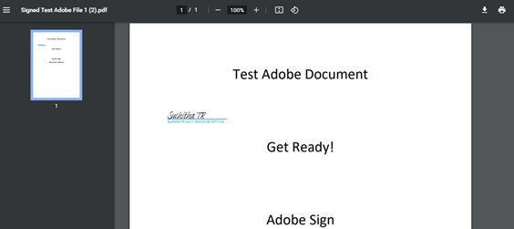

# Adobe Sign für [!DNL Veeva Vault]: Benutzerhandbuch {#veeva-vault-user-guide}

[**Adobe Sign-Support kontaktieren**](https://adobe.com/go/adobesign-support-center_de)

Dieses Dokument soll Kunden von [!DNL Veeva Vault] dabei helfen, zu erfahren, wie sie Adobe Sign für [!DNL Veeva Vault]-Integration verwenden, um einen Vertrag zu senden.

## Übersicht {#overview}

Die Adobe Sign-Integration mit [!DNL Veeva Vault] erleichtert den Vorgang, eine Signatur oder Genehmigung für alle Dokumentationen zu erhalten, die rechtsgültige Signaturen oder eine überprüfbare Dokumentverarbeitung erfordern.

Das Senden von Dokumenten zum Unterschreiben verläuft insgesamt ähnlich wie das Senden einer E-Mail, sodass es für die meisten Benutzer leicht zu übernehmen ist.

Die Adobe Sign-Integration mit [!DNL Veeva Vault] optimiert und beschleunigt Ihre Dokument- und Signatur-Workflows. Mithilfe des Integrations-Workflows können Sie:

* Sparen Sie Zeit und Ressourcen, die Sie für Schneckenpost, Übernachtungen und Faxe aufwenden.
* Senden Sie Verträge zur elektronischen Signatur oder Genehmigung von [!DNL Veeva Vault], greifen Sie auf den Vertragsverlauf in Echtzeit zu und sehen Sie gespeicherte Verträge an.
* Verfolgen Sie die Transaktionen in Echtzeit in Ihrem Unternehmen und erhalten Sie Aktualisierungen, wenn Vereinbarungen angezeigt, signiert, abgebrochen oder abgelehnt werden.
* eSign in über 20 Sprachen und Unterstützung des Rückfax-Diensts in über 50 Gebietsschemas weltweit.
* Wiederverwendbare Vereinbarungsvorlagen für Sendeoptionen erstellen.

## Vertrag mit Adobe Sign für [!DNL Veeva Vault] senden {#send-sign-vault-agreement}

So senden Sie eine Vereinbarung mit Adobe Sign für Veeva:

1. Gehen Sie zur Anmeldeseite [[!DNL Veeva Vault] und geben Sie Ihren Benutzernamen und Ihr Kennwort ein. ](https://login.veevavault.com/) Es öffnet die Homepage Ihres Vault, wie unten gezeigt.

   

1. Wählen Sie die Registerkarte **[!UICONTROL Library]** und wählen Sie dann **[!UICONTROL Create]** aus der oberen rechten Ecke aus.

   

1. Wählen Sie **[!UICONTROL Hochladen und fortfahren]**.

1. Laden Sie ein beliebiges Dokument von Ihrem lokalen Laufwerk hoch.

1. Wählen Sie im angezeigten Dialogfeld **[!UICONTROL Type]** als *[!UICONTROL Clinical]* und dann **[!UICONTROL Subtype]** und **[!UICONTROL Classification]**, falls erforderlich.

   

1. Wählen Sie **[!UICONTROL OK]**, um das Dialogfeld zu schließen.

1. Wählen Sie **[!UICONTROL Next]**.

1. Füllen Sie im eingeblendeten Fenster alle erforderlichen Felder im Metadatenabschnitt aus und wählen Sie **[!UICONTROL Speichern]**.

   

1. Es wird ein Testdokument im Status **[!UICONTROL Entwurf]** erstellt, wie unten dargestellt.

   

1. Wählen Sie in der oberen rechten Ecke das Dropdown-Menü  und wählen Sie **[!UICONTROL Review starten]**.

   

1. Wählen Sie **[!UICONTROL Reviewer]** und **[!UICONTROL Fälligkeitsdatum überprüfen]** aus.

1. Wählen Sie **[!UICONTROL Start]**. Der Dokumentstatus wird in [!UICONTROL IN REVIEW] geändert.

   

1. Füllen Sie die zugewiesene Aufgabe im Namen der Reviewer aus. Wenn Sie fertig sind, ändert sich der Dokumentstatus in [!UICONTROL ÜBERPRÜFT].

   

1. Wählen Sie das Dropdown-Menü  und wählen Sie **[!UICONTROL Adobe Sign]**.

   

1. Geben Sie im iFrame-Fenster, das im Vault geöffnet wird, die E-Mail-Adresse des Empfängers ein und wählen Sie **[!UICONTROL Next]**.

   

1. Nachdem das Dokument verarbeitet wurde, ziehen Sie die Signaturfelder per Drag &amp; Drop aus dem rechten Bereich auf und wählen Sie **[!UICONTROL Senden]**.

   

1. Das Dokument wird zum Unterschreiben an den Empfänger gesendet. Nachdem der Empfänger die Dokument-E-Mail erhalten hat, ändert sich der Dokumentstatus von [!UICONTROL Geprüft] in [!UICONTROL In Adobe signieren].

   

1. Sobald alle Signaturen in Adobe Sign erfasst und abgeschlossen sind, ändert sich der Dokumentstatus in Vault in [!UICONTROL Genehmigt].

1. Wählen Sie die Option **[!UICONTROL Dokumentdateien]** und erweitern Sie den Abschnitt **[!UICONTROL Ausgaben]** in Vault. Sobald sich das Dokument im Status &quot;Genehmigt&quot;befindet, wird automatisch eine neue Ausgabe mit dem Namen &quot;Adobe Sign-Darstellung&quot;erstellt.

   

1. Laden Sie die Adobe Sign-Version herunter, um die Empfängersignatur zu überprüfen.

   

## Vertrag mit Adobe Sign für [!DNL Veeva Vault] abbrechen {#cancel-sign-vault-agreement}

1. Gehen Sie zur Anmeldeseite [[!DNL Veeva Vault] und geben Sie Ihren Benutzernamen und Ihr Kennwort ein. ](https://login.veevavault.com/) Es öffnet die Homepage Ihres Vault, wie unten gezeigt.

   

1. Wählen Sie die Registerkarte **[!UICONTROL Bibliothek]** und dann das Dokument aus. Der Dokumentstatus kann lauten: [!UICONTROL In Adobe Sign Draft], [!UICONTROL In Adobe Sign Authoring] oder [!UICONTROL In Adobe Signing].

   

1. Wählen Sie **[!UICONTROL Adobe Sign abbrechen]**.

   

1. Sie löst die Webaktion aus und lädt das iFrame-Fenster in [!UICONTROL Vault].

   

1. Der Dokumentstatus ändert sich automatisch in [!UICONTROL Review].

   

Nachdem sich der Dokumentstatus in &quot;Review&quot;geändert hat, können Sie ihn erneut zum Unterschreiben senden.
