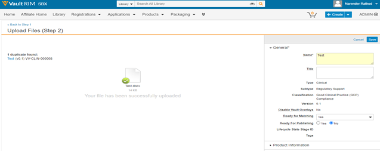
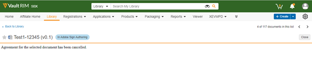

# Adobe Sign für [!DNL Veeva Vault]: Benutzerhandbuch {#veeva-vault-user-guide}

[**Adobe Sign-Support kontaktieren**](https://adobe.com/go/adobesign-support-center_de)

Dieses Dokument soll Ihnen helfen, [!DNL Veeva Vault] Kunden erfahren, wie sie Adobe Sign für [!DNL Veeva Vault] Integration zum Senden einer Vereinbarung.

## Übersicht {#overview}

Integration zwischen Adobe Sign und [!DNL Veeva Vault] erleichtert den Prozess des Einholens einer Signatur oder Genehmigung für jede Dokumentation, die rechtsgültige Signaturen oder eine überprüfbare Dokumentverarbeitung erfordert.

Der gesamte Prozess des Versendens von Dokumenten zum Unterschreiben ähnelt dem des Versendens einer E-Mail, sodass er für die meisten Benutzer einfach zu übernehmen ist.

Integration zwischen Adobe Sign und [!DNL Veeva Vault] Optimierung und Beschleunigung von Dokumenten- und Unterschrifts-Workflows. Wenn Sie den Integrationsarbeitsablauf verwenden, haben Sie folgende Möglichkeiten:

* Sparen Sie Zeit und Ressourcen, die Sie für Schneckenmails, Übernachtungen oder Faxe aufwenden müssen.
* Versendet Verträge zur elektronischen Unterzeichnung oder Genehmigung von [!DNL Veeva Vault], greifen Sie auf den Vertragsverlauf in Echtzeit zu und zeigen Sie gespeicherte Verträge an.
* Verfolgt Verträge in Echtzeit innerhalb eurer Organisation und erhaltet Updates, wenn sie angezeigt, unterschrieben, storniert oder abgelehnt werden.
* eSign in über 20 Sprachen und Unterstützung des Rückfax-Diensts in über 50 Gebietsschemas weltweit.
* Erstellen Sie wiederverwendbare Vereinbarungsvorlagen zum Senden von Optionen.

## Vertrag mit Adobe Sign für [!DNL Veeva Vault] {#send-sign-vault-agreement}

So senden Sie einen Vertrag mit Adobe Sign für Veeva:

1. Wechseln Sie zur Registerkarte [[!DNL Veeva Vault] Anmeldeseite](https://login.veevavault.com/) und geben Sie Ihren Benutzernamen und Ihr Kennwort ein. Es öffnet die Homepage Ihres Vault, wie unten gezeigt.

   

1. Auswählen **[!UICONTROL Bibliothek]** und wählen Sie dann **[!UICONTROL Erstellen]** in der rechten oberen Ecke.

   

1. Auswählen **[!UICONTROL Hochladen und Fortfahren]**.

1. Laden Sie ein Dokument von Ihrem lokalen Laufwerk hoch.

1. Wählen Sie im angezeigten Dialogfeld **[!UICONTROL Typ]** als *[!UICONTROL Klinisch]* und wählen Sie dann ein **[!UICONTROL Untertyp]** und **[!UICONTROL Klassifizierung]**, falls erforderlich.

   

1. Auswählen **[!UICONTROL Ok]** , um das Dialogfeld zu schließen.

1. Auswählen **[!UICONTROL Weiter]**.

1. Füllen Sie im angezeigten Fenster alle erforderlichen Felder im Metadatenabschnitt aus und wählen Sie **[!UICONTROL Speichern]**.

   

1. Es wird ein Testdokument in **[!UICONTROL Entwurf]** Status, wie unten angezeigt.

   

1. Wählen Sie in der oberen rechten Ecke  und wählen Sie **[!UICONTROL Review starten]**.

   

1. Wählen Sie das **[!UICONTROL Überprüfer]** und **[!UICONTROL Fälligkeitsdatum der Überprüfung]**.

1. Auswählen **[!UICONTROL Start]**. Der Dokumentstatus wird in &quot; [!UICONTROL IN ÜBERPRÜFUNG].

   

1. Führen Sie die zugewiesene Aufgabe im Namen der Reviewer aus. Sobald Sie fertig sind, ändert sich der Dokumentstatus in [!UICONTROL ÜBERPRÜFT].

   

1. Auswählen  und wählen Sie **[!UICONTROL Adobe Sign]**.

   

1. Geben Sie im Fenster iFrame , das in Vault geöffnet wird, die E-Mail-Adresse des Empfängers ein und wählen Sie **[!UICONTROL Weiter]**.

   

   **Hinweis:** Wenn kein Adobe Sign-Benutzerkonto für die E-Mail-Adresse des Absenders vorhanden ist, wird im iFrame-Fenster eine Meldung angezeigt (siehe unten). Es sendet dem Benutzer auch eine E-Mail mit den Anweisungen zum Aktivieren des Kontos.

   

   

   Wenn jedoch *Sign-Benutzer automatisch bereitstellen* deaktiviert ist, schlägt die Adobe Sign-Benutzererstellung fehl und das iFrame-Fenster zeigt eine Meldung an, in der der Benutzer aufgefordert wird, sich an seinen Adobe Sign-Kontoadministrator zu wenden. Der Adobe Sign-Kontoadministrator kann eine der folgenden Aktionen ausführen:

   * Aktivieren Sie die *Sign-Benutzer automatisch bereitstellen* für das Konto.
   * Erstellen Sie den Benutzer in Adobe Sign, bevor Sie die Veeva Vault Adobe Sign-Integration verwenden.

   

1. Nachdem das Dokument verarbeitet wurde, ziehen Sie die Signaturfelder aus dem rechten Bereich und wählen Sie **[!UICONTROL Senden]**.

   

1. Das Dokument wird zur Signatur an die Empfänger gesendet. Sobald der Empfänger die Dokument-E-Mail erhält, ändert sich der Dokumentstatus von [!UICONTROL Überprüft] bis [!UICONTROL Signieren in Adobe].

   

1. Sobald alle Signaturen in Adobe Sign erfasst und abgeschlossen sind, ändert sich der Dokumentstatus in Vault in [!UICONTROL Genehmigt].

1. Auswählen **[!UICONTROL Dokumentdateien]** und erweitern Sie die Option **[!UICONTROL Ausgabedarstellungen]** Abschnitt in Vault. Es wird automatisch eine neue Formatvariante mit dem Namen &quot;Adobe Sign-Formatvariante&quot; erstellt, sobald sich das Dokument im Status &quot;Genehmigt&quot; befindet.

   

1. Laden Sie die Adobe Sign-Ausgabedarstellung herunter, um die Empfängersignatur zu validieren.

   

## Abbrechen eines Vertrags mit Adobe Sign für [!DNL Veeva Vault] {#cancel-sign-vault-agreement}

1. Wechseln Sie zur Registerkarte [[!DNL Veeva Vault] Anmeldeseite](https://login.veevavault.com/) und geben Sie Ihren Benutzernamen und Ihr Kennwort ein. Es öffnet die Homepage Ihres Vault, wie unten gezeigt.

   

1. Auswählen **[!UICONTROL Bibliothek]** und wählen Sie dann das Dokument aus. Der Dokumentstatus kann wie folgt lauten: [!UICONTROL In Adobe Sign Draft], [!UICONTROL In Adobe Sign Authoring]oder [!UICONTROL Signieren in Adobe].

   

1. Auswählen **[!UICONTROL Adobe Sign kündigen]**.

   

1. Es löst die Webaktion aus und lädt das iFrame-Fenster in [!UICONTROL Vault].

   

1. Der Dokumentstatus ändert sich automatisch in [!UICONTROL Review].

   

Nachdem sich der Dokumentstatus in &quot;Überprüfen&quot; geändert hat, können Sie es erneut zur Signatur senden.
