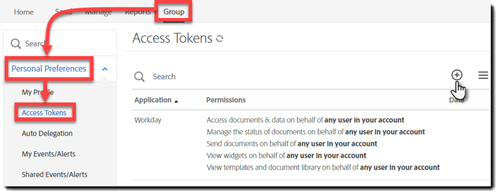

# [!DNL Workday] Testinstallation{#workday-trial-installation}

## Übersicht {#overview}

Dieses Dokument soll Kunden von [!DNL Workday] helfen, ein Testkonto bei Adobe Sign zu aktivieren und es dann in [!DNL Workday]-Mandanten zu integrieren. Um Adobe Sign in [!DNL Workday] zu verwenden, müssen Sie wissen, wie [!DNL Workday]-Elemente erstellt und geändert werden, z. B.:

* Geschäftsprozessrahmen
* Einrichtung und Konfiguration des Mandanten
* Reporting und [!DNL Workday] Studio-Integration

**Hinweis**: Wenn Sie über ein Adobe Sign-Konto verfügen, müssen Sie keine Testversion starten. Sie können sich an Ihren Client Success Manager wenden, um die [!DNL Workday]-Integration anzufordern.

Die Schritte auf oberster Ebene zur Integration sind folgende:

* Aktiveren des Testkontos für Adobe Sign
* Integrationsschlüssel in Adobe Sign generieren
* Installieren Sie den Integrationsschlüssel in den Tenant [!DNL Workday].

## Adobe Sign-Testkonto aktivieren {#activate-sign-trial-account}

Um eine 30-Tage-Testversion von Adobe Sign anzufordern, müssen Sie dieses [Registrierungsformular](https://land.echosign.com/esign-trial-workday-registration.html) ausfüllen.

**Hinweis**: Es wird dringend empfohlen, zum Erstellen der Testversion eine gültige funktionale E-Mail-Adresse und keine temporäre E-Mail-Adresse zu verwenden. Sie müssen auf diese E-Mail-Adresse zugreifen, um das Konto zu überprüfen. Die Adresse muss also gültig sein.

Innerhalb eines Arbeitstags stellt ein Adobe Sign-Onboarding-Spezialist Ihr Konto (in Adobe Sign) für [!DNL Workday] bereit. Sobald Sie fertig sind, erhalten Sie eine Bestätigungs-E-Mail wie unten gezeigt.

Folgen Sie den Anweisungen in der E-Mail, um Ihr Konto zu initialisieren und auf Ihre Adobe Sign [!UICONTROL Home]-Seite zuzugreifen.

## Integrationsschlüssel generieren {#generate-an-integration-key}

Bei neuen Installationen müssen Sie einen Integrationsschlüssel in Adobe Sign generieren und dann in [!DNL Workday] eingeben. Dieser Schlüssel authentifiziert die Adobe Sign- und [!DNL Workday]-Umgebungen, um sich gegenseitig zu vertrauen und Inhalte freizugeben.

So erstellen Sie in Adobe Sign einen Integrationsschlüssel:

1. Melden Sie sich in Adobe Sign mit Ihrem Administratorkonto an..
1. Navigieren Sie zu **[!UICONTROL **Account]** > **[!UICONTROL Persönliche Vorgaben]** > **[!UICONTROL Zugriffstoken**]**.
1. Klicken Sie auf das Symbol **mit dem eingekreisten Pluszeichen** auf der rechten Seite des Fensters.

   Dadurch wird die Schnittstelle [!UICONTROL Integrationsschlüssel erstellen] geöffnet.

   

1. Geben Sie einen intuitiven Namen für Ihren Schlüssel ein, z. B. [!DNL Workday].

   Für den Integrationsschlüssel müssen folgende Elemente aktiviert sein:

   * agreement_read
   * agreement_write
   * agreement_send
   * widget_read
   * library_read

   

1. Klicken Sie auf **[!UICONTROL Speichern]**.

   Die Seite [!UICONTROL Zugriffstoken] mit den in Ihrem Konto erstellten Schlüsseln wird angezeigt.

1. Klicken Sie auf die Schlüsseldefinition, die für [!DNL Workday] erstellt wurde.

   Der Link [!UICONTROL Integrationsschlüssel] wird oben in der Definition angezeigt.

1. Klicken Sie auf den Link **[!UICONTROL Integrationsschlüssel]**.

   Der Integrationsschlüssel wird angezeigt.

   

1. Kopieren Sie diesen Schlüssel und speichern Sie ihn an einem sicheren Ort für den nächsten Schritt.
1. Klicken Sie auf **[!UICONTROL OK]**.

   

## [!DNL Workday]-Mandanten konfigurieren {#configuring-the-workday-tenant}

### Integrationsschlüssel installieren {#install-the-integration-key}

Durch die Installation des Integrationsschlüssels im [!DNL Workday]-Mandanten wird die Vertrauensbeziehung zu Adobe Sign hergestellt. Sobald diese Beziehung besteht, kann für jeden Geschäftsvorgang ein [!UICONTROL Schritt Dokument prüfen] hinzugefügt werden, der den Signaturvorgang aktiviert.

**Hinweis**: Adobe Sign wird  [!DNL Workday] umweltrelevant als &quot;Adobe Document Cloud&quot;bezeichnet.

So installieren Sie den Integrationsschlüssel:

1. Melden Sie sich bei [!DNL Workday] als Kontoadministrator an.
1. Suchen Sie die Seite **[!UICONTROL Einrichtung für Mandanten bearbeiten - Geschäftsprozesse]** und öffnen Sie sie.

1. Geben Sie Informationen für die folgenden vier Felder an:

   * **[!UICONTROL Adobe Document Cloud-Bestätigung]**: Eine feste Textbestätigung der Integration.

   * **[!UICONTROL Adobe Document Cloud API-Schlüssel]**: Wo der Integrationsschlüssel installiert ist

   * **[!UICONTROL Adobe Document Cloud Sender-E-Mail-Adresse]**: Die E-Mail-Adresse des Gruppenebenen-Administrators in Adobe Sign

   * **[!UICONTROL Entfernen Sie Dokumente, die auf e-Signatur warten, wenn das Dokument abgebrochen]** wird: Eine optionale Konfiguration, die Dokumente aus dem Signaturzyklus entfernt, wenn ein Dokument abgebrochen wird  [!DNL Workday].

   

1. Schließen Sie als Nächstes die Installation ab:

   1. Fügen Sie den Integrationsschlüssel in das Feld [!UICONTROL Adobe Sign API-Integrationsschlüssel] ein.
   1. Geben Sie die E-Mail-Adresse des Adobe Sign-Administrators in das Feld [!UICONTROL Adobe Document Cloud Sender Email Address] ein.
   1. Klicken Sie auf **[!UICONTROL OK]**.

   

Adobe Sign-Funktionen können jetzt zu jedem Geschäftsvorgang hinzugefügt werden, indem ein [!UICONTROL Schritt zum Überprüfen des Dokuments ] hinzugefügt und konfiguriert wird, um **[!UICONTROL eSign durch Adobe]** als eSignature-Typ zu verwenden.

### Schritt &quot;Dokument prüfen&quot;konfigurieren {#configure-the-review-document-step}

Das Dokument für den Schritt &quot;Dokument prüfen&quot;kann ein statisches Dokument sein. ein Dokument, das von einem Schritt Dokument generieren innerhalb desselben Geschäftsvorgangs generiert wurde; oder einen formatierten Bericht, der mit der [!DNL Workday]-Berichtgestaltung erstellt wurde. Alle diese Dokumente können mit [Adobe-Text-Tags](https://adobe.com/go/adobesign_text_tag_guide_de) versehen werden, um das Aussehen und die Position der spezifischen Komponenten von Adobe Sign zu steuern. Die Quelle des Dokuments muss innerhalb der Definition des Geschäftsvorgangs angegeben werden. Es ist nicht möglich, ein Ad-hoc-Dokument hochzuladen, während der Geschäftsprozess ausgeführt wird.

Einzigartig bei der Verwendung von Adobe Sign mit einem Schritt Dokument prüfen ist die Möglichkeit, serialisierte Unterzeichnergruppen zu haben. Mit Unterzeichnergruppen können Sie rollenbasierte Gruppen angeben, die nacheinander signieren. Adobe Sign unterstützt keine parallelen Signaturgruppen.

Wenn Sie Unterstützung beim Konfigurieren des Schritts &quot;Dokument prüfen&quot;benötigen, finden Sie weitere Informationen in der [Kurzanleitung](https://adobe.com//go/adobesign_workday_quick_start){target=&quot;_blank&quot;}.

## Support {#support}

### [!DNL Workday] Support {#workday-support}

[!DNL Workday] ist der Integrationsverantwortliche, der Ihre erste Anlaufstelle bei Fragen zum Umfang der Integration, bei Funktionsanfragen oder Problemen bei der täglichen Arbeit mit der Integration sein sollte.

Die [!DNL Workday]-Community enthält mehrere gute Artikel, wie Sie die Integration beheben und Dokumente generieren:

* [Fehlersuche bei der eSignature-Integration](https://doc.workday.com/#/reader/3DMnG~27o049IYFWETFtTQ/zhA~hYllD3Hv1wu0CvHH_g)
* [Der Schritt „Dokumente prüfen“](https://doc.workday.com/#/reader/3DMnG~27o049IYFWETFtTQ/TboWWKQemecNipWgxLAjqg)
* [Dynamische Generierung von Dokumenten](https://community.workday.com/node/176443)

* [Konfigurationstipps für die Generierung von Angebotsunterlagen](https://community.workday.com/node/183242)

### Adobe Sign-Support {#adobe-sign-support}

Adobe Sign ist der Integrationspartner und sollte nur dann kontaktiert werden, wenn über die Integration keine Signaturen geliefert werden oder wenn die Benachrichtigung über ausstehende Signaturen fehlschlägt.

Adobe Sign-Kunden wenden sich bezüglich Support bitte an ihren Customer Success Manager (CSM). Alternativ können Sie den technischen Support der Adobe telefonisch erreichen: 1-866-318-4100; Warten Sie auf die Produktliste und geben Sie Folgendes ein: 4 und dann 2 (nach Aufforderung).

* [Hinzufügen von Adobe-Text-Tags zu Dokumenten](https://adobe.com/go/adobesign_text_tag_guide)

* [Konfiguration und Beispiele für „Dokument prüfen“](https://www.adobe.com//go/adobesign_workday_quick_start) 

[**Adobe Sign-Support kontaktieren**](https://adobe.com/go/adobesign-support-center_de)
